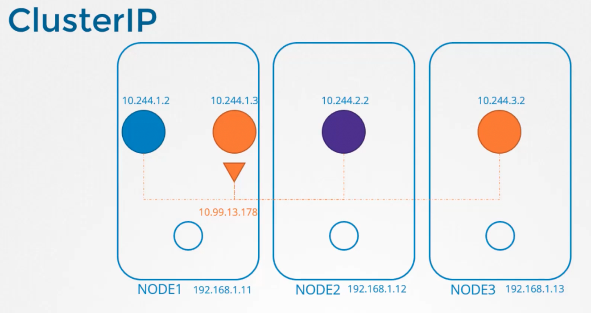

### Service Networking

- When a service is created, it is accessible from all pods on all nodes in the cluster
	- This type of cluster is called as ClusterIP
- 
- When a service is created to expose the pod to internet, we create a NodePort type of service
- 
- Every node in a cluster runs a `kubelet` process, which is responsible for creating pods.
	- Once the pod is created, `kubelet` invokes the CNI plugin to configure networking on the pod
- Similarly, `kube-proxy` runs on every node in a cluster
	- It monitors if a service object is getting created
	- Whenever a service object is created, it is assigned an IP address from a pre-defined range
	- `kube-proxy` component takes this assigned IP and creates forwarding rules on every node in the cluster
	- It is normally IP:Port combination, and `kube-proxy` manages it
- 
- `kube-proxy` has different modes
	- User space
	- IPTables -> Default
	- IPVS
- `kube-proxy --proxy-mode [userspace|IPTables|IPVS]`
- There shouldn't be a case where a pod and a service have the same IP
	- Pods and Services should be in different CIDR range
- `kube-proxy` will create IPTable rules to map a service to a pod.
	- This can be seen in IPTables and in `kube-proxy` logs
- 
- To identify the IP address range for the pods on a cluster
	- `cat /etc/kubernetes/manifests/kube-controller-manager.yaml | grep cluster-cidr`
- To identify the IP address range for the services on a cluster
	- `cat /etc/kubernetes/manifests/kube-apiserver.yaml | grep cluster-ip-range`
- 
- To identify the type of proxy configured by the `kube-proxy`
	- `kubectl logs -n kube-system <kube_proxy_pod_name>`
- Kubernetes uses DaemonSet to ensure `kube-proxy` runs on all nodes in the cluster
- To identify the IP range for the nodes on a cluster
	- `kubectl get nodes -o wide` -> Get the IP of the node
	- Run `IP addr` -> See which interface has the IP range specified. This is the CIDR

---
