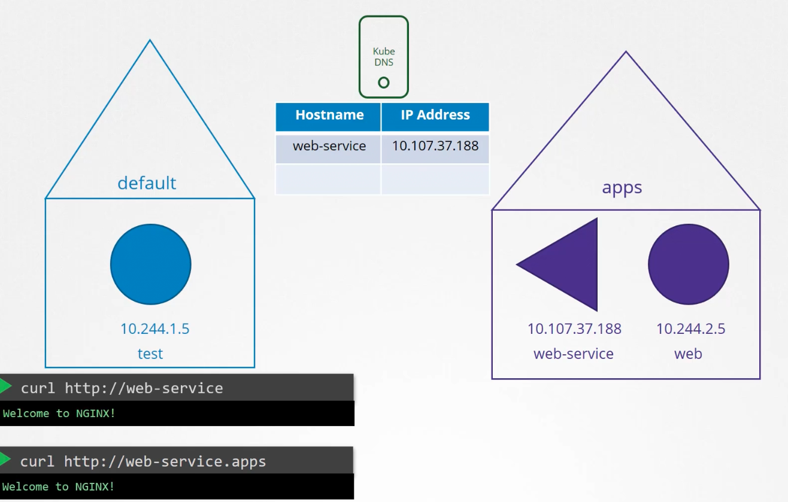
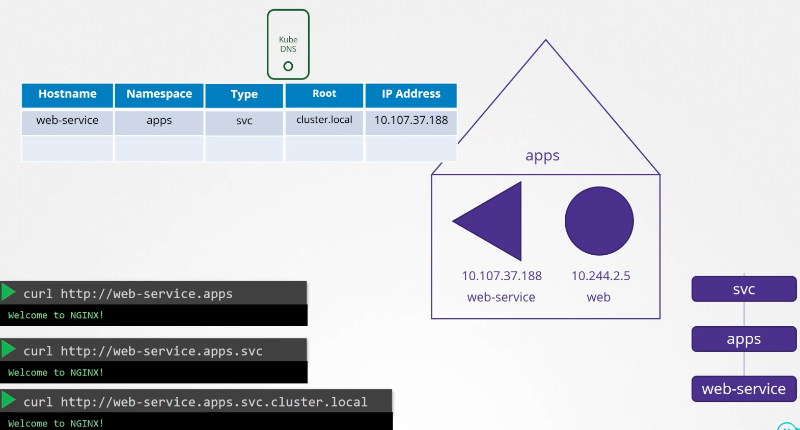
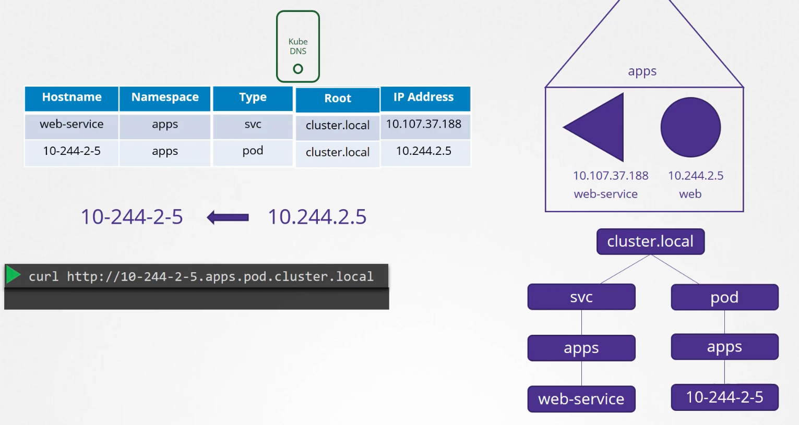
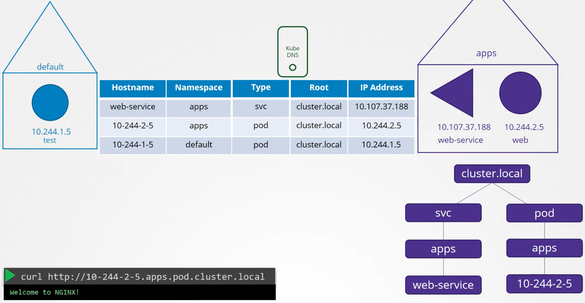

### DNS in Kubernetes

- This is about DNS resolution within the cluster, for Kubernetes objects like pods and services
- Kubernetes sets up a built-in DNS server (Kube DNS) when a cluster is setup
- 
- Whenever a service is created, Kubernetes creates a record with IP and Service name mapping
	- So within the cluster the service name resolves to the IP
	- If access from a different namespace, append the name of the namespace to the service name
		- Ex: Name of namespace - apps, Name of service - web-service
		- From another namespace, access the service using -"web-service.apps"
- For each namespace, the DNS creates a sub-domain
- All the services are grouped together in another sub-domain called "svc"
	- So the service can be accessed using the name - "web-service.apps.svc"
- All the services and pods are grouped together into a root domain called "cluster.local"
	- So the service can be access using the name - "web-service.apps.svc.cluster.local"
	- This is the FQDN for the service
- The above are the steps how a service's name is resolved inside a cluster
- 
- Records for pods are not created by default in Kube DNS, but can be enabled
	- It does not use the pod name, instead uses the IP to create the hostname, like hostname for a pod with IP 10.11.12.13 will be 10-11-12-13
	- Namespace will be the namespace where the pod resides
	- Type will be set to pod
	- So the pod now resolves to 10-11-12-13.apps.pod.cluster.local, which is the FQDN of the pod
- 

| Hostname    | Namespace | Type | Root          | IP Address    |
| ----------- | --------- | ---- | ------------- | ------------- |
| web-service | apps      | svc  | cluster.local | 10.107.37.138 |
| 10-11-12-13 | apps      | pod  | cluster.local | 10.11.12.13   |
| 10-244-1-5  | default   | pod  | cluster.local | 10.244.1.5    |
- A pod in the default namespace will resolve to 10-244-1-5.default.pod.cluster.local
- 

---
