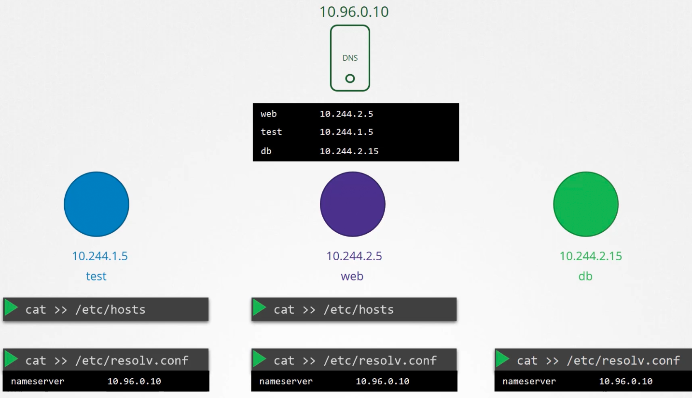
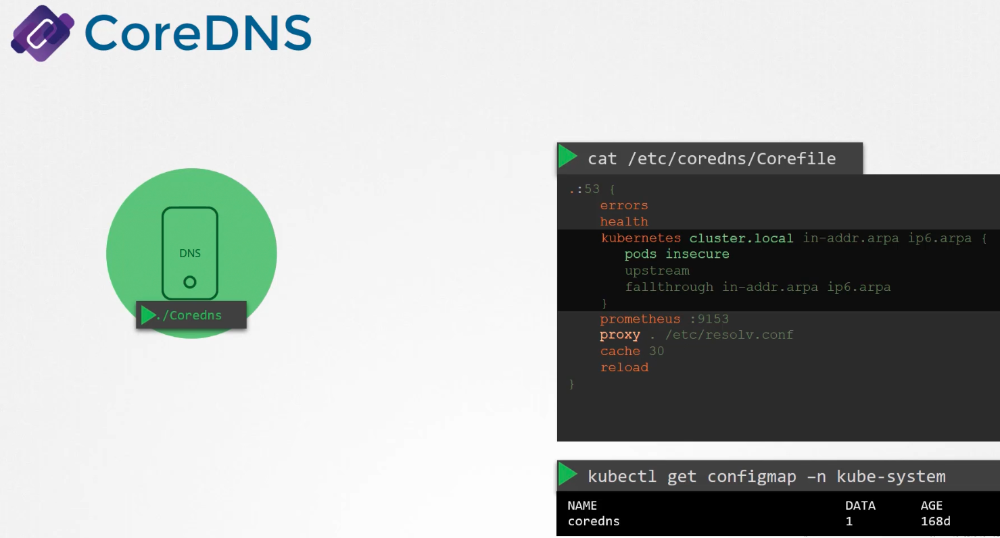
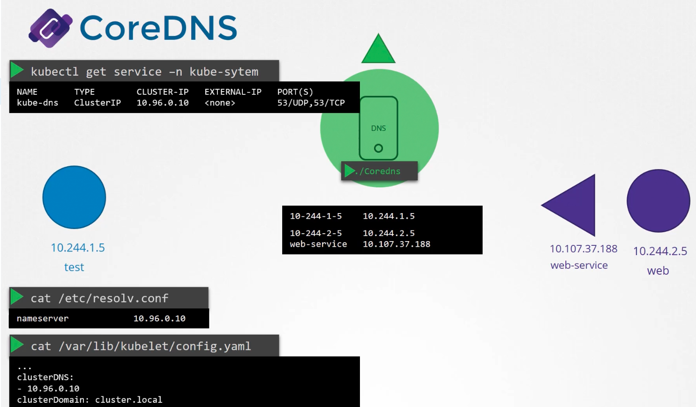
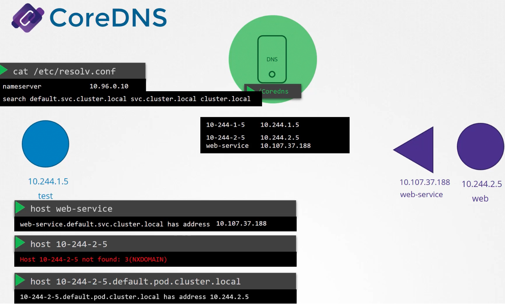

### CoreDNS

- To resolve a hostname of a system to its IP
	- Add an entry in `/etc/hosts` file like `web    10.11.12.13`
	- Add an entry in the `/etc/resolv.conf` to point to the DNS server like `nameserver    10.96.0.10`
		- In the DNS server add the entry `web    10.11.12.13`
- 
- So every time a pod is created, Kubernetes creates an entry in the DNS, so that all pods in the cluster can be resolved via hostname
- Kubernetes implements CoreDNS post v1.12
	- Previously Kube-DNS was used
- CoreDNS is deployed as pod in `kube-system` namespace
	- It uses a `corefile` located at `/etc/coredns`
	- In this `corefile` lot of plugins can be mentioned, like for metrics, errors etc
	- `kubernetes` plugin defines the DNS functionality, where the top level domain `cluster.local` is mentioned
	- The entry `pods insecure` enables DNS entry for each pod created.
	- By default, there will be no entry for pods created
	- The `corefile` is passed on to pods as a ConfigMap object
- 
- For pods to reach the CoreDNS, CoreDNS exposes itself via a service called `kube-dns`
- The IP address of this service is configured as the nameserver in `/etc/resolv.conf` for each pod
	- The DNS configuration on pods are done by Kubernetes automatically, via the `kubelet` service
	- It is mentioned in `kubelet` configuration file located at `/var/lib/kubelet/config.yaml` under `clusterDNS`
	- The `resolv.conf` will also have a `search` entry set to the sub-domains as well
		- This works only for services
		- For pods, we need to manually specify the full FQDN
- 
- 
- To know the DNS solution implemented in the cluster
	- `kubectl get pods -n kube-system`
- To identify the config file used to configure CoreDNS service
	- `kubectl -n kube-system describe deployments.apps coredns | grep -A2 Args | grep corefile`
- The ConfigMap containing the CoreDNS configuration can be seen
	- `kubectl describe configmap coredns -n kube-system`
- To test accessing a service from a pod
	- `kubectl exec -it test -- curl http://web-service`
		- `test` -> Pod name
		- `web-service` -> Service name
		- `curl http://web-service` -> Command to be executed in the pod

---
