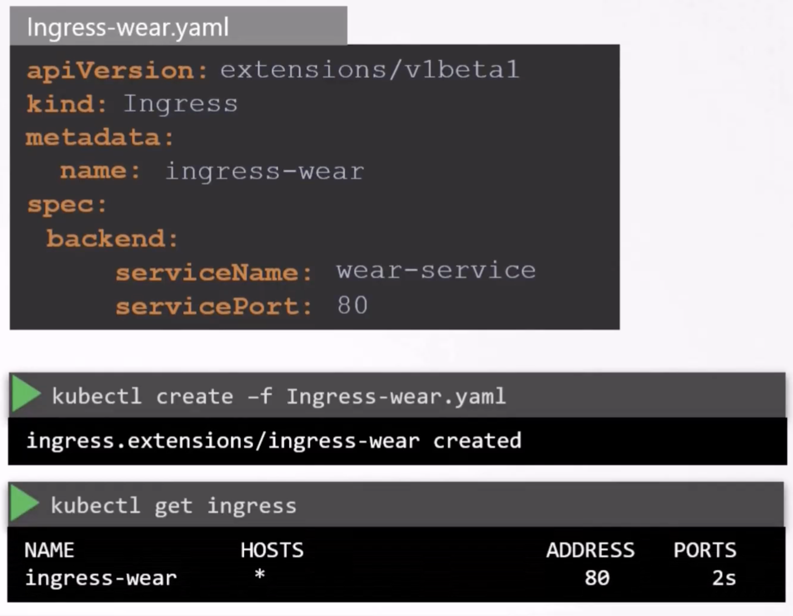

### Ingress

- Assume you are building a e-commerce website, where the service is running on a pod, and the pod connects to a DB
	- Deploy application in a pod on the Kubernetes cluster
	- DB is also deployed as a pod on the cluster
	- To access the DB, create a service of type ClusterIP. Make it accessible from the application pod
	- To make the application accessible to outside world, you create one more service of type NodePort
		- This will make the application available on a high port  ( > 30000 ) to the outside world Ex: 38080
	- Users can access the application using the url http://node-ip:port
	- 
	- If traffic increases, we increase the number of replicas in the deployment
		- The service will automatically take care of splitting traffic among the pods
	- To avoid users to type IP of the node every time to access the application, you configure DNS to point the application's name to the node's IP
		- Users's can access via http://hostname:port
	- To avoid users to input port, configure a proxy between the DNS and cluster, and the proxy server listens on port 80 and internally forwards traffic to port 38080
		- Now point the DNS to the proxy server's IP
		- Now users can access using http://proxy-server
	- The above are true if the containers are hosted on-premise in a datacenter
	- 
- In case it is hosted on public cloud like GCP
	- Instead of creating a service type NodePort, create a service type "Load Balancer"
	- It will automatically configure the proxy server part, which was done manually for on-premise
	- The load balance will have an external IP, listening on port 80, and it will automatically route traffic to 38080 internally
	- DNS is set to the load balancer's IP and the application's hostname
	- 
- If we now want to include new services like video streaming services, and want to expose it like "http://hostname/watch"
	- The new service is created as separate deployment, as pods, in the Kubernetes cluster
	- We create a service called "video service" of type "Load Balancer"
	- This load balancer will be exposed on a new high port, different from the existing one
	- But this load balancer will have a new IP and we want to map it to the same hostname, but in a different path
	- To achieve this, we introduce a new load balancer on top of the 2 existing load balancers
	- 
- Finally, we need to enable ssl for application, https
	- 
- All of the above can be achieved via Ingress as a definition file
- Ingress helps to expose your application to a single URL accessible from outside
	- Allows configuration of different paths for different services
	- Allows configuration of SSL
- 
- Ingress is a layer 7 load balancer, and can be configured like a Kubernetes primitive
	- Ingress still needs to be published as NodePort (for on-premise) or as a Load Balancer on a public cloud
- 
- Ingress controller
	- Deploy a supported solution like HA proxy, Nginx etc
- Ingress resources
	- Specify a set of rules to configure via a definition file
- 
- Ingress controller is not available by default, must deploy one
	- GCE (Google's layer 7 load balancer), Nginx, Istio, HAProxy
	- GCE and Nginx are maintained by Kubernetes
- 
- We deploy Nginx as another pod, using the definition file
	- Create ConfigMap and environment variables and ports for the Ingress controller
	- Create a service of type NodePort to expose the Nginx ingress controller
	- Ingress controller needs a service account to talk to Kubernetes, with appropriate Roles and Role Bindings
- Ingress resource
	- Set of rules and configurations applied on the Ingress controller
		- Rules like route traffic to different services based on URL path, or domain names
	- Ingress resource is created with a Kubernetes definition file
	- You use rules to route traffic, via paths or domain names, or combination of both
	- Rules are for each domain name, under which paths are defined
	- Ingress resource is defined in definition yaml file
		- Use `kubectl create ...` command to create the ingress resource
	- `kubectl describe ingress <ingress_resource_name>` - Gives details about ingress resource
	- Deploy a default service, so that any paths undefined will be serviced by it
- 
- 
- 
- 
- 
- 
- 
- 
- 


- `kubectl get ingress -A`
- `kubectl create ingress <name_of_ingress> -n <namespace> --rule="/path=servicename:port"`
- `kubectl create ingress ingress-pay -n critical-space --rule="/pay=pay-service:8282"`
- `kubectl create namespace <namespace_name>`
- `kubectl create configmap <name_of_configmap> --namespace <name_of_namespace>`
- `kubectl create serviceaccount <SA_name> --namespace <namespace_name>`
- `kubectl get roles,rolebindings -n <namespace_name>`
- Create a service
	- `kubectl expose <deployment_name> -n <namespace> --name <service_name> --port=443 --target-port=8443 --type NodePort`
	- To edit the NodePort, edit the created service (via the defn file)
- Create ingress resource
	- `kubectl create ingress <name_of_ingress_resource> -n <namespace> --rule="/wear=wear-service:8080" --rule="/watch=watch-service:8080"`


---

As we already discussed **Ingress** in our previous lecture. Here is an update. 

In this article, we will see what changes have been made in previous and current versions in **Ingress**.

Like in **apiVersion**, **serviceName** and **servicePort** etc.

[__](https://kodekloud.com/kk-media/image/upload/v1702469282/course-resource-new/1200736109541070.InaagGGYE8f31Jm2PTKH_height640.png)

Now, in k8s version **1.20+,** we can create an Ingress resource in the imperative way like this:-

```
Format - kubectl create ingress  --rule="host/path=service:port"**
```

Example -

```
kubectl create ingress ingress-test --rule="wear.my-online-store.com/wear*=wear-service:80"**
```

Find more information and examples in the below reference link:-**

[https://kubernetes.io/docs/reference/generated/kubectl/kubectl-commands#-em-ingress-em-](https://kubernetes.io/docs/reference/generated/kubectl/kubectl-commands#-em-ingress-em-) 

**References:-**

[https://kubernetes.io/docs/concepts/services-networking/ingress](https://kubernetes.io/docs/concepts/services-networking/ingress)

[https://kubernetes.io/docs/concepts/services-networking/ingress/#path-types](https://kubernetes.io/docs/concepts/services-networking/ingress/#path-types)


---

Different ingress controllers have different options that can be used to customise the way it works. NGINX Ingress controller has many options that can be seen [here](https://kubernetes.github.io/ingress-nginx/examples/). I would like to explain one such option that we will use in our labs. The [Rewrite](https://kubernetes.github.io/ingress-nginx/examples/rewrite/) target option.

Our `watch` app displays the video streaming webpage at `http://<watch-service>:<port>/`

Our `wear` app displays the apparel webpage at `http://<wear-service>:<port>/`

We must configure Ingress to achieve the below. When user visits the URL on the left, his/her request should be forwarded internally to the URL on the right. Note that the /watch and /wear URL path are what we configure on the ingress controller so we can forward users to the appropriate application in the backend. The applications don't have this URL/Path configured on them:

`http://<ingress-service>:<ingress-port>/watch` --> `http://<watch-service>:<port>/`

`http://<ingress-service>:<ingress-port>/wear` --> `http://<wear-service>:<port>/`

Without the `rewrite-target` option, this is what would happen:

`http://<ingress-service>:<ingress-port>/watch` --> `http://<watch-service>:<port>/watch`

`http://<ingress-service>:<ingress-port>/wear` --> `http://<wear-service>:<port>/wear`

Notice `watch` and `wear` at the end of the target URLs. The target applications are not configured with `/watch` or `/wear` paths. They are different applications built specifically for their purpose, so they don't expect `/watch` or `/wear` in the URLs. And as such the requests would fail and throw a `404` not found error.

To fix that we want to "ReWrite" the URL when the request is passed on to the watch or wear applications. We don't want to pass in the same path that user typed in. So we specify the `rewrite-target` option. This rewrites the URL by replacing whatever is under `rules->http->paths->path` which happens to be `/pay` in this case with the value in `rewrite-target`. This works just like a search and replace function.

For example: `replace(path, rewrite-target)`

In our case: `replace("/path","/")`

```
apiVersion: networking.k8s.io/v1
kind: Ingress
metadata:
  name: test-ingress
  namespace: critical-space
  annotations:
    nginx.ingress.kubernetes.io/rewrite-target: /
spec:
  rules:
    - http:
        paths:
          - path: /pay
            pathType: Prefix
            backend:
              service:
                name: pay-service
                port:
                  number: 8282
```

In another example given [here](https://kubernetes.github.io/ingress-nginx/examples/rewrite/), this could also be:

`replace("/something(/|$)(.*)", "/$2")`

```
apiVersion: networking.k8s.io/v1
kind: Ingress
metadata:
  name: rewrite
  namespace: default
  annotations:
    nginx.ingress.kubernetes.io/rewrite-target: /$2
spec:
  rules:
    - host: rewrite.bar.com
      http:
        paths:
          - path: /something(/|$)(.*)
            pathType: Prefix
            backend:
              service:
                name: http-svc
                port:
                  number: 80

```


---

