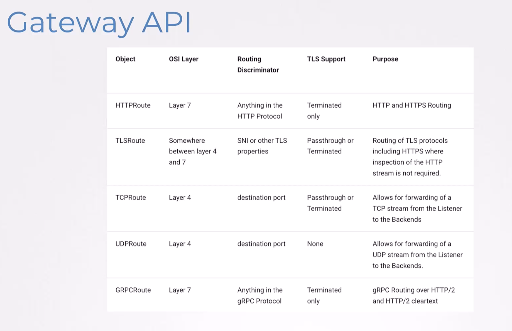
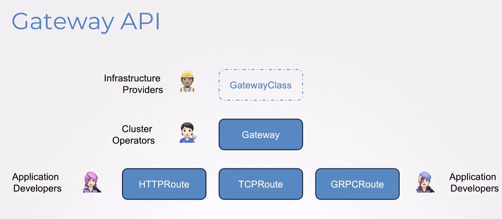
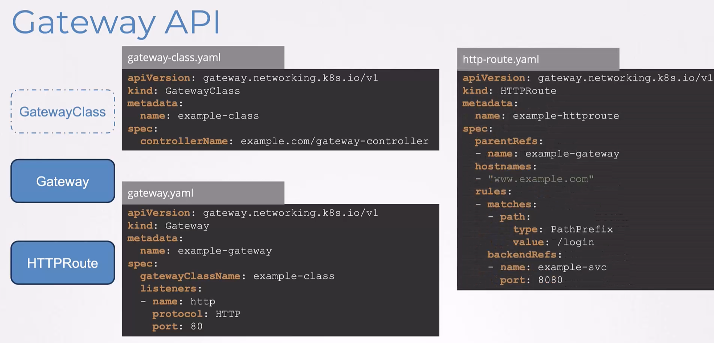
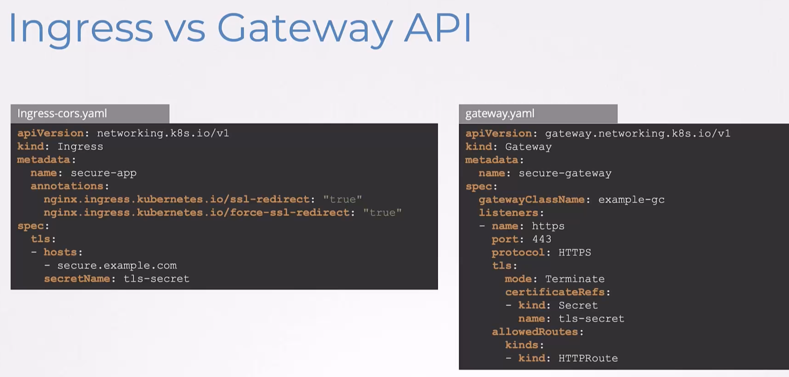
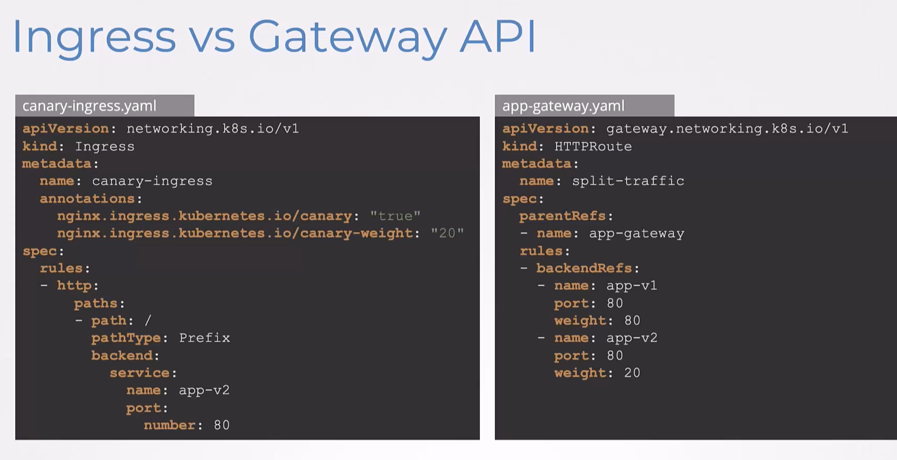

### Gateway API

- In a multi tenant environment, where each service is managed by a different team, Ingress can be problematic
	- No support for multi-tenancy
	- No namespace isolation
	- No RBAC for features
	- No resource isolations
	- Supports only HTTP based rules
	- Need to use annotations
	- CORS setting
- 
- Gateway API - It is an official Kubernetes project
	- On layer 4 and 7 routing
		- Next get ingress, load balancing and service mesh
- Gateway class - Infra
- Gateway - Cluster
- HTTP route - App layer
- 
- 
- 
- 


---


---


# Kubernetes **Gateway API**: A Practical Guide Using NGINX

This guide introduces the Kubernetes ****Gateway API****, a modern and extensible approach to managing ingress and traffic routing in Kubernetes. While we'll be using the ****NGINX Gateway Controller**** for demonstration, the concepts and APIs are ****implementation-agnostic**** and apply across different **Gateway API**-compatible controllers.

📚 Official Docs: [gateway-api.sigs.k8s.io](https://gateway-api.sigs.k8s.io)

---

## 1. Installing **Gateway API** with NGINX

The **Gateway API** defines custom resources, but a controller is needed to implement them. For this demo, we’ll use the ****NGINX Gateway Controller****, which supports all standard **Gateway API** resources.

To install the **NGINX Gateway Controller**, run the following commands:

```
kubectl kustomize "https://github.com/nginx/nginx-gateway-fabric/config/crd/gateway-api/standard?ref=v1.6.2" | kubectl apply -f -

kubectl kustomize "https://github.com/nginx/nginx-gateway-fabric/config/crd/gateway-api/experimental?ref=v1.6.2" | kubectl apply -f -

helm install ngf oci://ghcr.io/nginx/charts/nginx-gateway-fabric --create-namespace -n nginx-gateway
```

> What this does:
> 
> - Installs the **NGINX Gateway Controller**, along with the **Gateway API Custom Resource Definitions** (CRDs) and related resources.

🔗 [NGINX Gateway Fabric Reference](https://docs.nginx.com/nginx-gateway-fabric/installation/installing-ngf/helm/)

---

## 2. **GatewayClass** Definition

A **GatewayClass** defines a set of Gateways that are implemented by a specific controller. Think of it as a blueprint that tells Kubernetes which controller will manage the Gateways.

### Purpose

- Decouples Gateway configuration from the actual implementation: This allows you to define Gateways without worrying about the underlying controller.
- Supports multiple gateway implementations in a single cluster: For example, you can have both NGINX and Istio Gateways in the same Kubernetes cluster.

Here’s an example of a **GatewayClass**:

```
apiVersion: gateway.networking.k8s.io/v1
kind: GatewayClass
metadata:
  name: nginx
spec:
  controllerName: nginx.org/gateway-controller
```

Explanation:

- **`controllerName`**: This must match the **name** expected by your controller (e.g., `nginx.org/gateway-controller` for NGINX). It tells Kubernetes which controller will manage Gateways of this class.

🔗 [**GatewayClass** Reference](https://gateway-api.sigs.k8s.io/api-types/gatewayclass/)

---

## 3. Configuring **HTTP** Gateway and Listener

A Gateway is a Kubernetes resource that defines how traffic enters your cluster. It specifies the protocols, ports, and routing **rules** for incoming traffic.

Here’s an example of a Gateway that listens for **HTTP** traffic:

```
apiVersion: gateway.networking.k8s.io/v1
kind: Gateway
metadata:
  name: nginx-gateway
  namespace: default
spec:
  gatewayClassName: nginx
  listeners:
  - name: http
    protocol: HTTP
    port: 80
    allowedRoutes:
      namespaces:
        from: All
```

Explanation:

- **`gatewayClassName`**: Refers to the **GatewayClass** (e.g., nginx) that will manage this Gateway.
- **`listeners`**: Defines how the Gateway listens for traffic.
    - **`name`**: A unique **name** for this listener.
    - **`protocol`**: Specifies that this listener will handle **HTTP** traffic.
    - **`port`**: The **port** number on which the Gateway will listen for **HTTP** traffic.
    - **`allowedRoutes`**: Specifies which namespaces can define routes for this Gateway. Here, `from: All` allows routes from all namespaces.

This configuration sets up a Gateway to handle **HTTP** traffic on **port** 80 and forward it to the appropriate backend services.

---

## 4. **HTTP** Routing

An **HTTPRoute** defines how **HTTP** traffic is forwarded to Kubernetes services. It works in conjunction with a Gateway to route requests based on specific **rules**, such as matching paths or headers.

Here’s an example of an **HTTPRoute**:

```
apiVersion: gateway.networking.k8s.io/v1
kind: HTTPRoute
metadata:
  name: basic-route
  namespace: default
spec:
  parentRefs:
  - name: nginx-gateway
  rules:
  - matches:
    - path:
        type: PathPrefix
        value: /app
    backendRefs:
    - name: my-app
      port: 80
```

Explanation:

- **`parentRefs`**: Links this route to a specific Gateway (e.g., `nginx-gateway`).
- **`rules`**: Defines how traffic is routed.
    - **`matches`**: Specifies the conditions for matching traffic.
        - **`path`**: Matches requests with a specific path prefix (e.g., `/app`).
    - **`backendRefs`**: Specifies the backend **service** (e.g., `my-app`) and **port** (e.g., `80`) to which the traffic should be forwarded.

This configuration routes all requests with the path prefix `/app` to `my-app` **service** on **port** `80`.

🔗 [**HTTP** Routing Guide](https://gateway-api.sigs.k8s.io/guides/http-routing/)

---

## 5. **HTTP** Redirects and Rewrites

Redirects and rewrites are powerful tools for modifying incoming requests before they reach the backend **service**.

Example: **HTTP** to **HTTPS** Redirect Redirects are used to force traffic to a different scheme (e.g., **HTTP** to **HTTPS**). Here’s an example:

### Example: **HTTP** to **HTTPS** Redirect

```
apiVersion: gateway.networking.k8s.io/v1
kind: HTTPRoute
metadata:
  name: https-redirect
  namespace: default
spec:
  parentRefs:
  - name: nginx-gateway
  rules:
  - filters:
    - type: RequestRedirect
      requestRedirect:
        scheme: https
```

Explanation:

- **`filters`**: Defines additional processing for requests.
    - **`type: RequestRedirect`**: Specifies that this filter will redirect requests.
    - **`requestRedirect.scheme`**: Redirects all **HTTP** requests to **HTTPS**.

This configuration ensures that all incoming **HTTP** traffic is redirected to **HTTPS**, improving security.

🔗 [**HTTP** Redirects Guide](https://gateway-api.sigs.k8s.io/guides/http-redirect-rewrite/)

### Example: Path Rewrite

Rewrites modify the request path before forwarding it to the backend. Here’s an example:

```
apiVersion: gateway.networking.k8s.io/v1
kind: HTTPRoute
metadata:
  name: rewrite-path
  namespace: default
spec:
  parentRefs:
  - name: nginx-gateway
  rules:
  - matches:
    - path:
        type: PathPrefix
        value: /old
    filters:
    - type: URLRewrite
      urlRewrite:
        path:
          replacePrefixMatch: /new
    backendRefs:
    - name: my-app
      port: 80
```

Explanation:

- **`matches.path`**: Matches requests with the path prefix `/old`.
- **`filters.type: URLRewrite`**: Specifies that this filter will rewrite the URL.
    - **`replacePrefixMatch: /new`**: Replaces the `/old` prefix with `/new`.
- **`backendRefs`**: Forwards the modified request to `my-app` **service** on **port** `80`.

This configuration rewrites requests from `/old` to `/new` before sending them to the backend.

🔗 [**HTTP** Rewrite Guide](https://gateway-api.sigs.k8s.io/guides/http-redirect-rewrite/)

---

## 6. **HTTP** Header Modification

You can modify **HTTP** headers in requests or responses to add, set, or remove specific headers.

Here’s an example:

```
apiVersion: gateway.networking.k8s.io/v1
kind: HTTPRoute
metadata:
  name: header-mod
  namespace: default
spec:
  parentRefs:
  - name: nginx-gateway
  rules:
  - filters:
    - type: RequestHeaderModifier
      requestHeaderModifier:
        add:
          x-env: staging
    backendRefs:
    - name: my-app
      port: 80
```

Explanation:

- **`filters.type: RequestHeaderModifier`**: Specifies that this filter will modify request headers.
    - **`add.x-env`**: Adds a custom header (x-env) with the value staging.
- **`backendRefs`**: Forwards the modified request to the my-app **service** on **port** 80.

This configuration is useful for adding **metadata** to requests, such as environment-specific headers.

🔗 [**HTTP** Header Guide](https://gateway-api.sigs.k8s.io/guides/http-header-modifier/)

---

## 7. **HTTP** Traffic Splitting

Traffic splitting allows you to distribute traffic between multiple backend services. This is often used for canary deployments or A/B testing.

Here’s an example:

```
apiVersion: gateway.networking.k8s.io/v1
kind: HTTPRoute
metadata:
  name: traffic-split
  namespace: default
spec:
  parentRefs:
  - name: nginx-gateway
  rules:
  - backendRefs:
    - name: v1-service
      port: 80
      weight: 80
    - name: v2-service
      port: 80
      weight: 20
```

Explanation:

- **`backendRefs`**: Specifies the backend services and their weights.
    - **`weight: 80`**: Sends 80% of traffic to v1-**service**.
    - **`weight: 20`**: Sends 20% of traffic to v2-**service**.

This configuration splits traffic between two services, with most traffic going to v1-**service**.

🔗 [**HTTP** Traffic Splitting Guide](https://gateway-api.sigs.k8s.io/guides/traffic-splitting/)

---

## 8. **HTTP** Request Mirroring

Request mirroring allows you to send a copy of incoming requests to a secondary **service** for testing or analysis, without affecting the primary **service**.

Here’s an example:

```
apiVersion: gateway.networking.k8s.io/v1
kind: HTTPRoute
metadata:
  name: request-mirror
  namespace: default
spec:
  parentRefs:
  - name: nginx-gateway
  rules:
  - filters:
    - type: RequestMirror
      requestMirror:
        backendRef:
          name: mirror-service
          port: 80
    backendRefs:
    - name: my-app
      port: 80
```

Explanation:

- **`filters.type: RequestMirror`**: Specifies that this filter will mirror requests.
    - **`requestMirror.backendRef`**: Points to the secondary **service** `mirror-service` that will receive the mirrored requests.
- **`backendRefs`**: Forwards the original request to the primary **service** `my-app`.

This configuration is useful for testing new services or analyzing traffic patterns without impacting production.

🔗 [**HTTP** Traffic Request Guide](https://gateway-api.sigs.k8s.io/guides/http-request-mirroring/)

---

## 9. **TLS** Configuration

**TLS** (Transport Layer Security) is used to encrypt traffic between clients and servers, ensuring secure communication. In Kubernetes, you can terminate **TLS** traffic at the Gateway level by using a certificate stored in a Kubernetes `Secret`. This means the Gateway will handle decrypting the traffic before forwarding it to backend services.

**Example: **TLS** Termination**

The following example demonstrates how to configure a Gateway to terminate **TLS** traffic:

```
apiVersion: gateway.networking.k8s.io/v1
kind: Gateway
metadata:
  name: nginx-gateway-tls
  namespace: default
spec:
  gatewayClassName: nginx
  listeners:
  - name: https
    protocol: HTTPS
    port: 443
    tls:
      mode: Terminate
      certificateRefs:
      - kind: Secret
        name: tls-secret
    allowedRoutes:
      namespaces:
        from: All
```

Explanation:

- **`protocol`**: Specifies that this listener will handle **HTTPS** traffic.
- **`tls.mode`**: Indicates that the Gateway will terminate the **TLS** connection (decrypt the traffic).
- **`certificateRefs`**: Points to a Kubernetes **Secret** (e.g., `tls-secret`) that contains the **TLS** certificate and private key.
- **`allowedRoutes`**: Configures which namespaces can define routes for this Gateway. Here, from: All allows routes from all namespaces.

This setup is commonly used for secure communication between clients and the Gateway, while backend services receive unencrypted traffic.

🔗 [**TLS** Configuration Guide](https://gateway-api.sigs.k8s.io/guides/tls/)

---

## 10. **TCP**, **UDP**, and Other Protocols

The **Gateway API** supports more than just **HTTP** traffic. You can configure Gateways to handle protocols like **TCP**, **UDP**, and even **gRPC**. This flexibility makes it suitable for a wide range of applications, such as databases, DNS servers, and microservices.

### **TCP** Example

**TCP** is a connection-oriented **protocol** often used for applications like databases. The following example shows how to configure a Gateway for **TCP** traffic:

```
apiVersion: gateway.networking.k8s.io/v1
kind: Gateway
metadata:
  name: tcp-gateway
  namespace: default
spec:
  gatewayClassName: nginx
  listeners:
  - name: tcp
    protocol: TCP
    port: 3306
    allowedRoutes:
      namespaces:
        from: All
```

Explanation:

- **`protocol`**: Specifies that this listener will handle **TCP** traffic.
- **`port`**: The **port** number for the listener, commonly used for MySQL databases.
- **`allowedRoutes`**: Allows routes from all namespaces to use this Gateway.

This configuration is ideal for exposing database services to external clients.

### **UDP** Example

**UDP** is a connectionless **protocol** often used for DNS or streaming applications. Here’s an example of a Gateway configured for **UDP** traffic:

```
apiVersion: gateway.networking.k8s.io/v1
kind: Gateway
metadata:
  name: udp-gateway
  namespace: default
spec:
  gatewayClassName: nginx
  listeners:
  - name: udp
    protocol: UDP
    port: 53
    allowedRoutes:
      namespaces:
        from: All
```

Explanation:

- **`protocol`**: Specifies that this listener will handle **UDP** traffic.
- **`port`**: The **port** number for the listener, commonly used for DNS services.
- **`allowedRoutes`**: Allows routes from all namespaces to use this Gateway.

This setup is useful for exposing DNS services or other **UDP**-based applications.

### **gRPC** Example

**gRPC** is a high-performance RPC (Remote Procedure Call) framework often used in microservices. The **Gateway API** supports **gRPC** by using **HTTPRoute** resources. Here’s an example:

```
apiVersion: gateway.networking.k8s.io/v1
kind: HTTPRoute
metadata:
  name: grpc-route
  namespace: default
spec:
  parentRefs:
  - name: nginx-gateway
  rules:
  - matches:
    - method:
        service: my.grpc.Service
        method: GetData
    backendRefs:
    - name: grpc-service
      port: 50051
```

Explanation:

- **`method.service`**: Specifies the **gRPC** **service** **name** (e.g., `my.grpc.Service`).
- **`method.method`**: Specifies the **gRPC** **method** to match (e.g., `GetData`).
- **`backendRefs`**: Points to the backend **service** (`grpc-service`) and its **port** `50051`.

This configuration routes **gRPC** requests to the appropriate backend **service**, enabling seamless communication between microservices.

---

## Conclusion

The **Gateway API** enables expressive, structured routing with features like header rewrites, traffic splits, and **protocol** flexibility. Starting with **HTTP** basics lays a strong foundation before incorporating advanced protocols like **TLS** and **TCP**. This ensures a smooth, secure, and scalable ingress strategy in your Kubernetes clusters.


---
