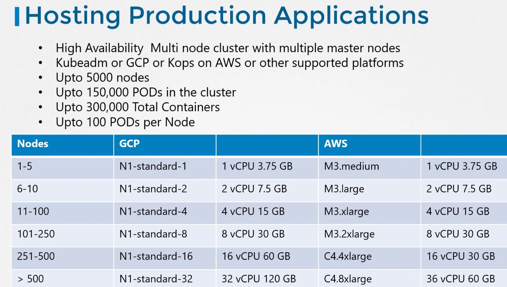

### Designing a Kubernetes cluster

Before designing ask
1. Purpose of the cluster
	1. Education or Dev/testing or hosting production application
2. Cloud or on-premise
3. Workloads
	1. How many? -> Few or many applications
	2. What kind? -> Web or big data analytics
	3. Applications resource requirement -> CPU or memory intensive
	4. Traffic -> Heavy or burst

- Determine the hardware requirement based on the resource requirement.
- Kubeadm tool can be used to deploy Kubernetes cluster on-premise
- GKE can be used to deploy on GCP
- Kops can be used to deploy on AWS
- AKS can be used to deploy on Azure

For hosting production application
- Highly available multi-node cluster with multiple master nodes
- Ex: Kubeadm, GCP, AWS via Kops etc
- Upto
	- 5000 nodes
	- 150,000 pods in cluster
	- 300,000 containers
	- 100 pods per node

---
