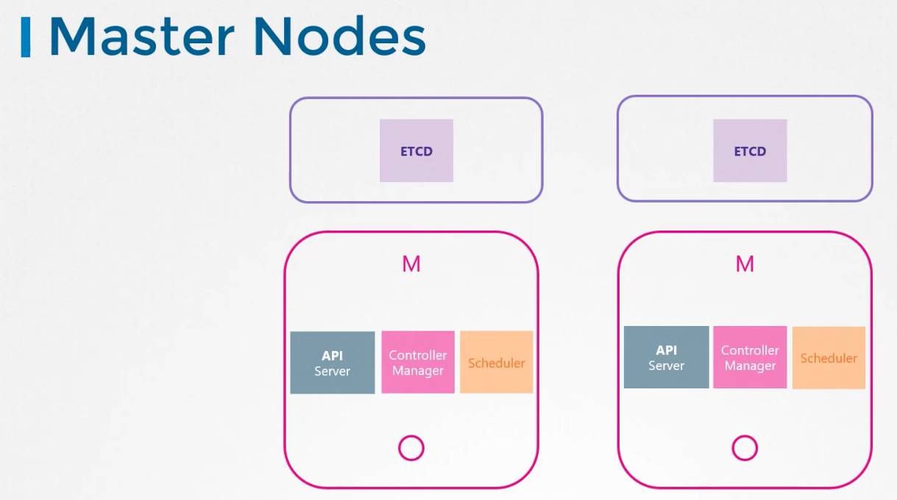
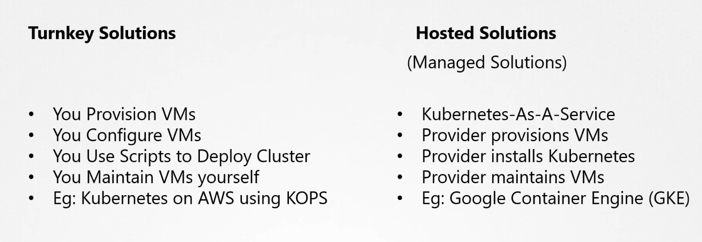

### Choosing Kubernetes Infrastructure

- Kubernetes cluster can be deployed on laptop, on-premise or on cloud
- To deploy a Kubernetes cluster on a local machine
	- Minikube - Deploys a single node cluster
	- Kubeadm - Can deploy a single node or multi-node cluster

Master Node

| Turnkey Solutions                                                                                       | Hosted Solutions (Managed solutoins)                                                                              |
| ------------------------------------------------------------------------------------------------------- | ----------------------------------------------------------------------------------------------------------------- |
| Where you provision the required VMS and use tools + scripts to configure Kubernetes cluster on them    | This is like Kubernetes as a service solution                                                                     |
| We are responsible for maintaining and patching the VM                                                  | Kubernetes is configured and maintained by the provider. The VMs are also maintained by the provider              |
| Ex: OpenShift, CloudFoundary Container Runtime, VMware Cloud PKS, Vagrant, Kubernetes on AWS using Kops | Ex: GKE on GCP, OpenShift Online, Azure Kubernetes Service, Amazon Elastic Container Service for Kubernetes (EKS) |

---
