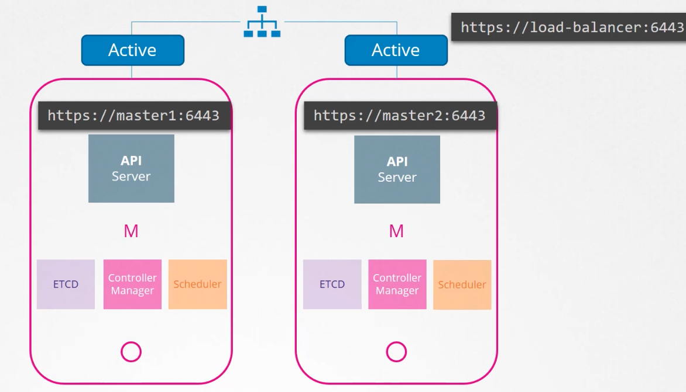
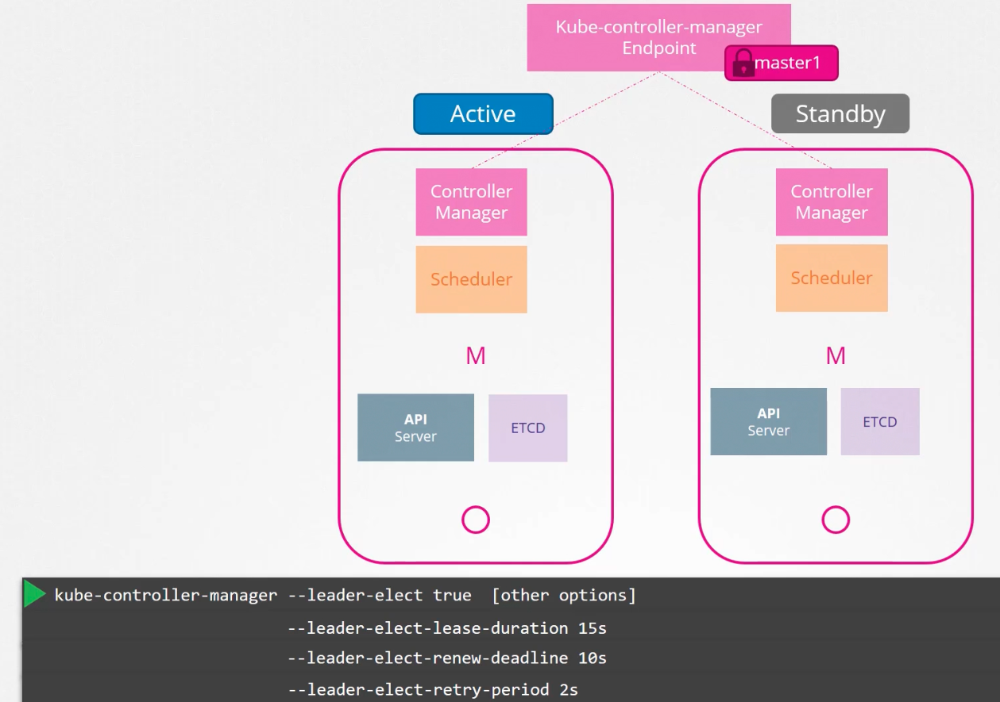
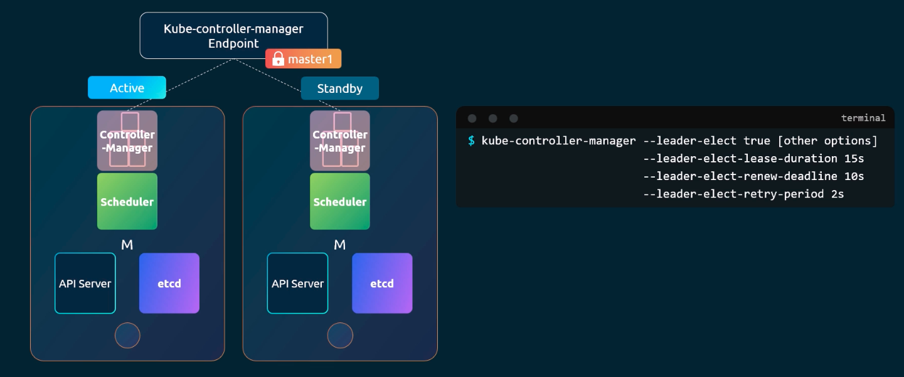
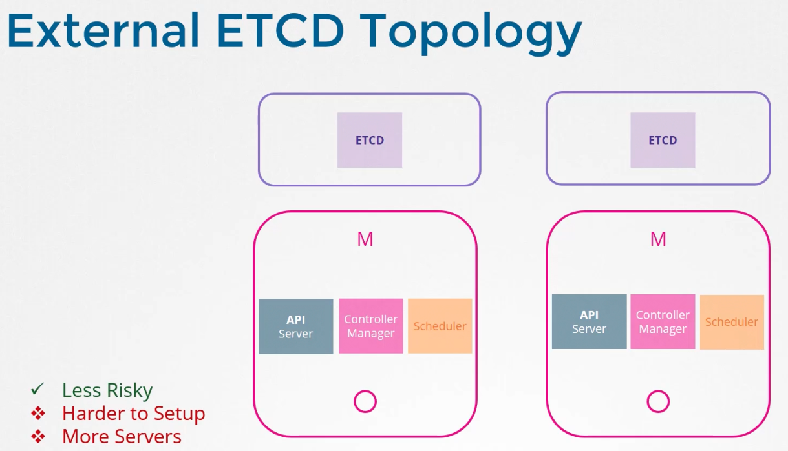
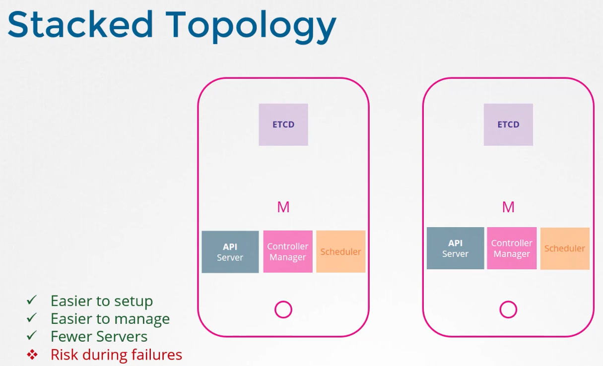
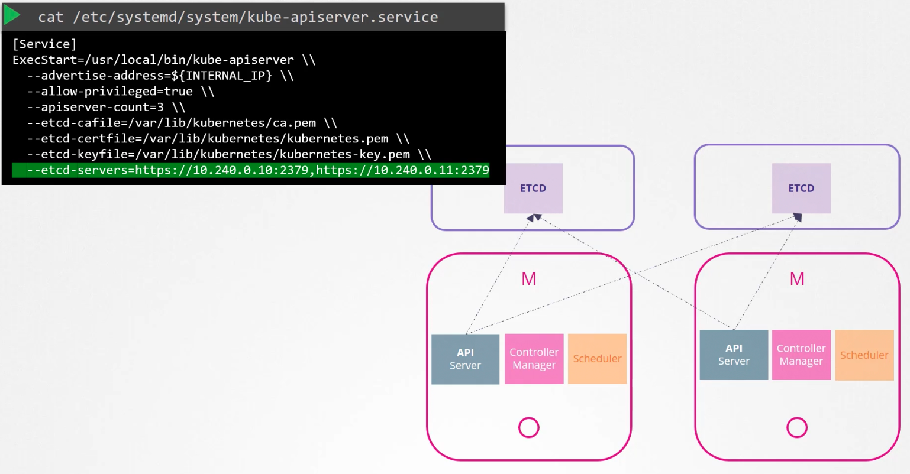

### Configuring High Availability

- Have master nodes for high availability (HA) in production.
	- Master node hosts all the control plane components
- API server on all master nodes in HA can be in active-active mode
	- This is for service requests coming into control plane components
	- Have a load balancer to split traffic to multiple API servers
- 
- Scheduler and Controller Manager components in control plane watch the state of cluster and take actions
	- They must not run in parallel
	- they must run in active-standby mode
	- A leader election process decides who is active
	- This is applicable for both Scheduler and Controller Manager
- 
- 
- To achieve HA for ETCD, it is separated from control plane nodes and is run on its own set of servers
	- This is external ETCD topology
- 
- Running ETCD as part of control plane node is Stacked topology
- 
- Make sure api-server is pointing to the right address of ETCD service
	- ETCD is a distributed system
	- Read happens from all instances and write can be on any one of the ETCD servers
- 

---
