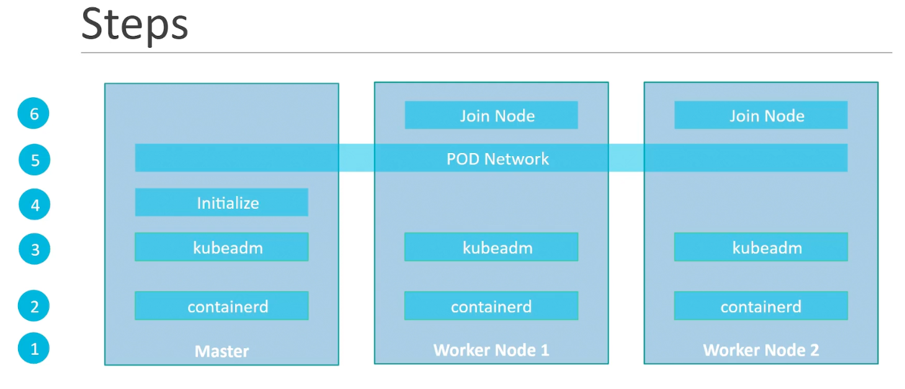

### Deployment with kubeadm - Introduction

- Provision master and worker nodes on VMs
- Install container runtime ContainerD on all nodes
- Install kubeadm tool, kubectl and kubelet on all nodes
- Initialize master
- Setup pod network
- Join worker nodes to master nodes
- Deploy application on the Kubernetes environment to test

The vagrant file used in the next video is available here:

[https://github.com/kodekloudhub/certified-kubernetes-administrator-course](https://github.com/kodekloudhub/certified-kubernetes-administrator-course)

Here’s the link to the documentation:

[https://kubernetes.io/docs/setup/production-environment/tools/kubeadm/install-kubeadm/](https://kubernetes.io/docs/setup/production-environment/tools/kubeadm/install-kubeadm/)

---
