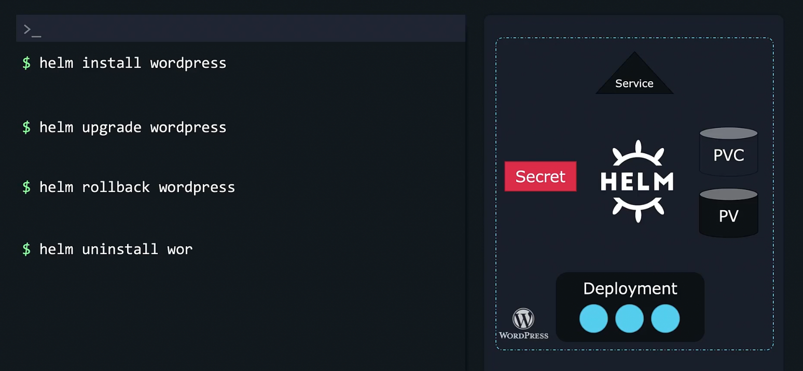

### What is Helm?

- In a given application, there can be multiple Kubernetes objects like deployments, persistent volumes, persistent volume claims, service, secret etc
- Each of the Kubernetes object will have a configuration file
- To deploy, we need to run `kubectl create -f ...` command on all the configuration yaml file separately
- Also, if we want to upgrade/update/change a Kubernetes object, say the size of persistent volume, we need to run `kubectl edit -f ...` on the appropriate Kubernetes object 
- As the Kubernetes objects grow, it will be very difficult to scale to maintain the configuration yaml files
- Helm treats an application as a package, and knows all components/Kubernetes objects and its corresponding configuration
	- It eases the deployment and maintenance of the application by abstracting the need to manually manage the Kubernetes objects
	- `helm install wordpress`
	- `helm upgrade wordpress`
	- `helm rollback wordpress`
	- `helm uninstall wordpress`
- Helm lets us treat our application as application, instead of a set of Kubernetes objects.
- 

---
