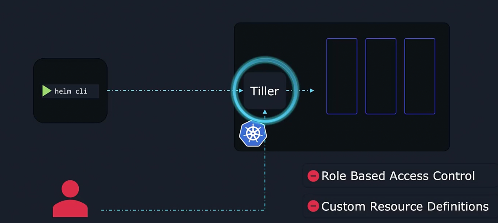
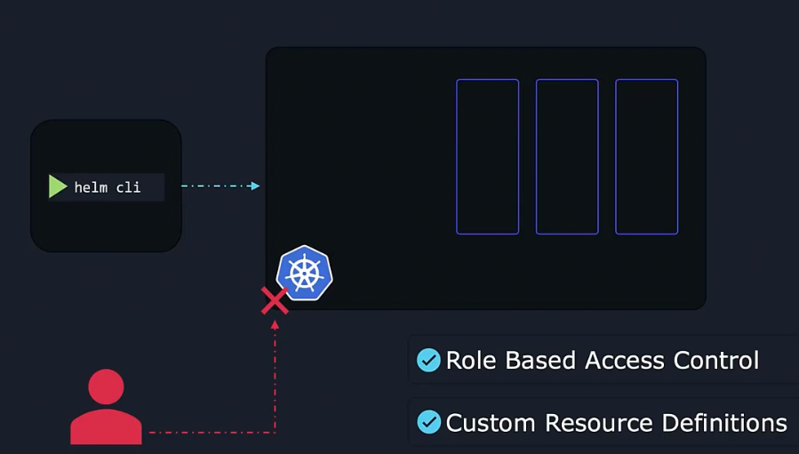
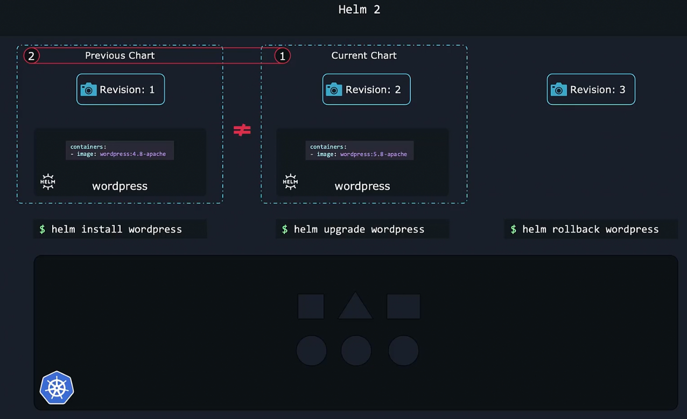
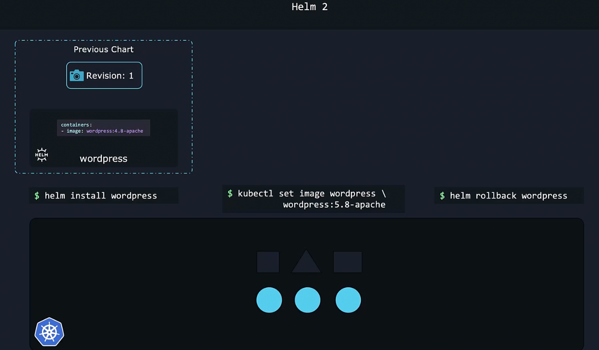
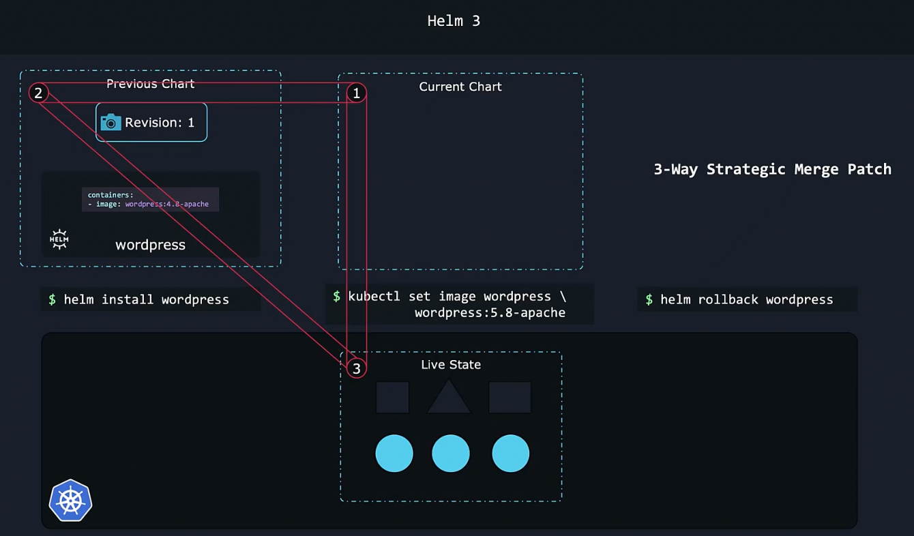

### Helm 2 vs Helm 3

- Helm has a CLI which helps perform Kubernetes operations
- Helm 2 used tiller to talk to cluster
- 
- Helm 3 spoke to cluster directly
- 
- Helm 2 compares the current chart to the previous chart, to determine where to rollback to
	- If something is changed manually, helm 2 will not be able to identify
- 
- 
- Whereas Helm 3 compares the live state to the current chart and the previous chart, to determine where to rollback
	- This is called as 3-way strategic merge patch
- 

---

