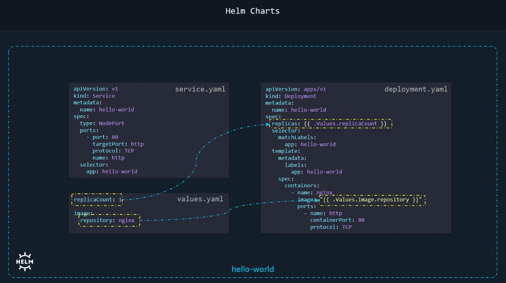
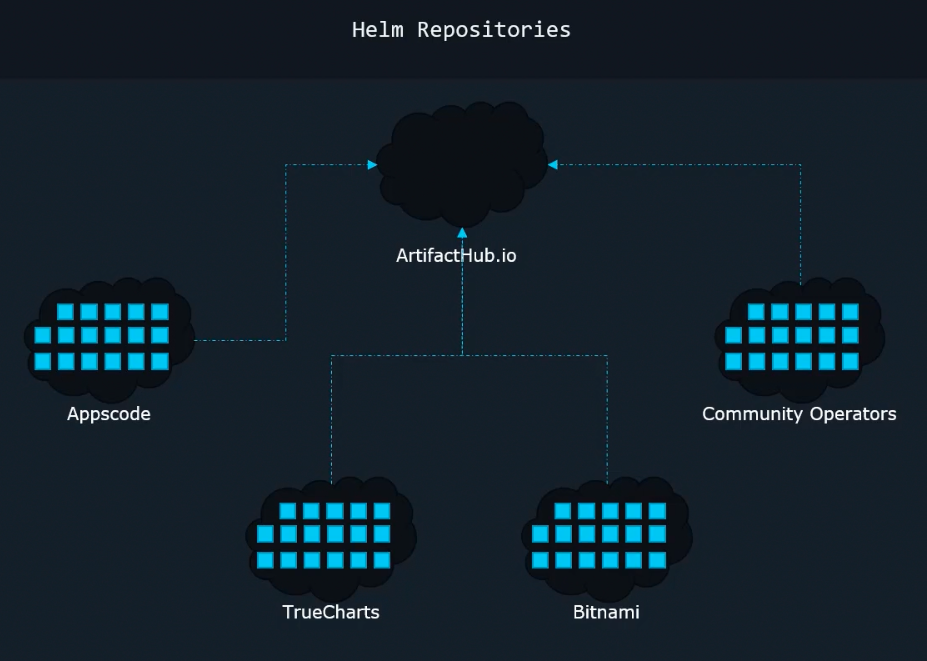
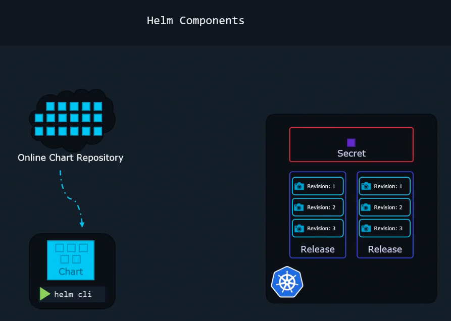

### Helm Components

- Helm CLI
	- To run commands
- Helm charts
	- Collection of files that contain all instructions that helm needs to create a collection of Kubernetes objects in the cluster
	- 
- Release
	- When a chart is applied, a release is created
	- A release is a single installation of an application using a helm chart
- Revision
	- Each release will have multiple revisions
	- Each revision is like a snapshot of the application
- Online chart repository
	- Helm charts can be found on public repository - artifacthub.io
	- 
- Metadata
	- Contains all information about the chart used, revisions, release details etc
	- This is stores in cluster as Kubernetes secret.
- 

---
