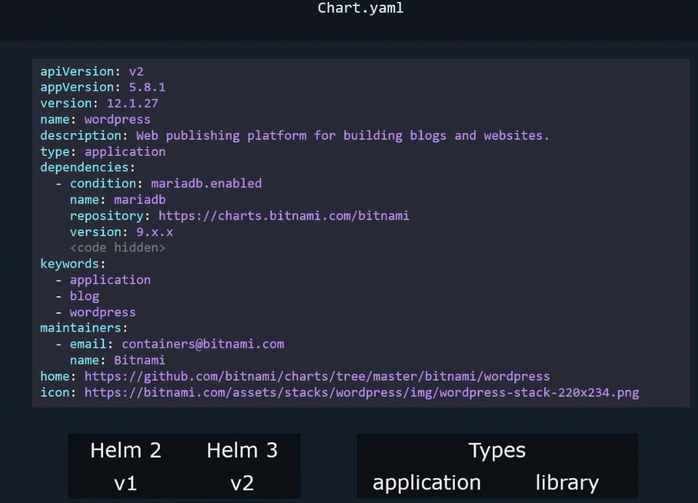
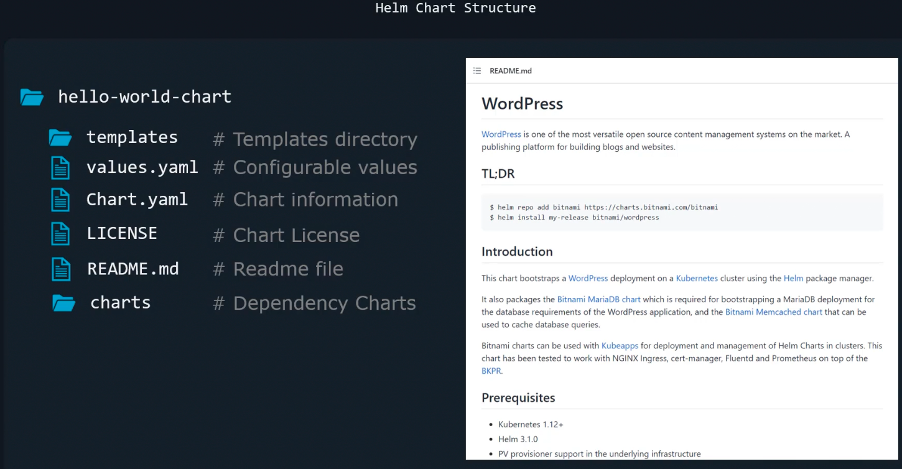

### Helm Charts

- ![[helmcharttemplatesvalueschart.png]]
- apiVersion for Helm 2 will not be set or will be set to v1 in chart.yaml file
- apiVersion for Helm 3 will be set to v2 in chart.yaml file
- apiVersion
	- For informational purposes
- version
	- Version of chart
- name and description
	- Name and description of chart
- Dependencies
	- Different tiers of application like DB is specified here
- Keywords and maintainers
	- Information purposes
- Home and icon
	- Icon and home url
- type:
	- application or arbitrary
- 
- 

---
