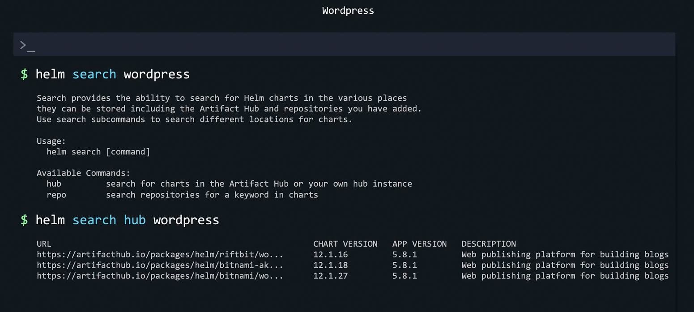
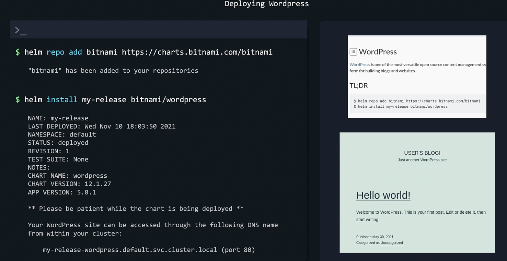
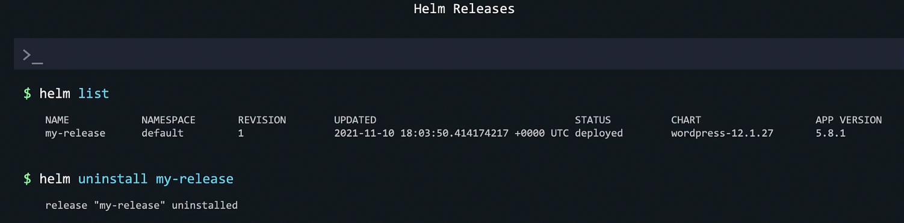
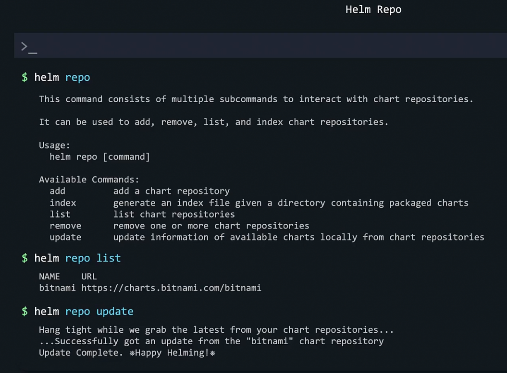

### Helm Basics

- `helm --help`
- `helm repo --help`
- `helm repo update --help`
- `helm rollback --help`
- `helm search hub wordpress`
	- Search the repository for Wordpress application
	- 
- Deploy application
	- Add bitnami repository
		- `helm repo add bitnami https://charts.bitnami.com/bitnami`
	- Deploy application
		- `helm install my-release bitnami/wordpress`
		- Application is deployed as a release
	- 
	- List all releases
		- `helm list`
	- To remove the deployed application
		- `helm uninstall my-release`
	- 
	- To list existing repositories
		- `helm repo list`
	- To update repository
		- `helm repo update`
	- 

---
