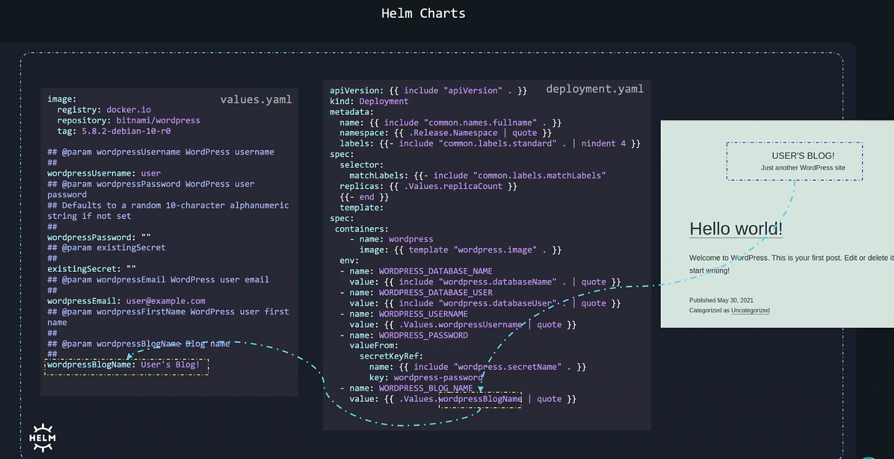
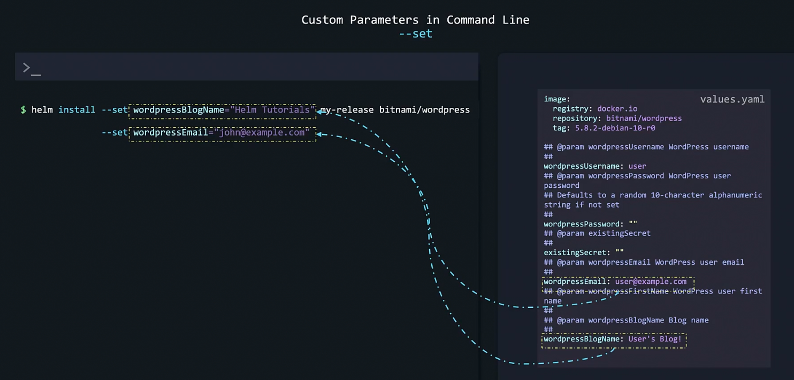
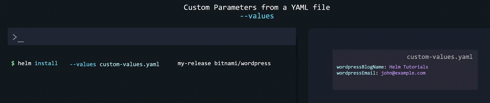
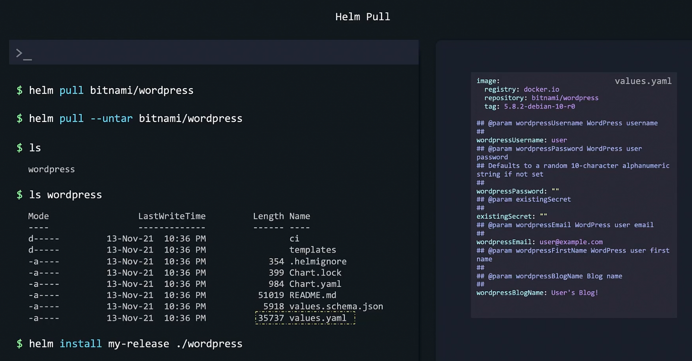
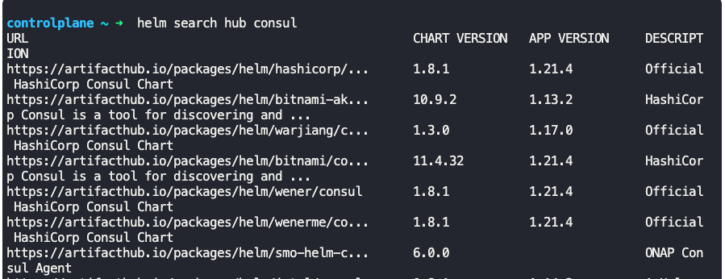
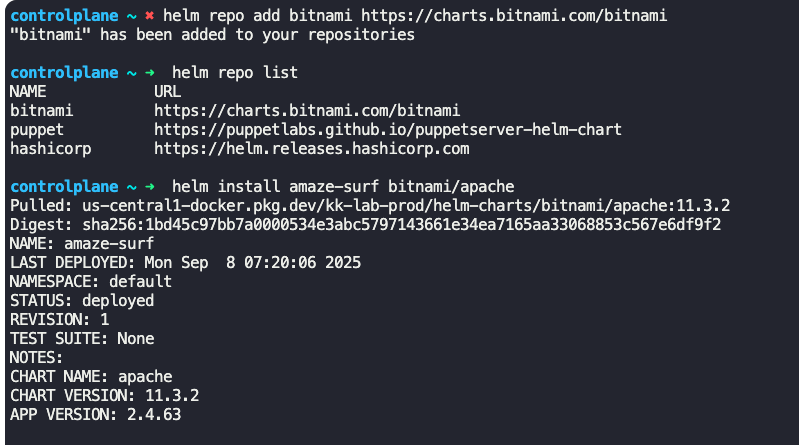
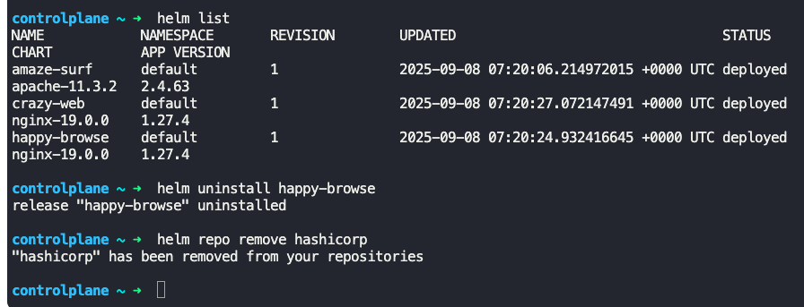

### Customizing chart parameters

- deployments.yaml reads data from values.yaml
- 
- Values in values.yaml can be changed for customization
	- These values can be changed via command line
		- `helm install --set wordpressBlogName="Helm Tutorials" my-release bitnami/wordpress`
	- 
	- The values can also be changed by moving these values to a custom values file, say custom-values.yaml
		- `helm install --values custom-values.yaml my-release bitnami/wordpress`
	- 
	- These values can also be changed by setting them in the default values.yaml file
		- `helm pull bitnami/wordpress` -> Pull the chart
		- `helm pull --untar bitnami/wordpress` -> Pull the chart and extract it
		- Change the values in values.yaml file
		- Install the Wordpress - `helm install my-release ./wordpress`
	- 
- To find a helm chart for say Wordpress, in artifact hub
	- `helm search hub wordpress`
	- 
- To find a helm chart for say Wordpress, in the repository added
	- `helm search repo wordpress`
- To remove repository
	- `helm repo remove hashicorp`
- 
- 

---

