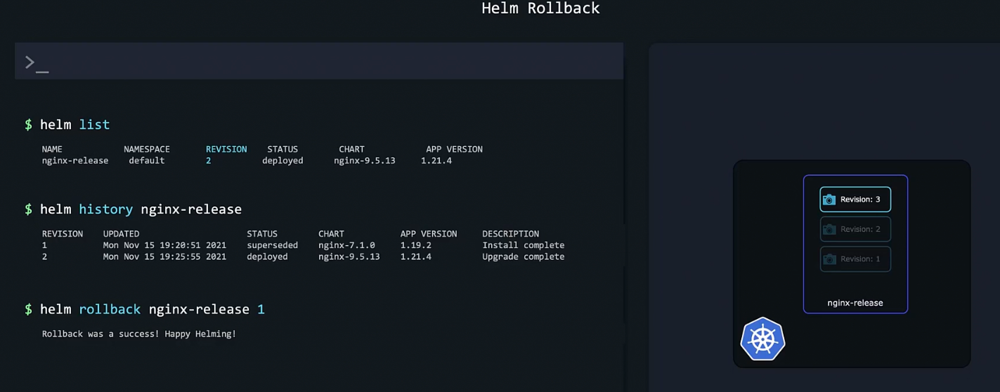

### Lifecycle management with Helm

- `helm list`
	- Lists releases
- `helm history <release_name>`
	- Gives information about various revision and when upgrades happened
- `helm install nginx-release hitnami/nginx --version 7.2.0`
	- Installs and creates a release
- `helm rollback <release_name> <revision_number>`
	- Rolls back to the revision number specified
	- Also creates a new revision
	- Rollback will not rollback a persistent volume
- To upgrade
	- `helm upgrade <release_name> <repo_name> --version <version_number>`
- 

---
