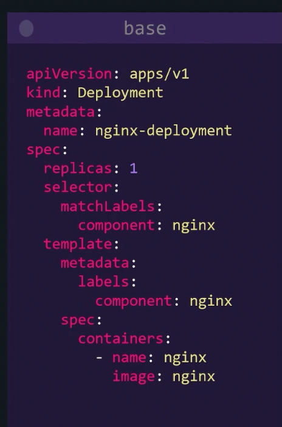
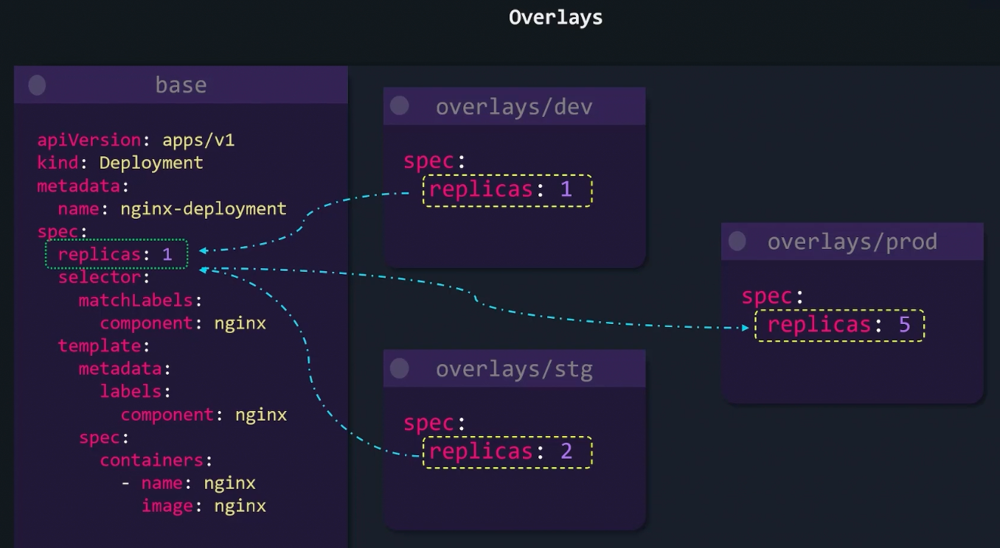
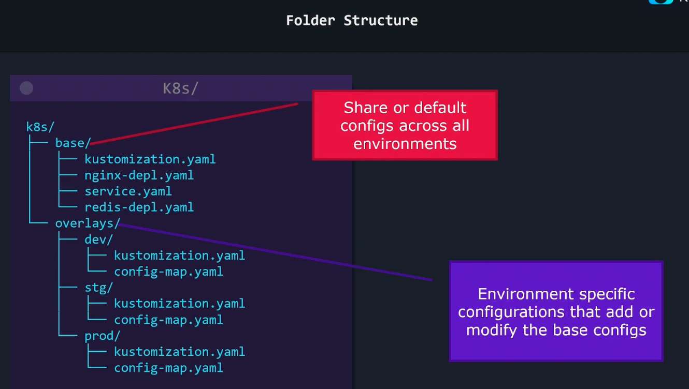

### Kustomize problem statement and Ideology

- How to configure applications on per environment basis, like dev environment needs only 2 replicas, staging needs 5 and prod needs 10?
	- One could have 3 different definition files, each for one environment, having different values as applicable, under /dev, /stg and /prod
	- This is not optimal approach. Every file created or modified should be replicated to all folders /dev, /stg and /prod.
	- Can raise to potential mismatch overtime
	- Kustomize addresses this problem
- We need to reuse Kubernetes configs across environments and only modify the variables that need to be changed on a per environment basis
- Kustomize has 2 basic terms
	- Base config
		- Represents config which is identical across environments
		- Represents default values
	- 
	- Overlay
		- Allows us to customize behaviour in per environment basis
	- 
- 
- Kustomize comes built-in with kubectl
	- May need to install Kustomize CLI to get latest version
- Kustomize does not use any templating language like Helm, its plain yaml.

---
