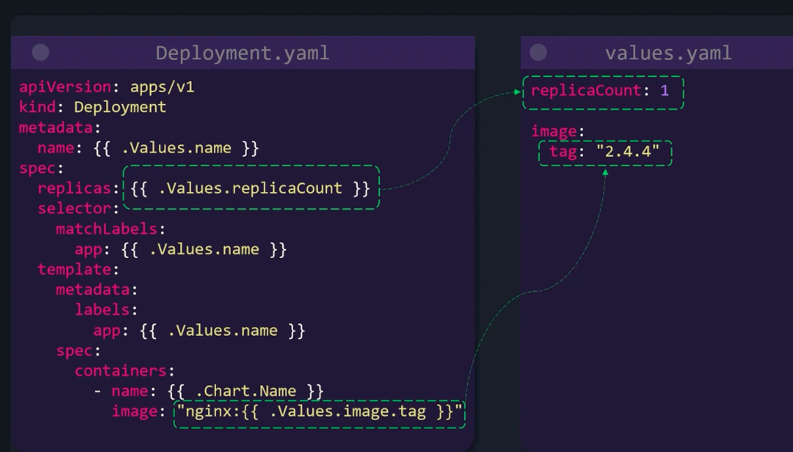
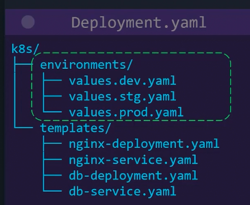

### Kustomize vs Helm

- Helm also provides capabilities to modify Kubernetes object properties on per environment basis
- Helm is also a complete package manager for the application
- Helm has additional extra features like conditionals, loops, functions and hooks
- Helms are not valid yamls, as they use templating syntax
- Kustomize is comparatively easier and simpler
- 
- 

---
