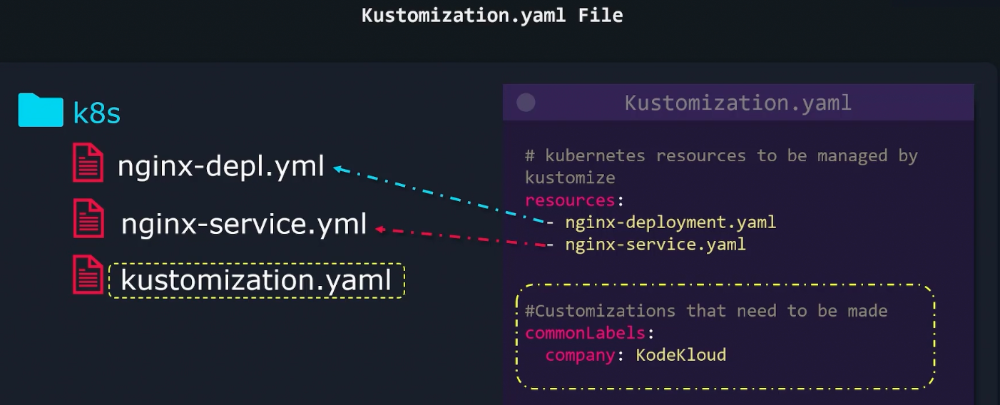

### kustomization.yaml file

- kustomization.yaml file contains
	- List of all Kubernetes object or resource yaml file to be managed
	- All the customization/transformation we need to change
- 
- `kustomize build k8s/`
	- Builds and gives out what the final config file looks like in the termial
	- Does not deploy

---
