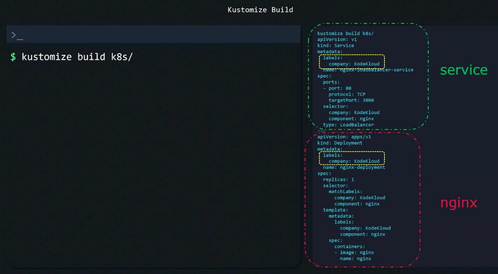
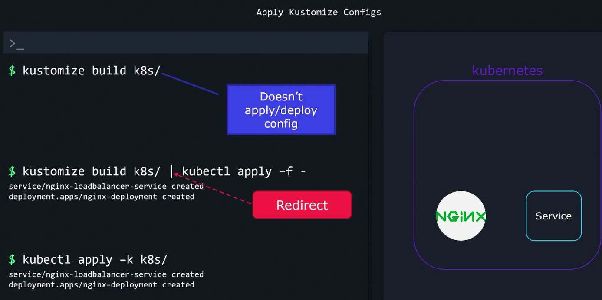
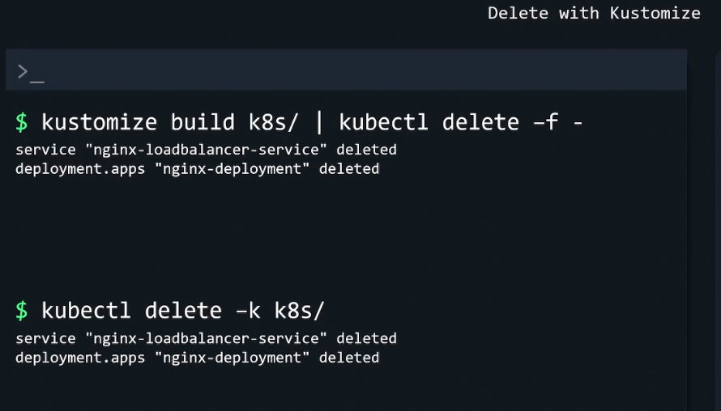

### Kustomize output

- `kustomize build` command does not deploy
- 
- To build and deploy
	- `kustomize build k8s/ | kubectl apply -f -`
	- `kubectl apply -k k8s/`
- 
- Delete with Kustomize
	- `kustomize build k8s/ | kubectl delete -f -`
	- `kubectl delete -k k8s/`
- 

---
