### Managing Directories

- Say our application consists of apis and dbs.
	- We split the corresponding Kubernetes object yaml files into the respective sub-directories
	- Like apis will go into k8s/api/ and db will go into k8s/db/
	- To create the object we run
		- `kubectl apply -f k8s/api/`
		- `kubectl apply -f k8s/db/`
	- 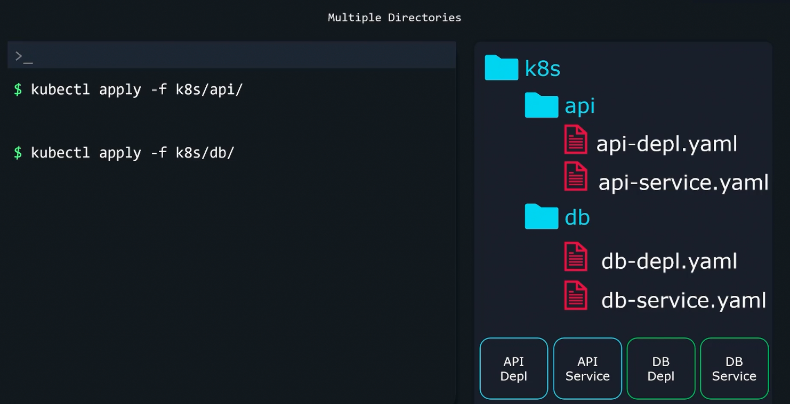
	- 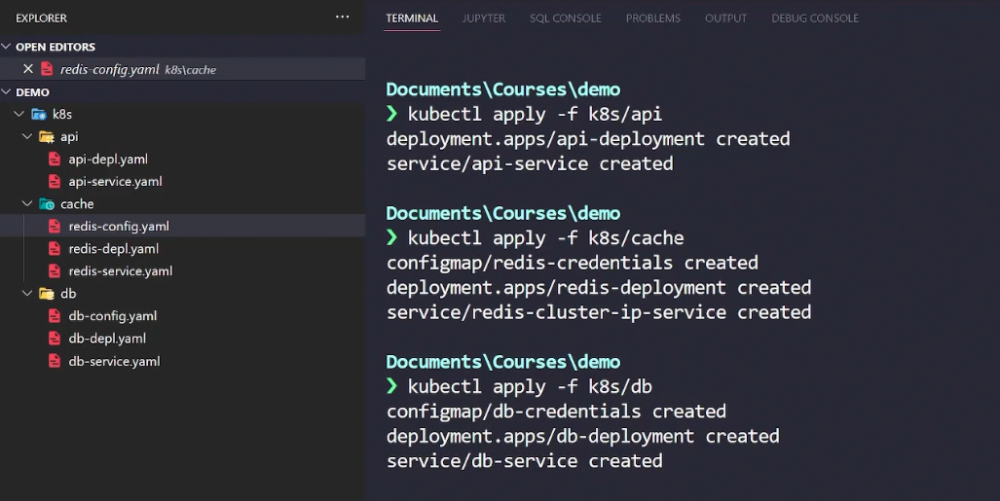
- Things start to get messy if the number of files and folders grow
- To overcome this we create kustomization.yaml file in the root of the directory
	- We will specify all the resources in this file
	- To deploy, it is going to be a single command
		- `kustomize build k8s/ | kubectl apply -f -` or `kubectl apply -k k8s/`
	- 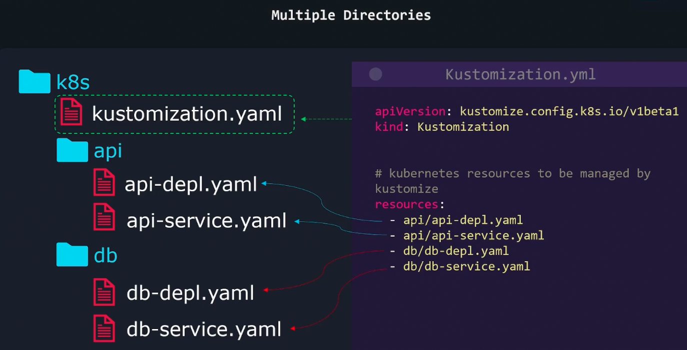
	- 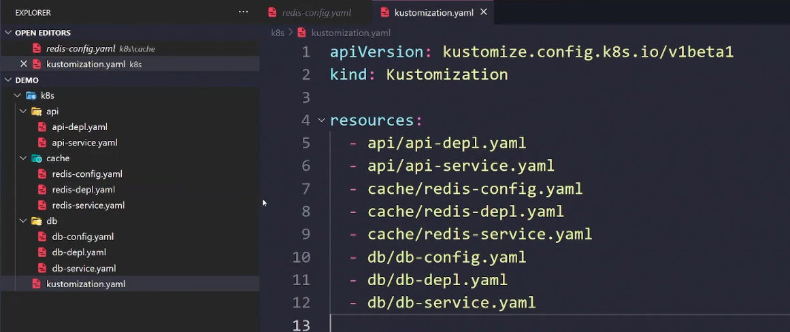
	- 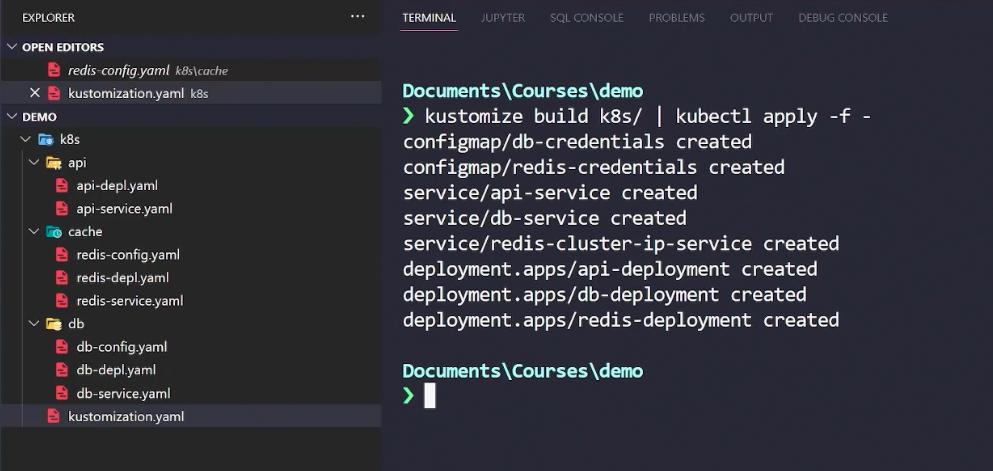
- If the number of directories grow, we can add kustomize.yaml file in each sub-directories.
	- The kustomize.yaml file in the sub-directory will contain the resources in that sub-directory only
	- 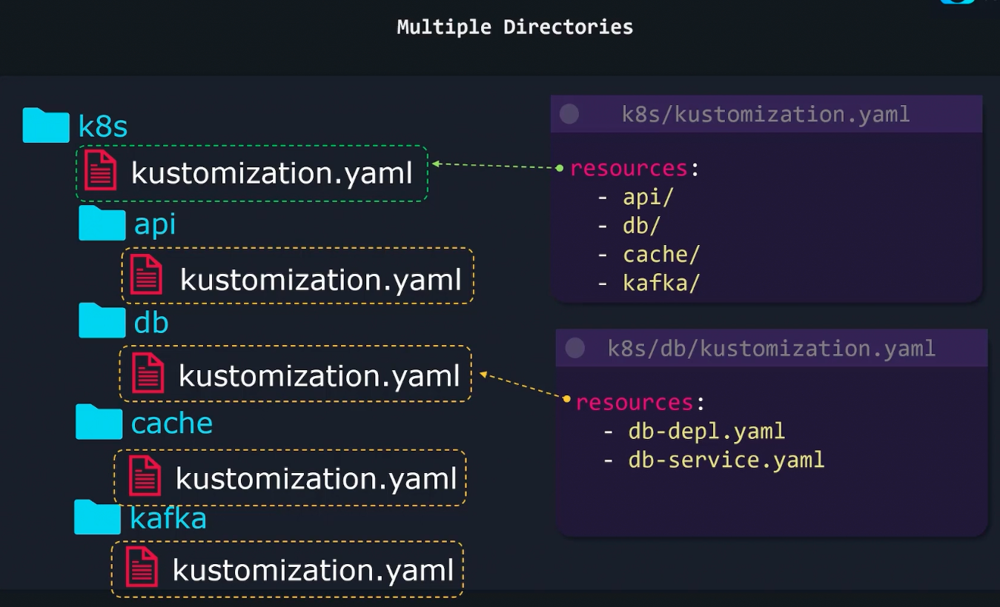
	- 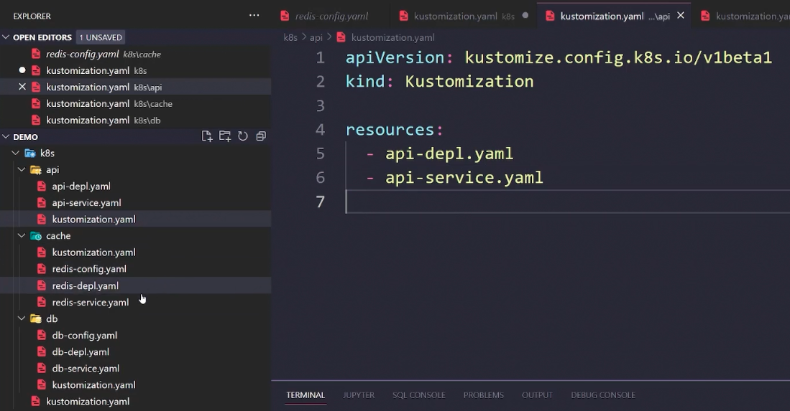
	- 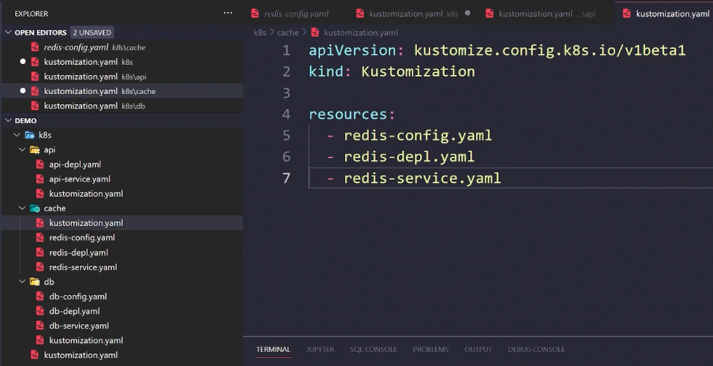
	- 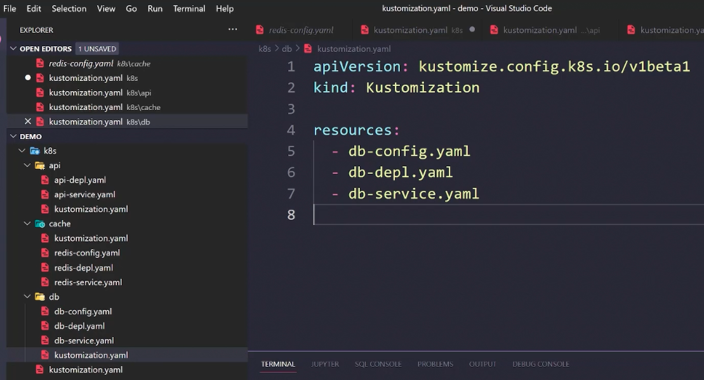
- In the root kustomize.yaml file, we can include the path of the sub-directories
	- 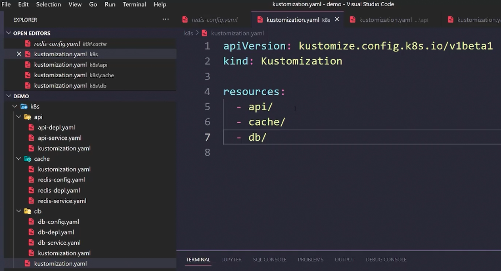
	- To apply
		- `kustomize build k8s/ | kubectl apply -f -` or `kubectl apply -k k8s/`
	- 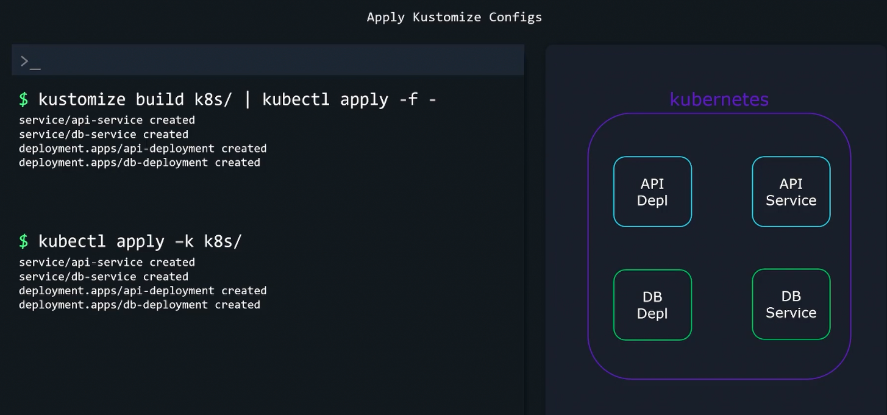
	- 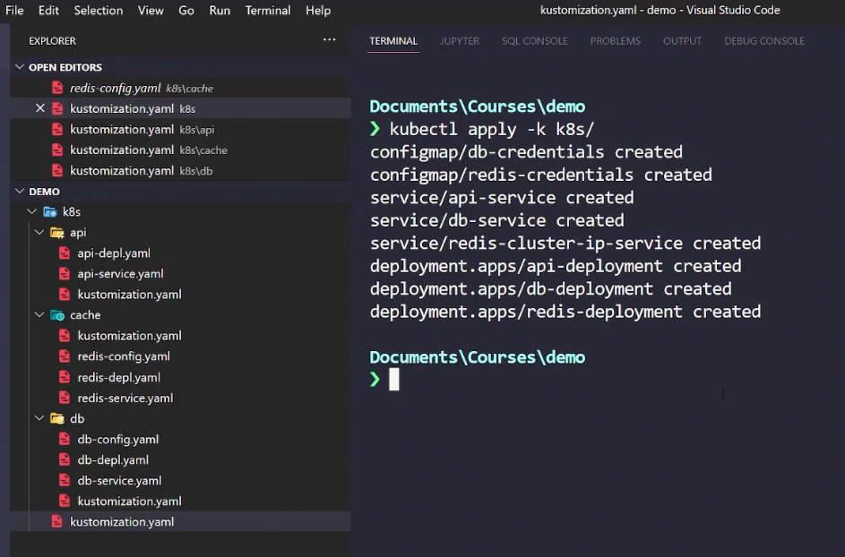

```kustomization.yaml
apiVersion: kustomize.config.k8s.io/v1beta1
kind: Kustomization
resources:
  - db/db-depl.yaml
  - nginx/nginx-depl.yaml
```

- To delete
	- 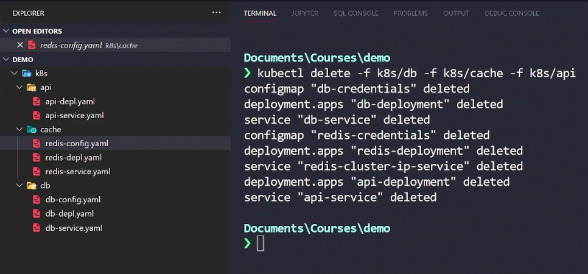


---

