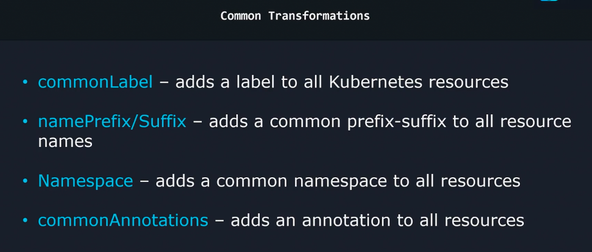
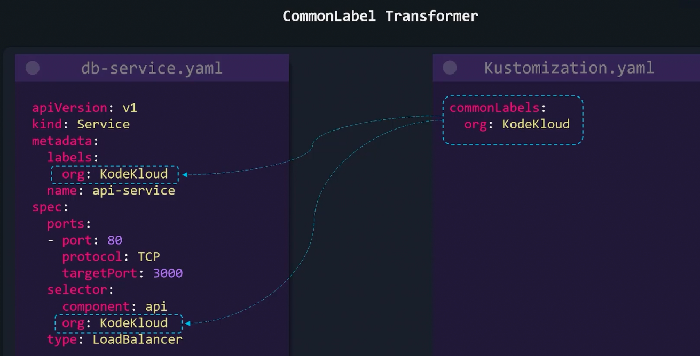
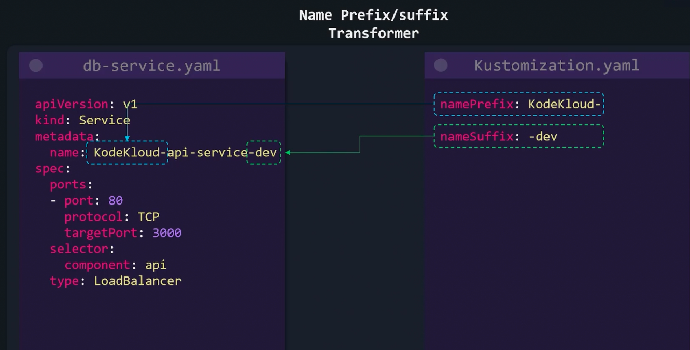
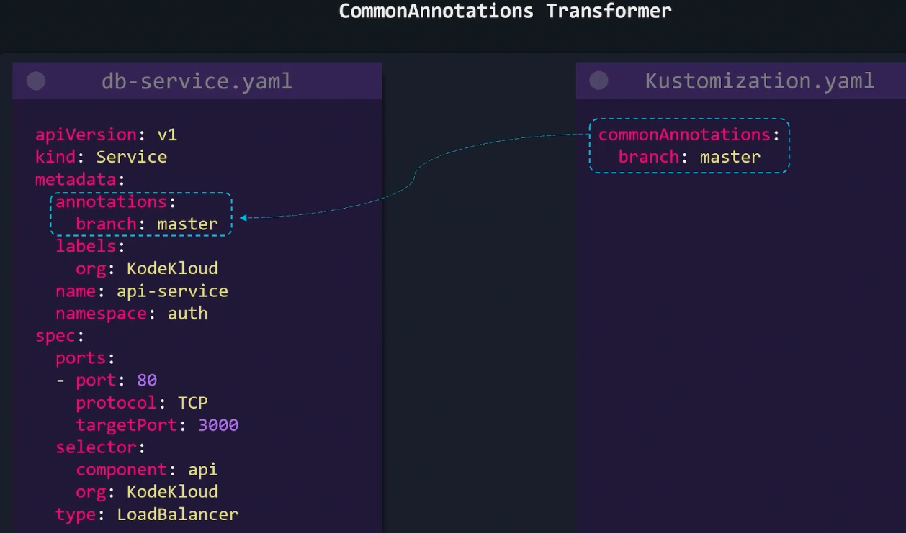

### Common Transformers

- If we want to apply some common configurations, like labels across all yaml (org:Dev) or adding a prefix or suffix to a name ("dev-"), we can use common transformers
	- To do this manually across all files is not scalable and time consuming
- Different types of common transformers
	- commonLabel
	- namePrefix/Suffix
	- Namespace
	- commonAnnotations
- 
- 
- 
- 
- 
- commonLabel transformer set on a kustomization.yaml file applies to all resources in its level and sub-level.
	- So, if you apply commonLabel at root, it applies to all resources
	- If you apply to a kustomization.yaml file in a sub directory, then it applies only to that sub directory
- The above behaviour applies to all transformations as well

```
commonLabels:
  department: engineering
namespace: debugging
namePrefix: kodekloud-
nameSuffix: -web
commonAnnotations:
  logging: debugging
images:
  - name: mongo
    newName: postgres
    newTag: "4.2"
```


---
