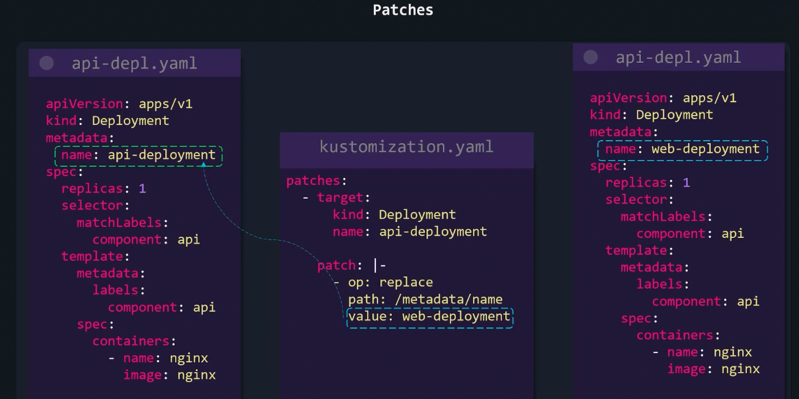
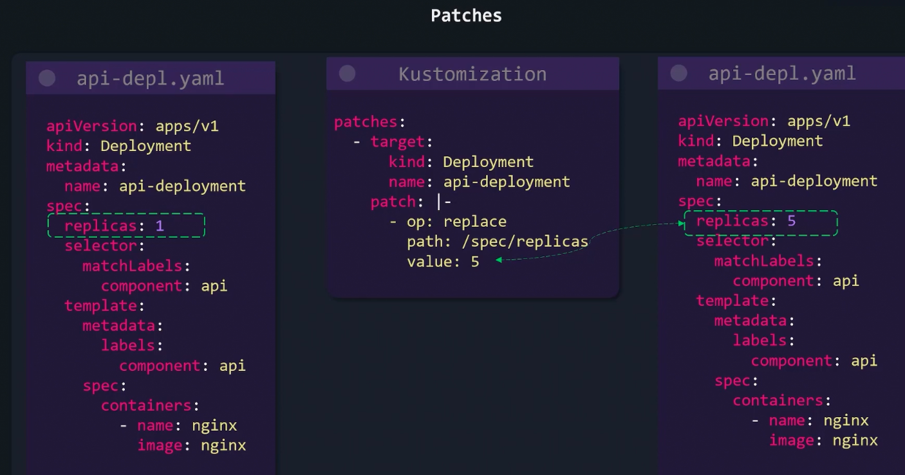
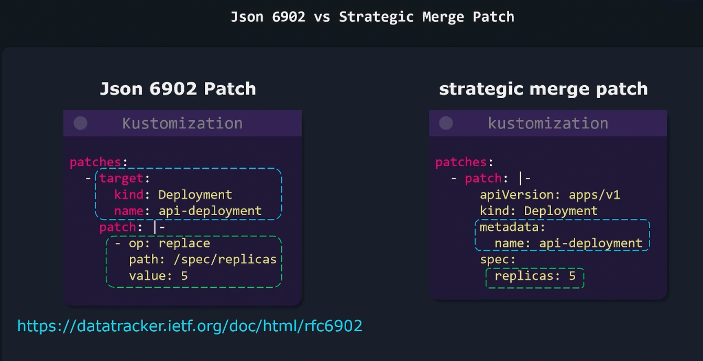

### Patches

- If you want to apply a change across board, use transformer
- If you want to apply a specific change to one object, or a couple of objects, use kustomize patch
	- Ex: Updating # of replicas in deployment
- 3 parameters are required for kustomize patch
	- operationType
		- add/remove/replace
		- add/remove can be for labels
		- replace can be for replica count
	- Target
		- What resource should this patch be applied on
		- kind, Version, Name, Namespace, labelSelector, AnnotationSelector
	- Value
		- What is the value that will either be replaced or added
- 2 ways to define patch
	- Json 6902 patch
		- Needs target
		- Needs patch details
	- Strategic Merge Patch
		- Specify what needs to be patched
- 
- 
- 

---
