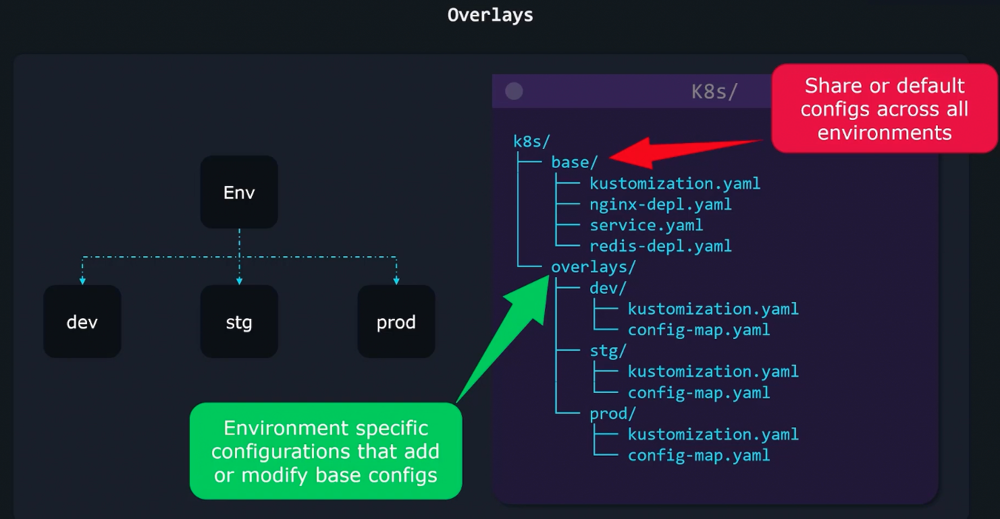
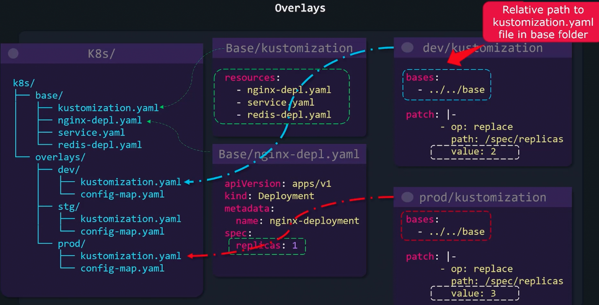
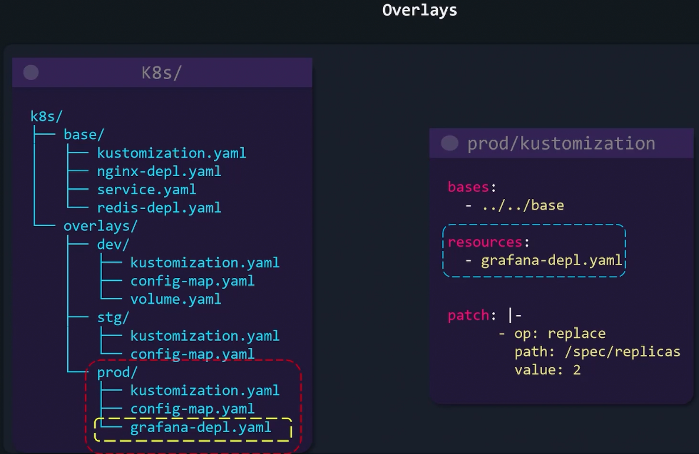

### Overlays

- Kustomize can take base Kubernetes config and customize it per environment basis
	- In environment specific folders we can add as many resources we want
	- Kustomize provides flexible folder structure
- 
- 
- 

---
