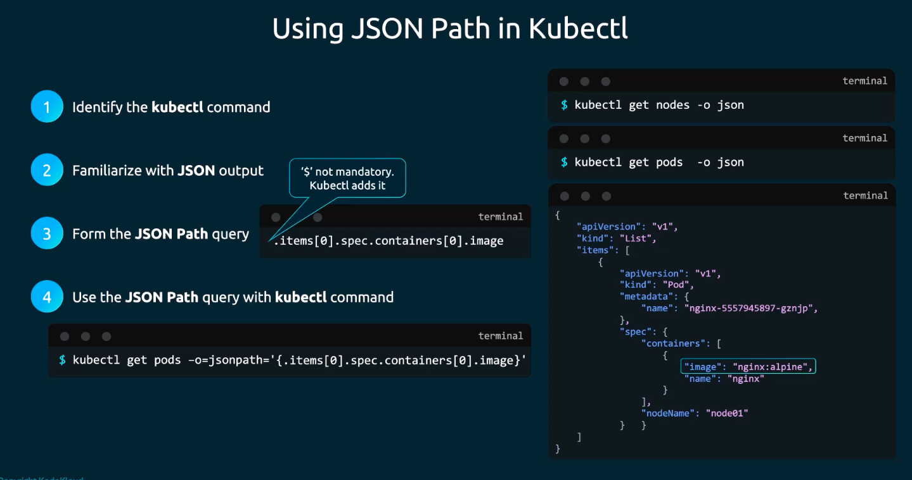
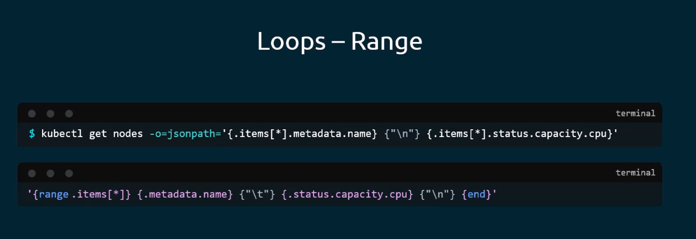
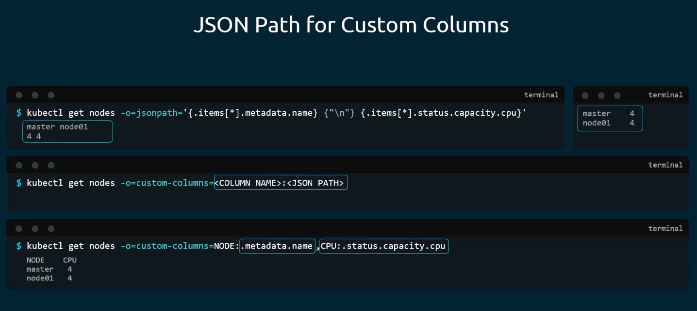

### JSON Path in Kubernetes

- Using json path in kubectl
	- Identify the kubectl command
		- Ex: `kubectl get nodes`, `kubectl get pods`
- Get the output in json format
	- Ex: `kubectl get nodes -o json`
- Form the json path query
	- For ex for "image:" -> `.items[0].spec.containers[0].image`
	- jsonpath.com evaluates the query
- Use json path query with kubectl command
	- `kubectl get pods -o=jsonpath='{.items[0].spec.containers[0].image}'`
	- `kubectl get nodes -o=jsonpath='{.items[*].metadata.name}'`
	- `kubectl get nodes -o=jsonpath='{.items[*].nodeInfo.architecture}'`
	- `kubectl get nodes -o=jsonpath='{.items[*].status.capacity.cpu}'`
- 
- Merge commands
	- `kubectl get nodes -o=jsonpath='{.items[*].metadata.name}{.items[*].status.capacity.cpu}'`
	- When merging, you can make the output pretty by using `{"\n"}` for new line and `{"\t"}` for tab.
- Loops-Range
	- `'{range.items[*]}{.metadata.name}{"\t"}{.status.capacity.cpu}{"\n"}{end}'`
- 
- Custom columns
	- `kubectl get nodes -o=custom-columns=Node:.metadata.name,CPU:.status.capacity.cpu`
- 
- Sort
	- `kubectl get nodes --sort-by=.metadata.name`
	- `kubectl get nodes --sort-by=.status.capacity.cpu`

---
