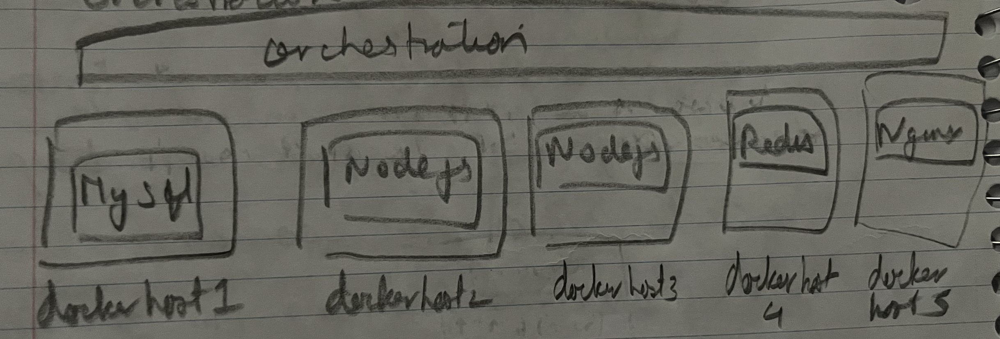

### Container orchestration

- The whole process of deploying and managing containers is called Container orchestration.
- 
- Manages dependencies and connectivity with other containers.
- Manages scaling up and scaling down based on traffic.
- Manages failures and crashes in a container.

**Container Orchestration Technologies**
- Docker Swarm
	- Easy to setup but lacks advanced features for complex applications
- Kubernetes
	- Developed by Google.
	- Most popular and has advanced features.
	- Steep learning curve.
	- Supported on AWS, GCP and Azure
- Mesos
	- Developed by Apache
	- Difficult to setup and has advanced features.

**Container orchestration takes care of**
- Hardware failures, by deploying containers on different nodes.
- Load balances traffic based on resource utilization automatically.
- Scale up or down, both horizontally and vertically, as per requirement.

---
