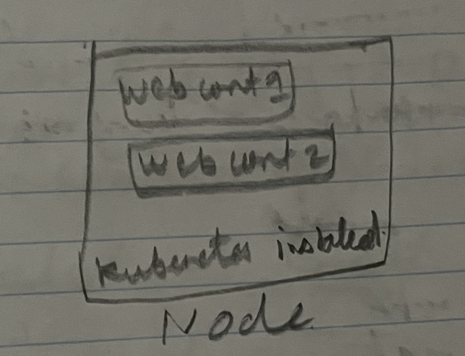
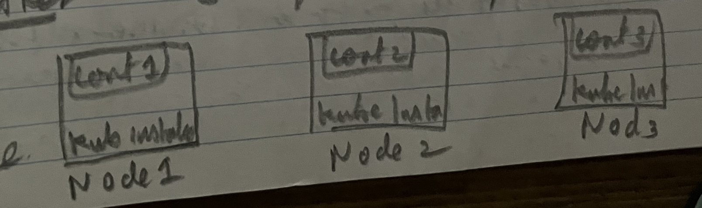
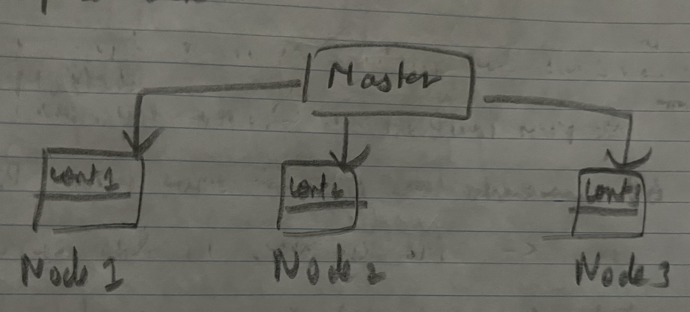
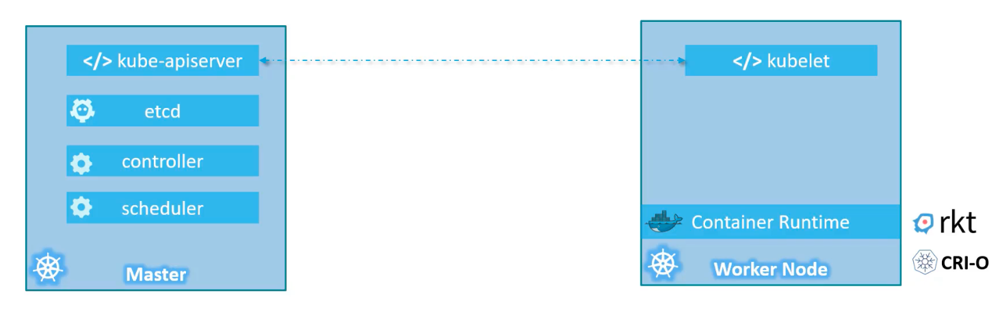
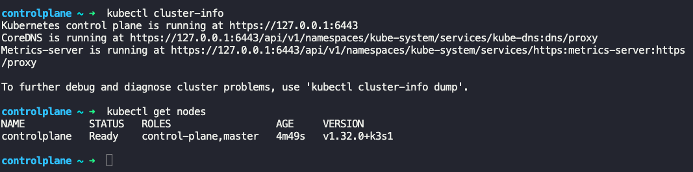
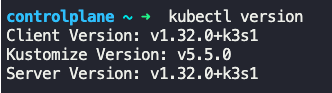
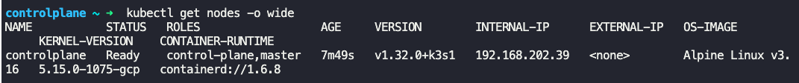

### Kubernetes architecture

**Node**
- Physical or virtual machine where Kubernetes is installed.
- Node is worker machine (or minions) where kubernetes will deploy and launch containers.
- 

**Cluster**
- Set of nodes grouped together is called a Cluster.
- Assists in load balancing
- 

**Master**
- Master is a node with kubernetes installed on it and is configured as Master,
- Master node is responsible for managing the cluster.
- Has information about the members of the cluster.
- Monitors nodes for health.
- Moves workload of failed nodes to another worker nodes
- Master is responsible for actual orchestration of container.
- 

### Components getting installed when Kubernetes is installed

- API Server
	- Frontend for kubernetes to interact with kubernetes cluster
- etcd
	- Distributed and reliable key-value store, to store data needed to manage kubernetes cluster.
	- Implements locks to avoid conflict within cluster
- scheduler
	- Responsible for distributing work across containers/nodes
- controllers
	- Brain behind orchestration
	- Monitors health of nodes
	- If a node goes down, it brings up new nodes
- kubelet
	- Agent that runs on each node in the cluster.
	- Makes sure that the containers are running on the nodes as expected.

Components installed in
- Master node
	- kube-api server
	- etcd
	- controller
	- scheduler
- Worker node
	- kubelet
	- container runtime (Docker, Rkt, Cri-o)
- 

### kubectl
- Known as Kube command line tool or kube control
- Used to deploy and manage applications on a kubernetes cluster, like cluster information, status of nodes etc.
- $`kubectl run hello-world` -> Deploys an application in cluster
- $`kubectl cluster-info` -> Gives information about cluster
- $`kubectl get nodes` -> Gives all nodes in the cluster
	- 
- $`kubectl version` -> Gives kubernetes version
	- 
- $`kubectl get nodes -o wide` -> Gives the flavour and version of OS on which kubernetes nodes are running.
	- 

---
