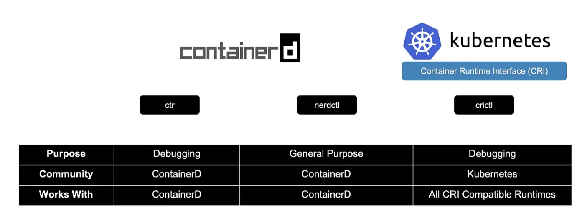
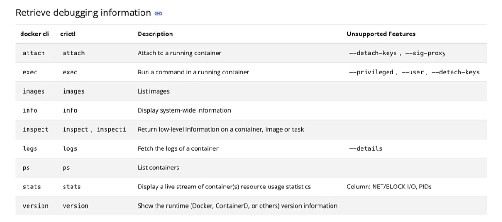

### Container Runtime Interface (CRI)

- Allows kubernetes to orchestrate any container runtimes such as, Docker, Rkt, Cri-o etc

### Open Container Initiative (OCI)

- Image spec
	- How an image should be built
- Runtime spec
	- How a container runtime should be developed.
- Using OCI, anybody can build a container runtime, and kubernetes can orchestrate it
- Docker did not adhere to OCI
	- Kubernetes used to use "docker shim" to orchestrate docker container, as Docker did not adhere to OCI.
		- From kubernetes v1.24, kubernetes dropped "docker shim" and hence for docker container runtime.

### ContainerD

- Part of Docker, but maintained separately
- `ctr` is a command line tool for ContainerD for debugging.
	- Supports limited set of features
	- $`ctr images pull docker.io/library/redis:alpine` -> Pulls/downloads image
	- $`ctr run docker.io/library/redis:alpine redis` -> Pulls/downloads image and runs the image in a container
- `nerdctl`
	- Specifically for ContainerD
	- Provides `docker` like CLI for ContainerD
	- Supports docker compose
	- Supports new features in ContainerD
		- Encrypted container image
		- Lazy pulling
		- P2P image distribution
		- Image signing and verification
		- Namespaces in kubernetes
	- $`nerdctl run --name redis redis:alpine`
	- $`nerdctl run --name webserver -p 80:80 -d nginx`

### CRICTL

- `crictl` is a CLI from kubernetes
- Developed and maintained by kubernetes community
- Works across different CRI compatible container runtimes like ContainerD, Rkt.
- It is installed separately
	- Used to inspect and debug container runtimes
- $`crictl pull busybox`
- $`crictl ps -a`
- $`crictl exec -i -t <cont_id> ls`
- $`crictl pods`
- $`crictl images`
- $`crictl logs <cont_id>`

---
