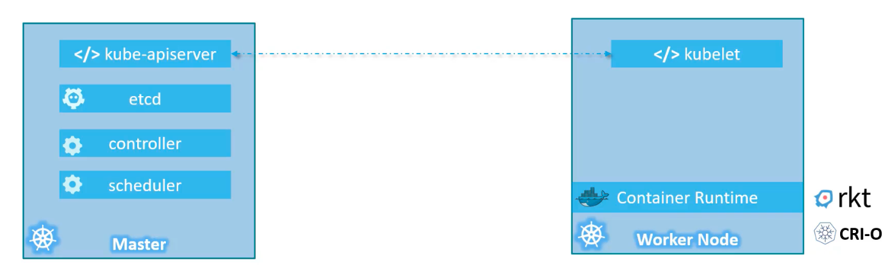
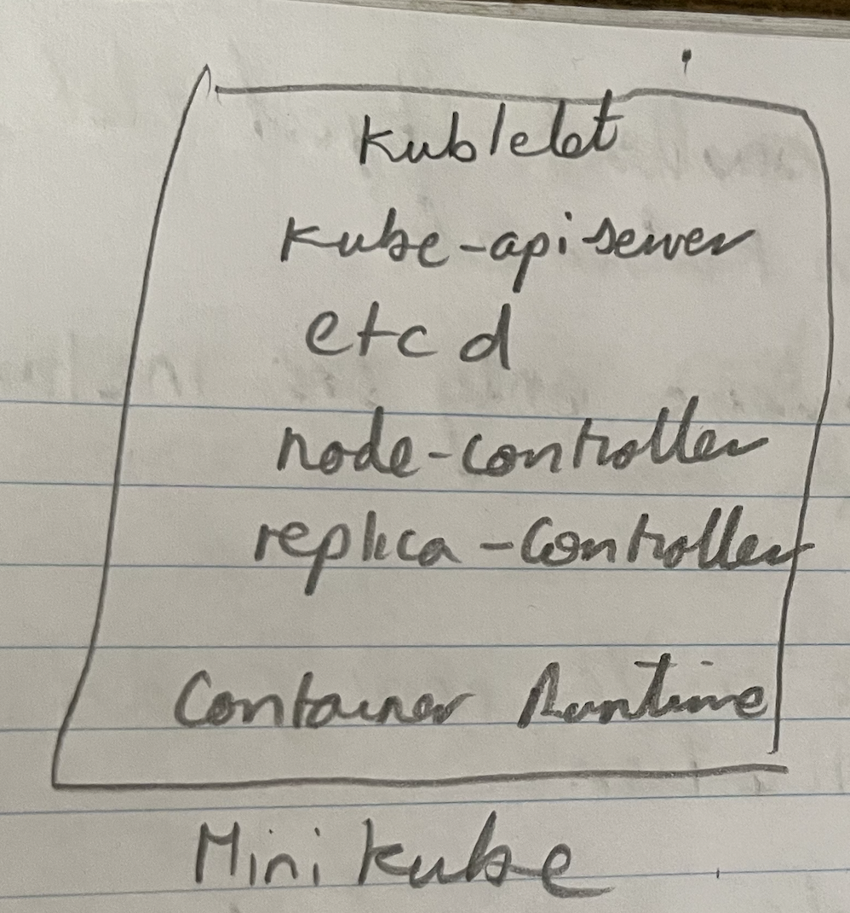
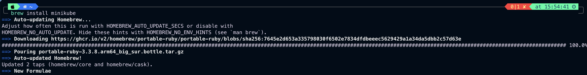
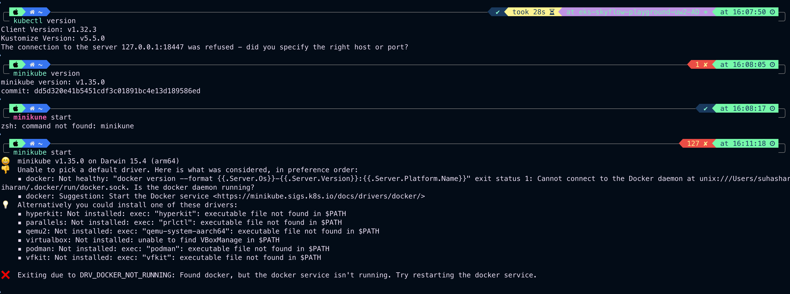
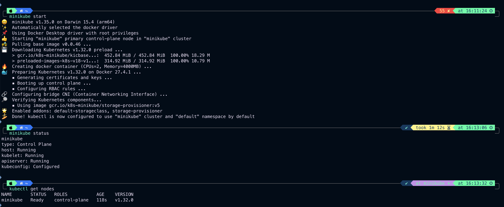
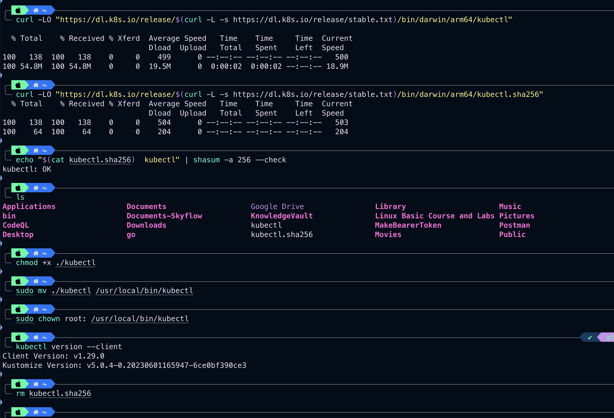
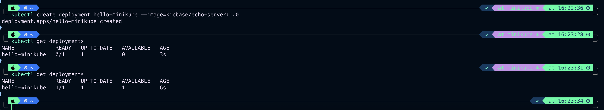
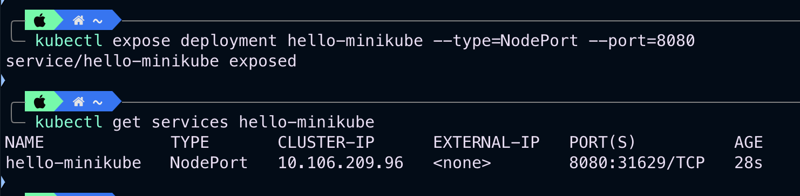
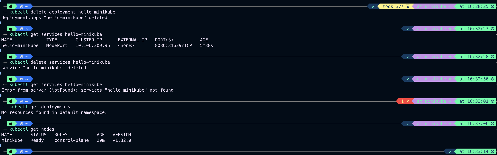

### Introduction and installation

- Minikube and Microk8s can be used to setup kubernetes in laptop
	- To play around and learn kubernetes
- `kubeadm` tool is to bootstrap and manage production grade kubernetes cluster.
- Hosted solutions are available on GCP, AWS and Azure.

### Minikube and Kubectl

- Typically when installing kubernetes, Master and Worker nodes are created sperately as below
- 
- Minikube bundles all the above components into a single node kubernetes cluster
- 
- Minikube install
	- 
	- Minikube start without docker
	- 
	- Minikube start and status $`minikube start` and $`minikube status`
	- 
- Kubectl install
	- 

### Kubectl

- $`kubectl get nodes`
- $`kubectl create deployment hello-minikube --image=kicbase/echo-server:1.0`
- $`kubectl get deployments`
- 
- $`kubectl expose deployment hello-minikube --type=NodePort --port=8080`
- $`kubectl get services hello-minikube`
- 
- $`kubectl delete deployment hello-minikube`
- $`kubectl delete services hello-minikube`
- 

---
