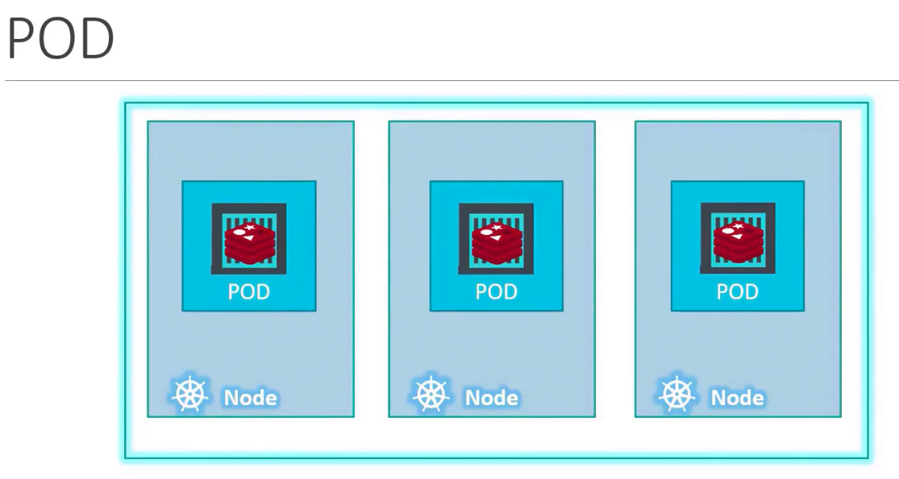
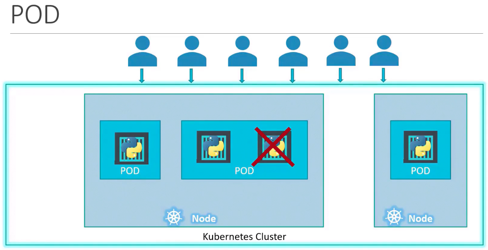
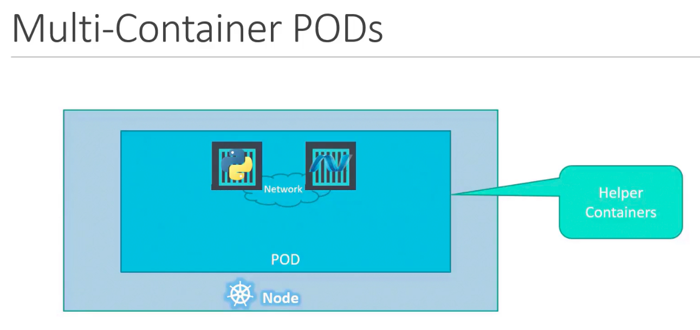
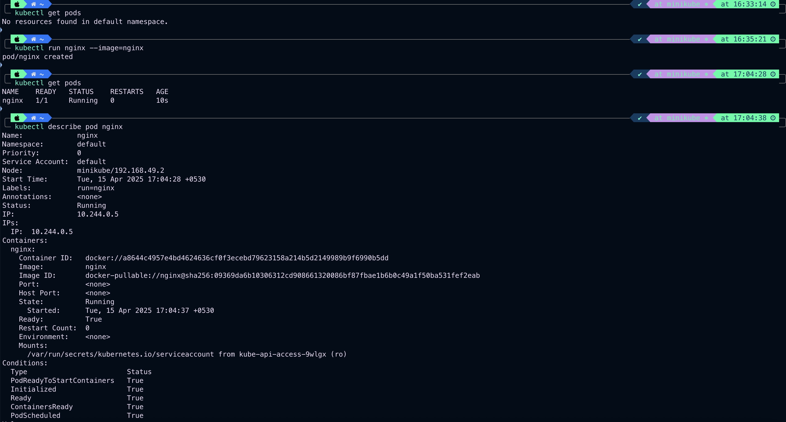
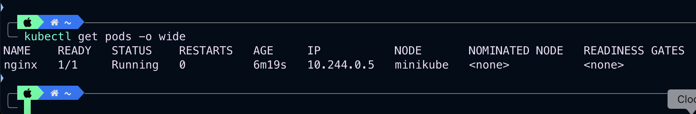

### Pods

- Kubernetes encapsulates containers into an object called pod.
- Pod is an single instance of an application.
- Pod is the smallest object that can be created in kubernetes.
- A pod contains only one instance of an application
- To scale, we create new pods with instances of the application.
- If the node runs out of space, we bring in new node and create new pods with instances of the application
- Pod has 1-1 relationship with container it is running.
- 
- 
- A node will have many pods running.
- A cluster will have 1 or more nodes running.

**Multi-container Pod**
- If we need a helper container (like istio sidecar) to assist our application container, both of these can reside in the same pod.
- They share the same network and storage space.
- 

**kubectl**
- $`kubectl run nginx --image nginx`
	- The first mention of `nginx` can be replaces with any name
	- The second mention of `nginx` must match the image name in docker hub.
	- The above command
		- deploys a pod
		- deploys an instance of nginx application by downloading the image from docker hub
- $`kubectl get pods`
	- Lists pods in the cluster
- $`kubectl describe pod nginx`
	- Provides detailed information about pod, like name of the container, node name and IP of node, IP of pod, container id, events in pod etc.
- 
- $`kubectl get pods -o wide`
	- Provides a bit of additional information like node where the pod is running and IP of pod.
- 

---
