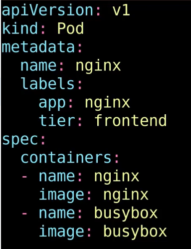
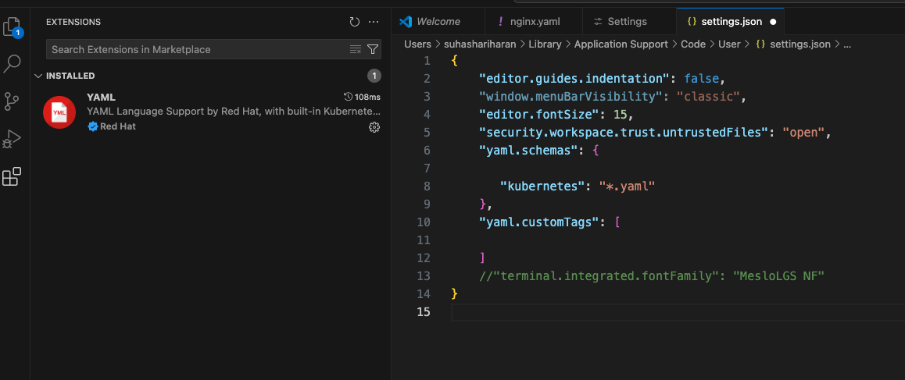
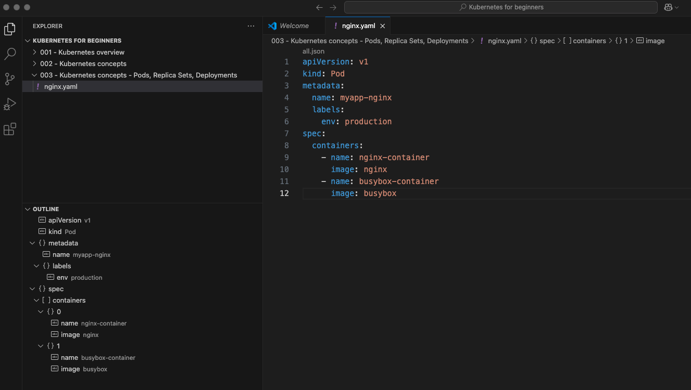
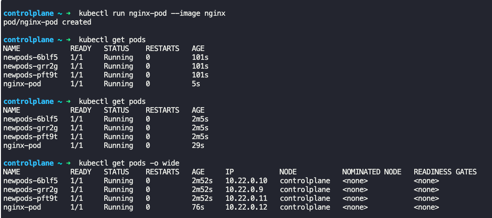
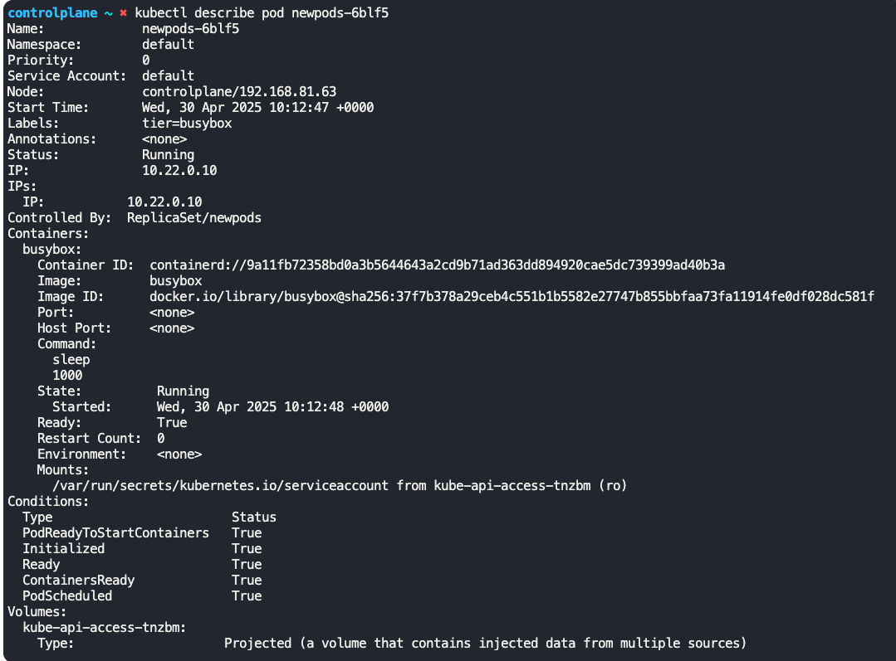
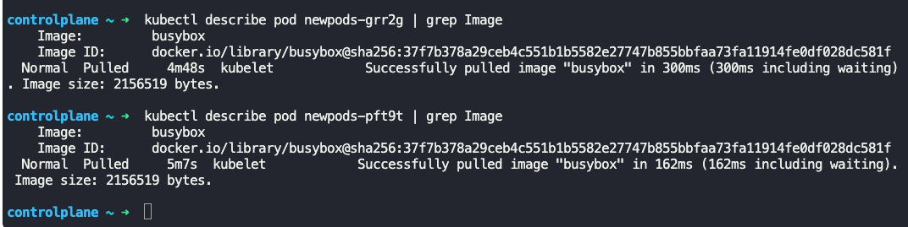
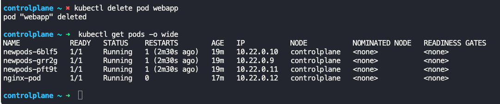
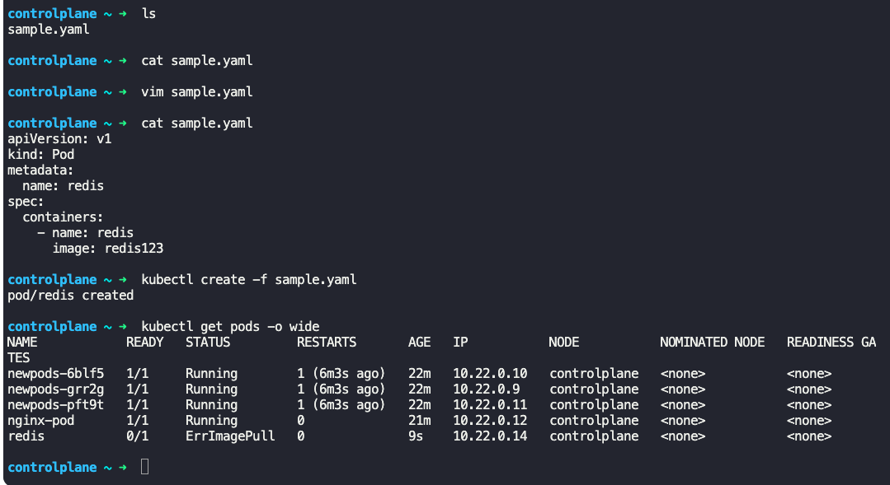
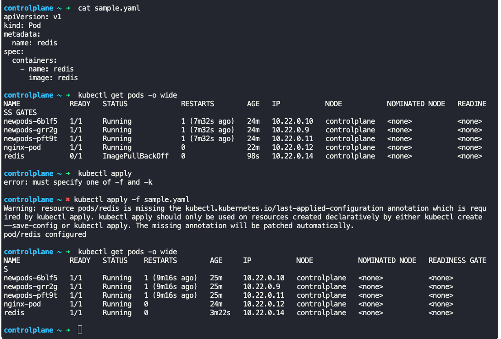

### Pods with YAML

- Kubernetes uses YAML files as inputs for creation of objects such as pods.
- Kubernetes definition file contains 4 top or root level fields, which are required.
``` 
    apiVersion:
    kind:
    metadata:
    spec:
```
- `apiVersion` - Version of kubernetes API, like `v1`, `apps/v1`
- `kind` - type of object we are creating like, `Pod`, `ReplicaSet`, `Deployment`, `Service`
- 

| kind       | version |
| ---------- | ------- |
| Pod        | v1      |
| Service    | v1      |
| ReplicaSet | apps/v1 |
| Deployment | apps/v1 |
- `metadata` - Data about the object
```
metadata:
  name: voting-app-pod
  labels:
    name: voting-app-pod
    app: demo-voting-app
```

- 
	- `metadata` is represented as dictionary
	- `name` and `labels` fields are not modifiable.
	- Data under `labels`are modifiable.
- `spec` - Specification of the object being created
```
spec:
  containers:
    - name: nginx-container
      image: nginx
```

- `containers` is represented as a list and `-` indicates first item in the list.
	- In a pod definition file, there can be multiple containers.
	- `name` can be anything to represent the container
	- `image` has to match the name in docker hub.

- All put together, a pod definition file will look like
```
apiVersion: v1
kind: Pod
metadata:
  name: voting-app-pod
  labels:
    name: voting-app-pod
    app: demo-voting-app
spec:
  containers:
    - name: nginx-container
      image: nginx
```

- Save the file as a YAML file, say pod-definition.yaml.
- $`kubectl create -f pod-definition.yaml`
	- Creates the pod
- $`kubectl get pods`
	- Lists all the pods
- $`kubectl decribe pod voting-app-pod`
	- Gives detailed information about a pod

**General instructions for creating YAML files**
- Can use any editor, such as vim
- Use 2 spaces for indentation for uniformity
- 
- `kubectl create` and `kubectl apply` commands work similarly.
- `kubectl apply -f pod-definition.yaml`
	- Creates pod based on configuration in yaml file
- Can use a IDE such as VSCode for creating YAML files
	- Use "YAML by RedHat" extension for YAML validation.
		- Settings->YAML:schemas->edit in settings.json
		- Enter the following
```
"yaml.schemas": {
   "kubernetes": "*.yaml"
}
```
- 
- Save , quit VSCode and reload
- On the left panel, outline shows the structure of the yaml file
- 
- $`kubectl run nginx-pod --image nginx`
	- Creates a pod named "nginx-pod" with the image "nginx"
- $`kubectl get pods -o wide`
	- Compared to just `get pods` command, it gives more details
	- In "Ready" column, "RunningContainersinPod/TotalContainersinPod" is mentioned
- 
- $`kubectl describe pod <pod_name>
	- Gives detailed information about the pod, including
		- Image used for the containers in the pod
		- Number of containers running in the pod
		- Status of the containers, such as, Running, Error/Waiting etc
- 
- 
- $`kubectl delete pod <pod_name>`
	- Deletes the pod
- 
- To make changes to yaml file, there are couple of ways
	- $`kubectl edit pod <pod_name>`
		- Make changes and save. The changes are applied automatically
	- Edit the yaml file in a editor like vim, and save changes
		- Run $`kubectl apply -f pod-definition.yaml` to apply changes made.
	- 
	- 


---
