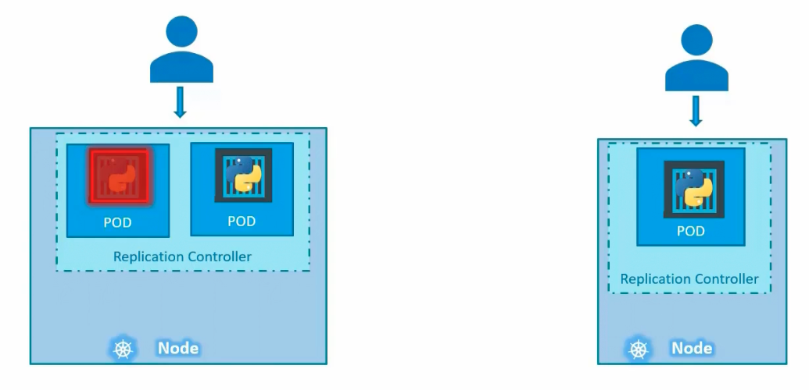
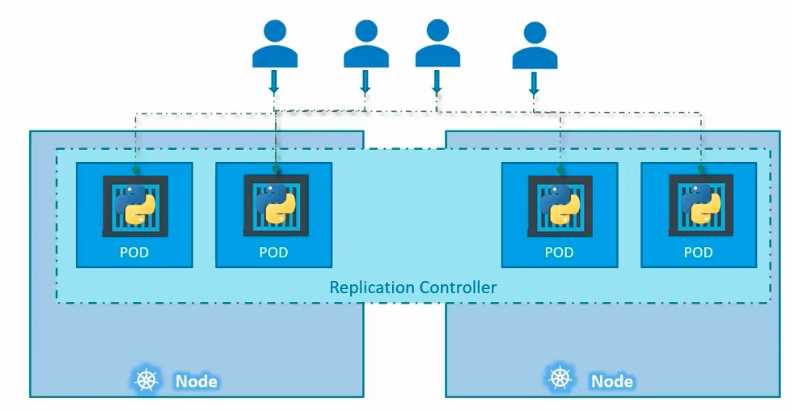
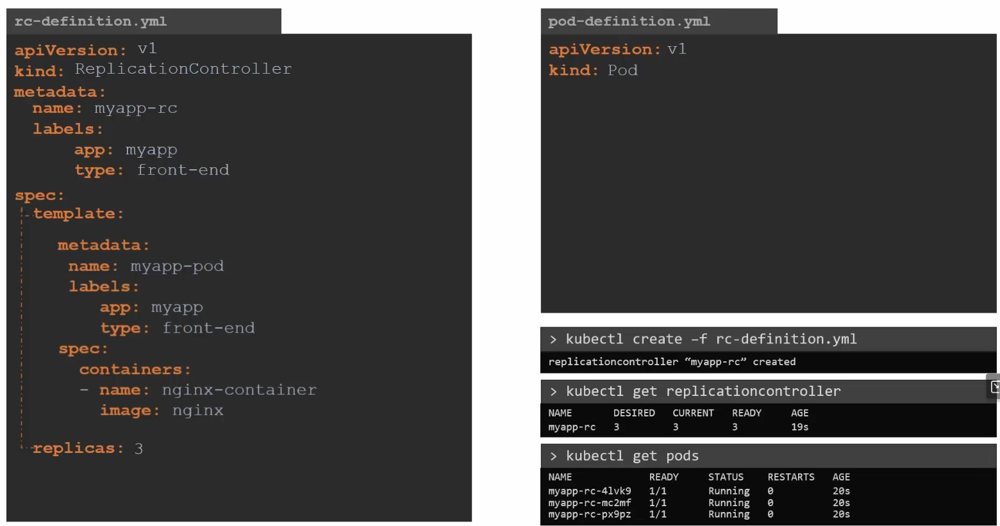
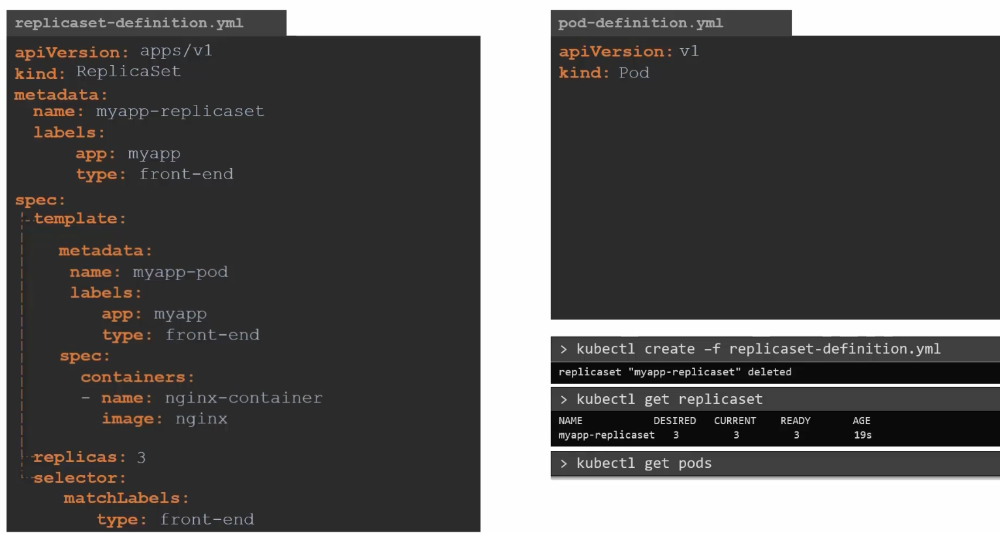
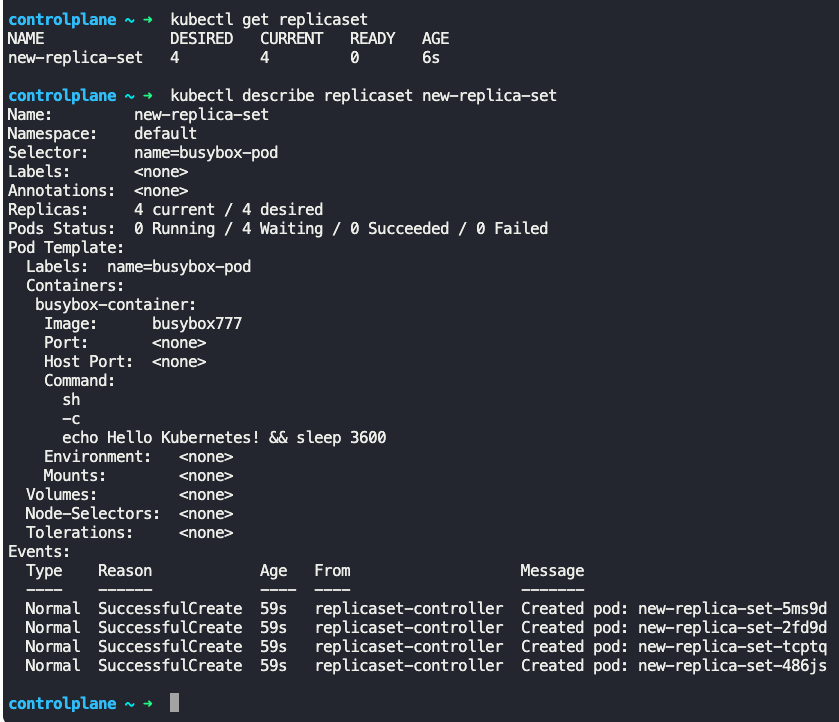
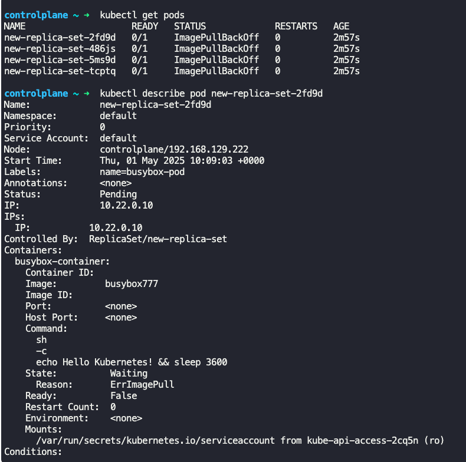

### Replication Controllers

- Controllers are the brain behind Kubernetes
- They monitor Kubernetes objects and respond accordingly.
- Replication Controller allows us to run multiple instances of a single pod in Kubernetes cluster, thus providing high availability
- Replication controller ensures specified number of pods run at all time.
	- In case of only one pod, replication controller can bring up the pod if it crashes
- 
- Replication controller helps with load balancing and scaling.
	- This is done across nodes as well
- 
- Replication controller can be defined as yaml files
```
apiVersion: v1
kind: ReplicationController
metadata:
  name: myapp-rc
  labels:
    app: myapp
    type: front-end
spec:
  replicas: 3
  template:
    metadata:
      name: myapp-pod
      labels:
        app: myapp
        type: front-end
    spec:
      containers:
      - name: nginx-container
        image: nginx
```
- The section under `template:` is from pod definition file
- $`kubectl create -f rc-definition.yaml`
	- Creates pods and replicas as defined in the replication controller definition file
- $`kubectl get replicationcontroller`
	- Gives details on replicas created
- $`kubectl get pods`
	- Gives details about pods created
- 


### Replication Set

- Replica set is a newer technology replacing replication controller
- Replication set has all the above mentioned functionalities of replication controller.
```
apiVersion: apps/v1
kind: ReplicaSet
metadata:
  name: myapp-replicaset
  labels:
    app: myapp
    type: front-end
spec:
  replicas: 3
  template:
    metadata:
      name: myapp-pod
      labels:
        app: myapp
        type: front-end
    spec:
      containers:
      - name: nginx-container
        image: nginx
  selector:
    matchLabels:
      type: front-end
```
- The section under `template:` is from pod definition file
- `selector:` section is mandatory for replica set, but not mandatory for replication controller
	- It contains the labels proved in the `template:` -> `metadata:` section (from pod definition file)
	- Say, if there are pods already present with the labels `type: front-end` before the replica set is created, the `matchLabels:` section will pick those pods and make it part of the replica set.
- $`kubectl create -f replicaset-defn.yaml`
	- Creates pods and replicas as specified in the replica set definition file (and the template of pods provided from pod definition file)
- $`kubectl get replicaset`
	- Gives the list of replica sets created
- $`kubectl delete replicaset <replicaset_name>`
	- Deletes replica set and all the underlying pods which it monitors
- $`kubectl get pods`
	- Gives list of pods created
- $`kubectl describe replicaset <replicaset_name>
	- Gives detailed information about the replica set.
- 
- 
- 

### Labels and Selectors

- Role of replica set (which is a process) is to monitor the pods.
	- If any of them were to fail, it will deploy new one
- Already existing pods can be monitored by replica sets
- If pods do not exist, replica set will create them.
- Replica set uses labels in pods to monitor the correct pods.
	- It matches the labels under the `template:` -> `metadata:` section with the labels mentioned under `selector:` -> `matchLabels:` section.
```
template:
    metadata:
      name: myapp-pod
      labels:
        app: myapp
        type: front-end

selector:
    matchLabels:
      type: front-end
```
- Say if we already have 3 pods labeled `front-end`.
	-  While creating replica set to monitor these 3 pods named `front-end`, we still need to provide the details of the pod under the `template:` section (from pod definition file).
	- The above is done so as incase if one of the pod fails, replica set can create a new one based on the information under the `template:` section

### Scale

- To increase or change the number of replicas in replica ser
	- Change the number of replicas mentioned in the replica set definition file
		- Run $`kubectl replace -f replicaset-definition.yaml`
	- $`kubectl scale --replicas=6 -f replicaset-definition.yaml` or
		- $`kubectl scale --replicas=6 replicaset <name_of_replicaset>`
	- $`kubectl edit replicaset <name_of_replicaset>`
		- Auto triggers creation of additional replicas
	- Note that except the 1st approach above, the other 2 approaches do not change.increase the number of replicas mentioned in the replica set definition file.
- Note: If we create a new pod with the same labels as specified in the replica set, then the replica set process will terminate and delete the new pod(s) if it overshoots the number of replicas specified in while configuring the replica set.


---
