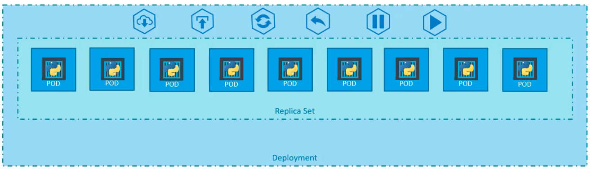
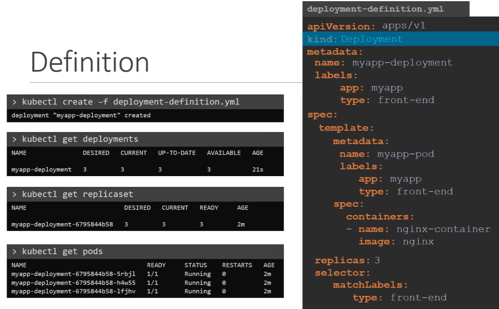
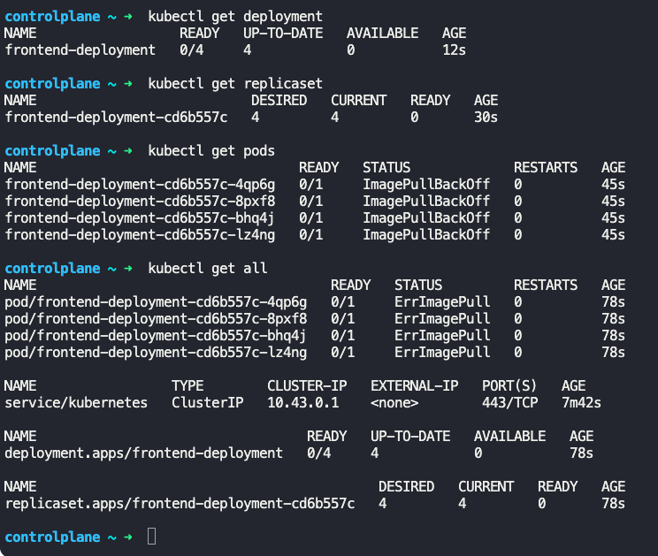
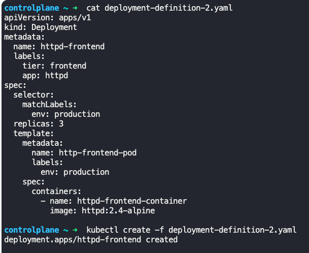
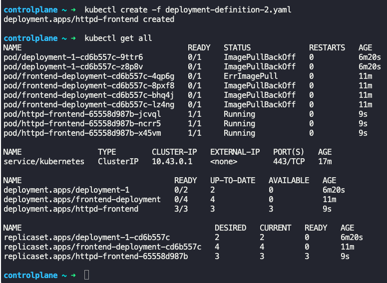
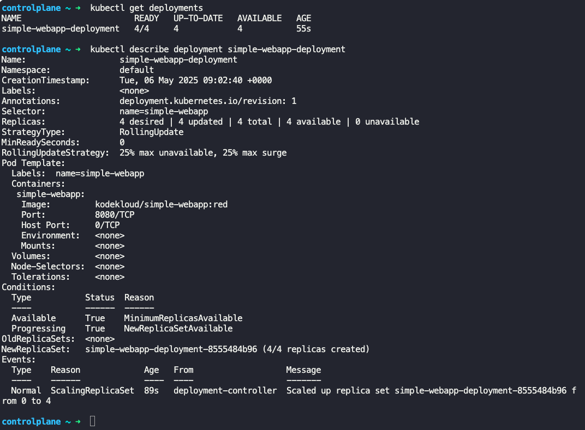
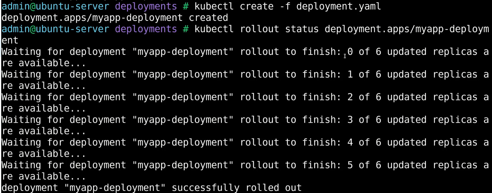

### Deployments

- Each container is encapsulated in a pod
- Multiple such pods are deployed using replica sets
- Deployment is a Kubernetes object that provides the ability to
	- upgrade underlying instances using rolling updates
	- undo changes
	- pause and resume changes as required


**Creating a Deployment**

- Create a deployment-definition.yaml file
	- Contents are similar to replica set definition file, except `kind: Deployment`
```
apiVersion: apps/v1
kind: Deployment
metadata:
  name: myapp-deployment
  labels:
    tier: frontend
    app: nginx
spec:
  selector:
    matchLabels:
      env: production
  replicas: 6
  template:
    metadata:
      name: myapp-nginx
      labels:
        env: production
    spec:
      containers:
        - name: nginx-container
          image: nginx
```
- 
- $`kubectl create -f deployment-definition.yaml --record`
	- Creates deployment, replica sets, and pods based on the configuration in the deployment definition file.
	- Automatically creates replica sets
	- Automatically creates pods
	- `--record` captures the cause of change, can be seen when history command ($`kubectl rollout history <deplyment_name>`) is run
- $`kubectl get deployments`
	- Lists all deployments
- $`kubectl get all`
	- Lists all Kubernetes objects like deployments, replica sets, pods which are created
- 
- $`kubectl describe deployment <deployment_name>`
	- Gives information about the deployment
- $`kubectl create deployment <deployment_name> --image=<image_name_from_dockerhub> --replicas=<number_of_replicas>`
	- Creates a deployment without deployment definition yaml file
	- You can get additional details by running $`kubectl create deployment --help`






### Rollouts, Update/Upgrades and Rollback

**Rollouts**
- When a deployment is created, it triggers a rollout
- New rollout creates a new deployment revision, say revision 1
- In future, when the container image version is updated, a new roll out is triggered.
	- In turn, a new deployment revision is created, say revision 2
- $`kubectl rollout status <deployment_name>`
	- Shows status of the rollout
- 
- $`kubectl rollout history <deployment_name>`
	- Shows revisions and history of rollouts

**Deployment Strategy**

- Re-create strategy
	- Destroy existing pods and re-deploy with latest container image version
		- This approach has downtime
- Rolling update strategy (default)
	- Take down older version and bring up a newer version 1 pod at a time.
- $`kubectl apply -f deployment-definition.yaml`
	- New rollout is triggered and new deployment revision is created
- $`kubectl set image <deployment_name> <container_name>=<image_name>`
	- This will change the image in pods in the deployment
	- No changes will be made in the deployment definition file

**Upgrades**

- Deployment performs upgrade under the hood using rolling update strategy
- Creates a new replica set and deploys pods with updated configuration 1 by 1.
	- Pods are taken down 1 by 1 in the old replica set, and brought up in the new replica set 1 by 1, in a rolling update strategy.
- $`kubectl edit deployment <deployment_name> --record`
- This can be seen via $`kubectl get replicaset` when the rolling update is happening
	- This should list 2 replica sets.

**Rollback**

- Kubernetes allows to rollback to a previous revision
- $`kubectl rollout undo <deployment_name>`
	- Will destroy the pods in new replica set, and bring up the pods in old replica set (based on older deployment configuration)
- Run $`kubectl get replicaset` before and after the rollback to notice the difference


---
