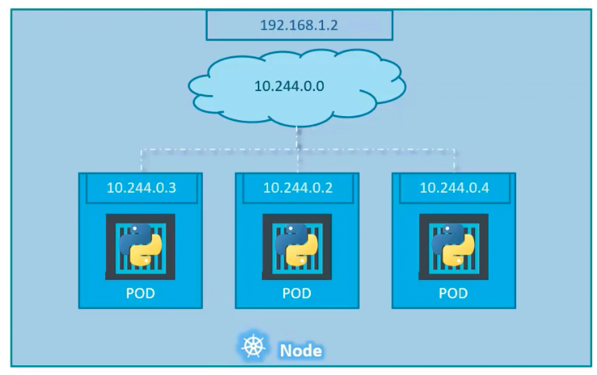
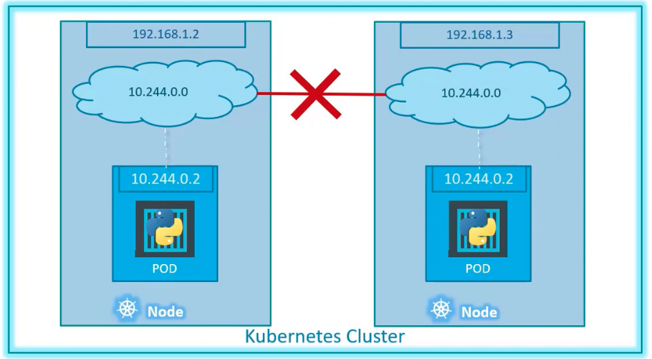
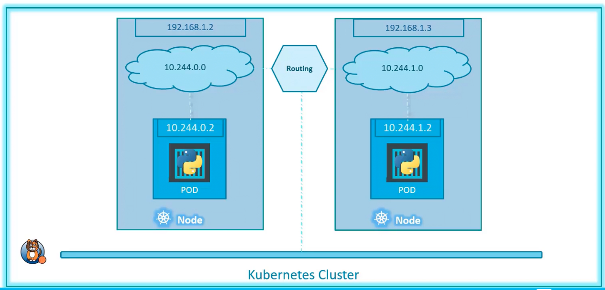

### Networking fundamentals in Kubernetes

- A node is assigned a IP address, say 192.168.1.2
- Every pod in the node gets an IP address in the range 10.244.0.0/16 series
- 
- Unlike docker world, individual containers do not get IP assigned
- In a cluster where multiple nodes are present
	- Kubernetes expects administrators to configure networking
	- All pods must be able to communicate to one another with NAT
	- All nodes must be able to communicate with all containers and vice versa without NAT
- 
- 
- Multiple pre-built solutions are available to set up networking, ex: Cisco ACI N/Ws, Cilium, Cigcloud fabric, Flannel, VMW NSX-T, Calico etc

---
