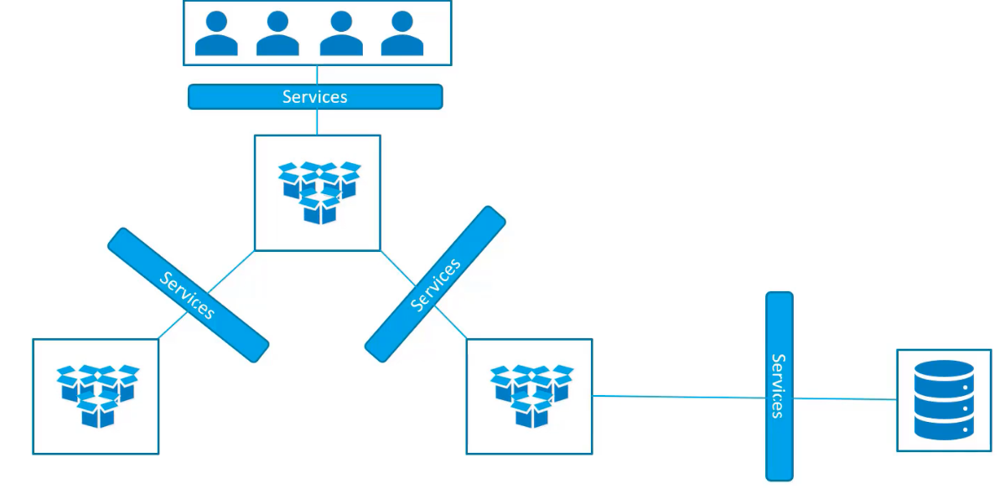
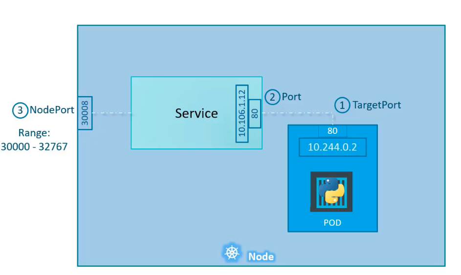
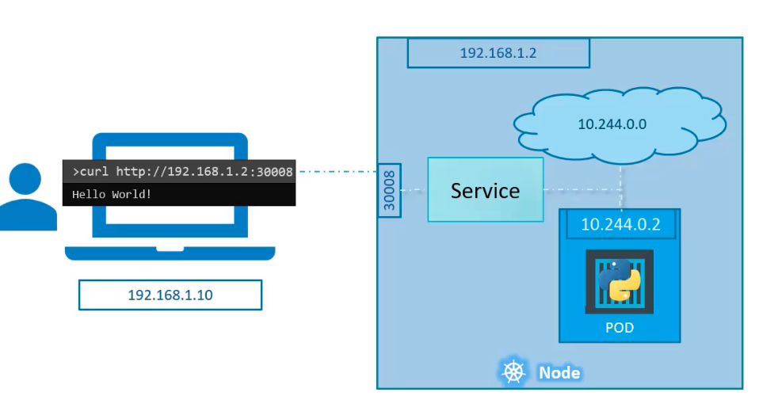
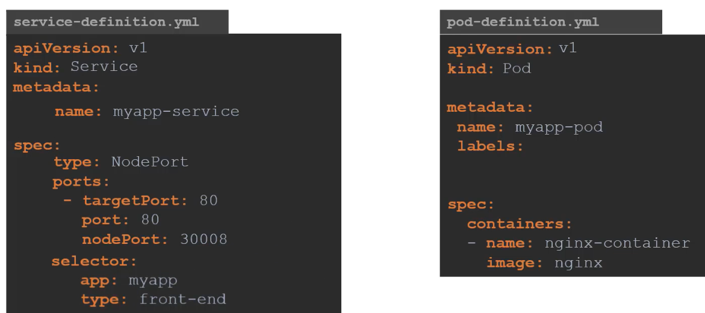
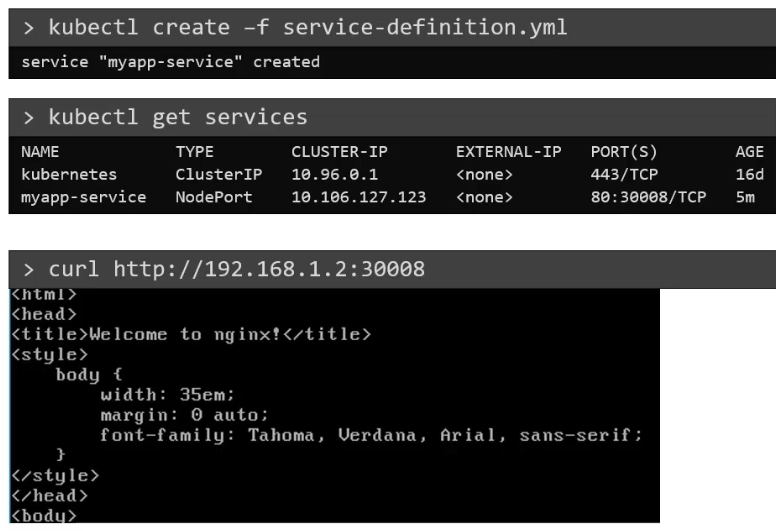
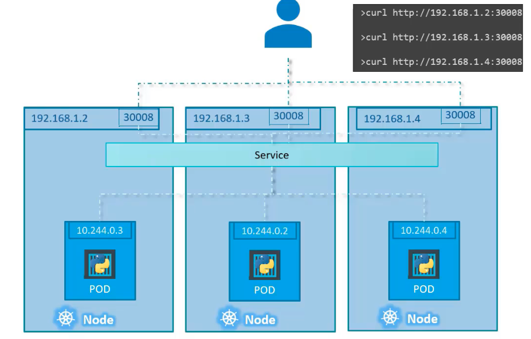
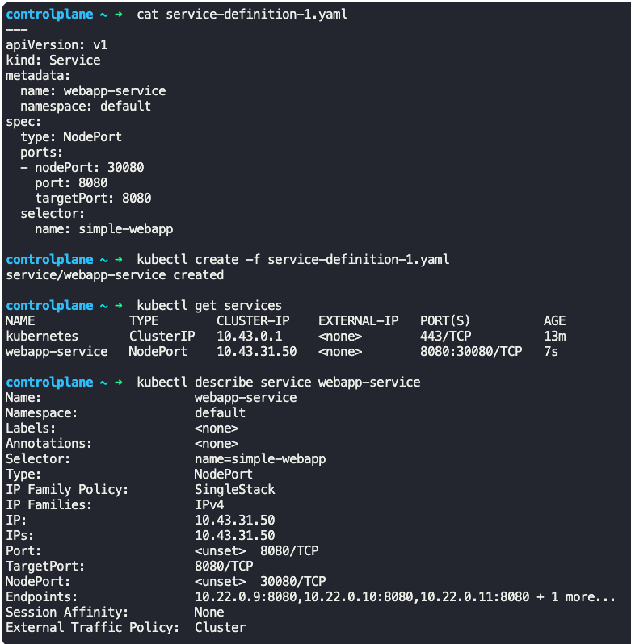
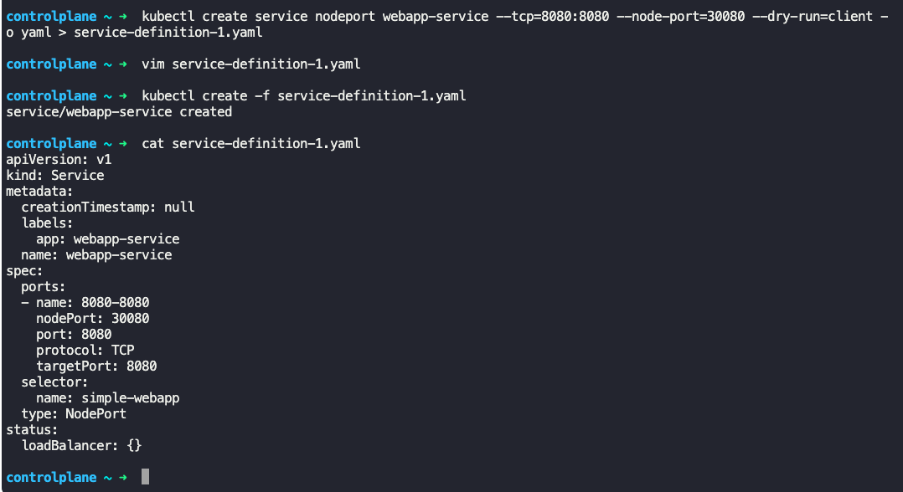

### Services in Kubernetes

- Services enable connectivity between group of pods
	- Each group of pod can serve different functionality, like frontend, backend, etc.
- Enables loose coupling between micro services in an application
- 
- Kubernetes service is an object just like pod, replica set and deployments
	- Service is like a virtual server inside a node
- One of the use case is to listen to a port on the node, and forward the request landing on the port to a pod running on the node.
	- This is called NodePort service
- Services types
	- NodePort
	- ClusterIP
		- Service creates a virtual IP inside the cluster, to enable communication between different services, such as front end, back end etc.
	- Load balancer
		- Provides load balancing support in cloud providers

### NodePort

- 3 port are involved
	- Port on the pod where the actual web server is running, say port 80
		- This is called as Target Port, as this where the service forwards the request to
	- Port on the service
		- This is referred to as Port.
		- Inside the cluster, a service has its own IP address, and this IP is call as the clusterIP of the service
	- Port on node
		- This is used to access the web server from outside (external access)
		- This is called as NodePort
		- The range of NodePort is from 30000 to 32767.
- 
- 

**Creating a NodePort service**

- Service definition yaml file
```
apiVersion: v1
kind: Service
metadata:
  name: myapp-service
spec:
  type: NodePort
  ports:
    - port: 80
      targetPort: 80
      nodePort: 30004
  selector:
    app: myapp
    type: front-end
```
- `port` is a mandatory field
- If `targetPort` is not specified, it will be same as value of `port`
- If `nodePort` is not specified, a random available port from 30000 to 32767 is picked
- To tie the service to a pod, we need to use the pod's labels (under `labels:`) (from pod definition yaml file) and specify it under `selector:` in service definition file.
- 
- $`kubectl create -f service-definition.yaml`
	- Creates the NodePort service
- $`kubectl get services`
	- Lists the services
	- Gives information on ClusterIP and mapped ports
- 

**Configuration of NodePort service across pods and nodes**

- In the case where multiple pods across a cluster are present with the same label,
	- When a service is created, it takes all the pods with the matching labels and uses them as endpoints automatically.
	- We do not need to make additional configurations.
	- Service uses random algorithm to distribute traffic across pods.
- In all of the following cases, service is created exactly the same way. When pods are removed/added, the service is automatically updated
	- Single pod on single node
	- Multi pods on single node
	- Multi pods on multi node as part of cluster
- 
- 


**Create nodeport service using kubectl**

$`kubectl create service nodeport webapp-service --tcp=8080:8080 --node-port=30080 --dry-run=client -o yaml > service-definition.yaml`

$`kubectl create -f service-definition.yaml`

For help
- $`kubectl create service --help`
- $`kubectl create service nodeport --help`



---
