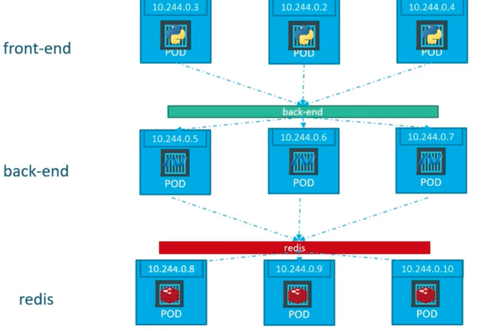
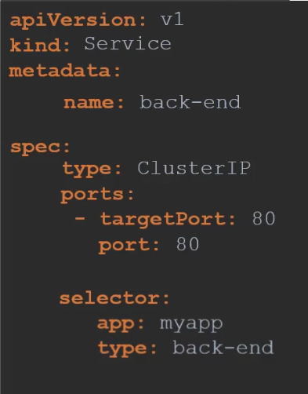
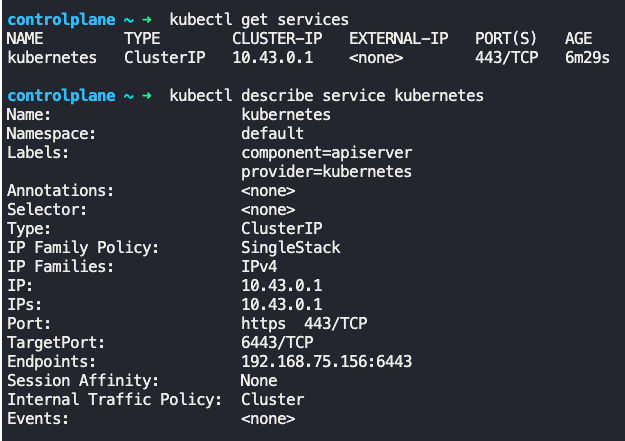

### ClusterIP

- Assume an application has 3 tiers, frontend tier, backend tier and DB tier.
- Each tier is a cluster of nodes having pods running applications
- Frontend tier needs to communicate with backend tier and backend tier needs to communicate with DB tier
- 
- To establish communication between tiers
	- Pods all have IP addresses assigned - communicate using this. But there are challenges with this
		- These IPs are not static
		- Pods go down all the time and new pods come up
		- Cannot rely on these IPs for internal communication
	- A Kubernetes service can group similar pods (like backend pods) and provide access to them via a single static IP, or a name
		- This service name should be used to communicate with pods within a tier
		- This type of service is known as ClusterIP

**Creating a ClusterIP service**

```
apiVersion: v1
kind: Service
metadata:
  name: back-end
spec:
  type: ClusterIP
  ports:
    - targetPort: 80
      port: 80
  selector:
    app: myapp
    type: back-end
```
- If `type` not specified, it defaults to `ClusterIP`
- `targetPort` is where the actual application listens on
- `port` is where the service is exposed or listens on
- $`kubectl create -f backend-service-definition.yaml`
	- Creates a ClusterIP service
- $`kubectl get services`
	- Lists all the services
- 
- 
	- `kubernetes` is a default service present when Kubernetes is setup.
		- It is of type ClusterIP


---
