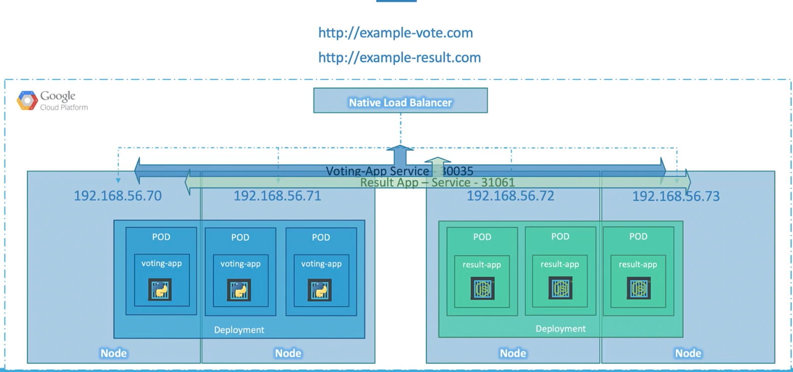
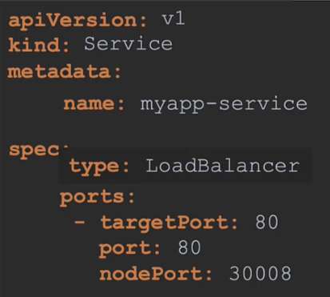

### LoadBalancer

- Kubernetes uses cloud native (AWS, GCP, Azure) load balancer to load balance trafffic to underlying services.
- 
```
apiVersion: v1
kind: Service
metadata:
  name: myapp-service
spec:
  type: LoadBalancer
  ports:
    - targetPort: 80
      port: 80
      nodePort: 30008
```
- 
- $`kubectl describe service <service_name>`
	- Gives details about the service like name, IP, targetPort, labels etc.
- Endpoints are all the pods the service services