### Sample microservice architecture

- Consider the sample voting application architecture
- 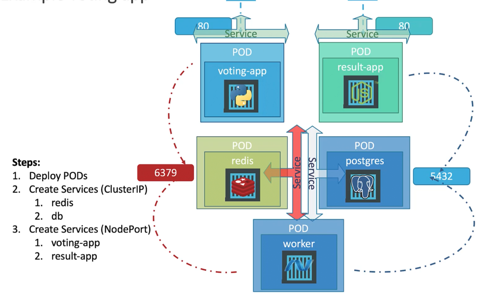
	- There is a frontend voting-app service to cast vote.
	- There is a in-memory database Redis to store the temporary results
	- There is a worker app to process the vote
	- There is Postgres DB to store the votes
	- There is another frontend result-app to show the results

### Deploy sample voting application on docker

- Assuming all the applications are built and the images are available in docker hub repository, we can create these docker containers using the following commands
	- $`docker run -d --name=redis redis`
	- $`docker run -d --name=db postgres:9.4`
	- $`docker run -d --name=vote --link redis:redis -p 5000:80 voting-app`
	- $`docker run -d --name=vote --result db:db -p 5001:80 result-app`
	- $`docker run -d --name=worker --link redis:redis --link db:db worker`
- The above commands deploys the voting application on docker

### Deploy sample voting application on Kubernetes

- Goals
	- Deploy each application as containers on a Kubernetes cluster
	- Enable connectivity between containers
	- Enable external access to access the application running on the containers
- Steps
	- Deploy pods
		- 5 pods
		- Each pod runs as microservice
	- Create ClusterIP services
		- name=redis
		- name=db
	- Create NodePort services
		- voting-app
		- result-app

- Yaml files of 5 pods
	- voting-app-pod.yaml
		- 
	- result-app-pod.yaml
		- 
	- redis-pod.yaml
		- 
	- worker-app-pod.yaml
		- 
	- postgres-pod.yaml
		- 
- Yaml files of services
	- voting-app-service.yaml
		- 
	- result-app-service.yaml
		- 
	- redis-service.yaml
		- 
	- postgres-service.yaml
		- 
	- No service file for worker app
- Create pods and its corresponding services
	- $`kubectl create -f voting-app-pod.yaml` - Deploys voting app pod
	- $`kubectl create -f voting-app-service.yaml` - Deploys voting app service
	- $`minikube service voting-service url` - Gives url to access voting app service
	- $`kubectl create -f redis-pod.yaml`
	- $`kubectl create -f redis-service.yaml`
	- $`kubectl create -f postgres-pod.yaml`
	- $`kubectl create -f postgres-service.yaml`
	- $`kubectl create -f worker-app-pod.yaml`
	- $`kubectl create -f result-app-pod.yaml`
	- $`kubectl create -f result-app-service.yaml`
	- $`minikube service result-service url`
	- Verify creation of pods and services
		- $`kubectl get pods,svc`
	- 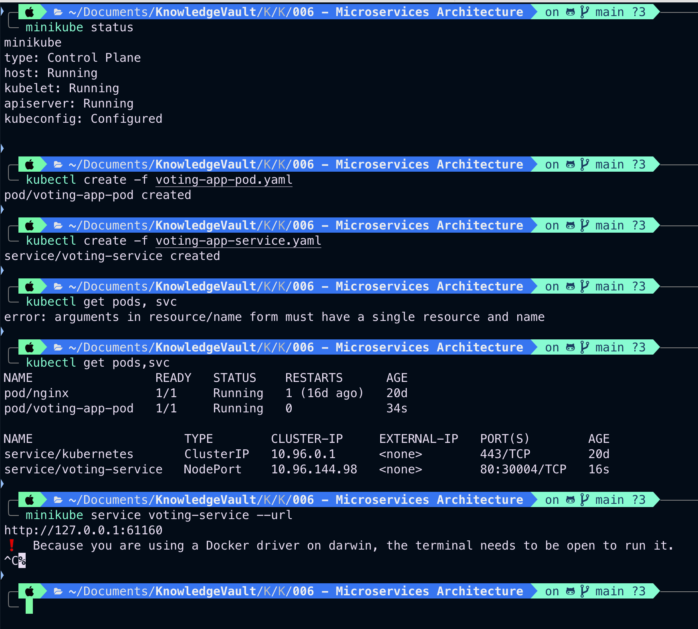
	- 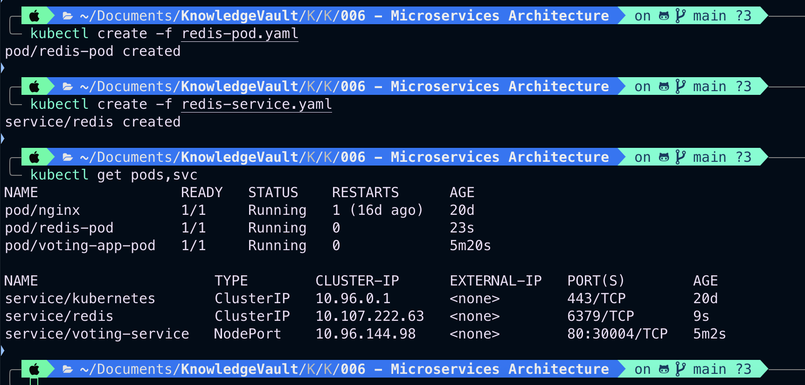
	- 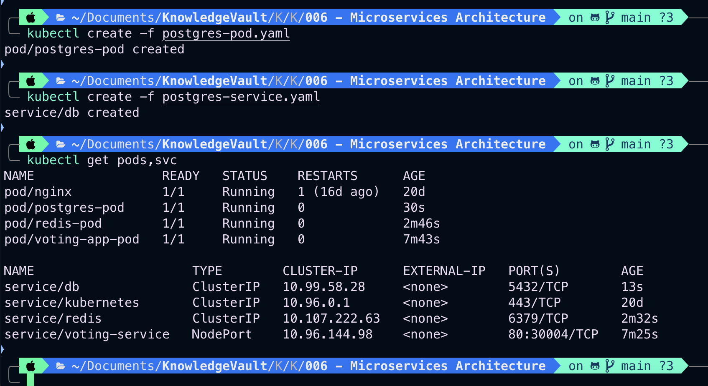
	- 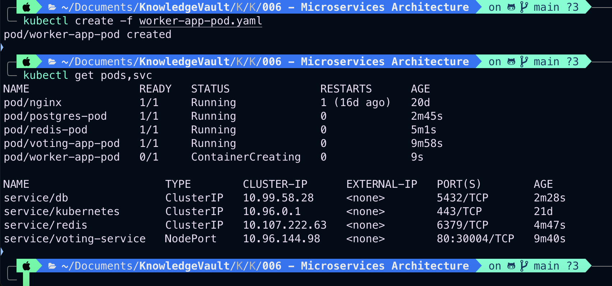
	- 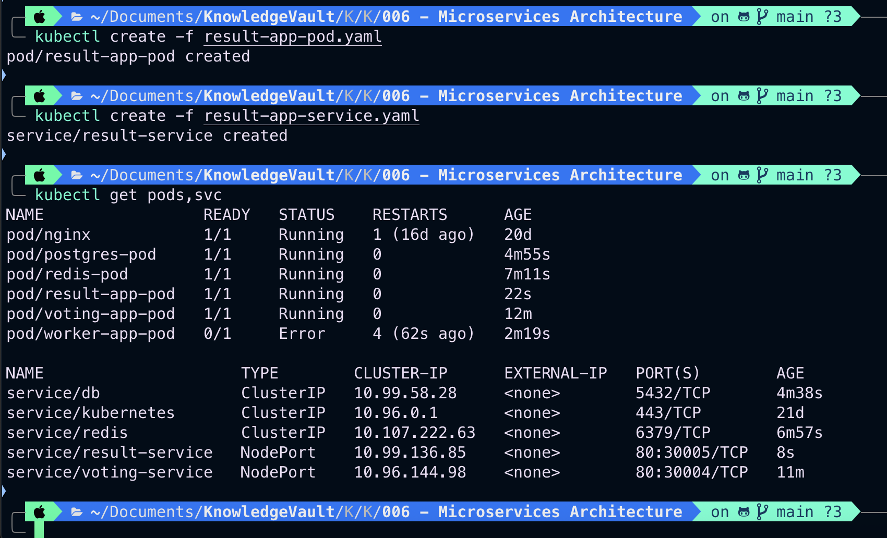
- Create a micro service architecture using deployments
	- Instead of deploying applications as pods, use deployments
	- Deploying as pods will not help us scale our applications easily
	- To update an application to a new image, the existing pods need to be taken down and new ones deployed, resulting in down time
	- Roll backs, rolling updates and recording of each event are not supported on pods, and they need Deployments for it
	- 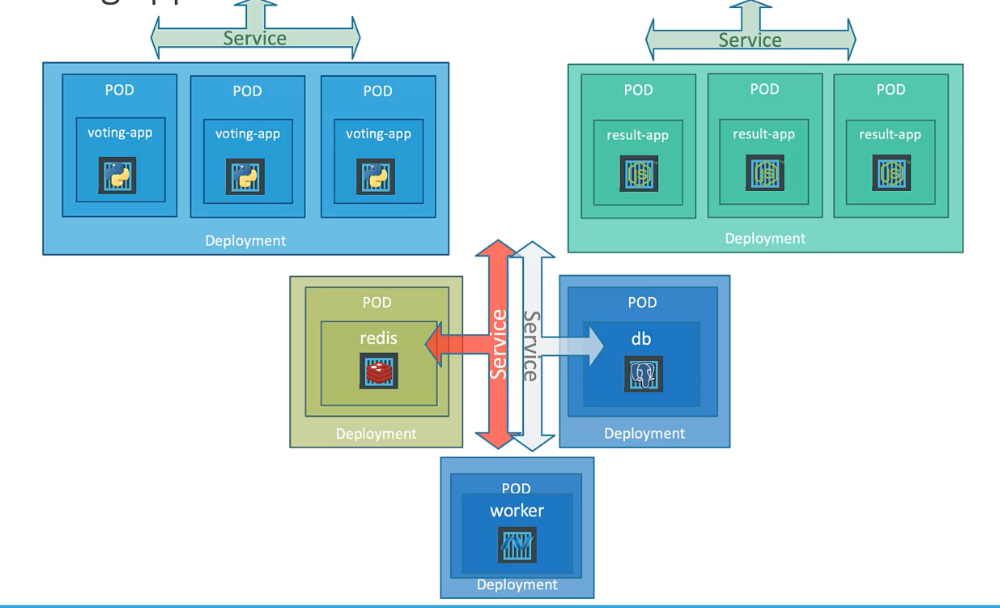
	- Yaml files for deployments
		- voting-app-deploy.yaml
			- 
		- result-app-deploy.yaml
			- 
		- redis-deploy.yaml
			- 
		- postgres-deploy.yaml
			- 
		- worker-app-deploy.yaml
			- 
	- Create deployments and services
		- $`kubectl create -f voting-app-deploy.yaml`
		- $`kubectl create -f voting-app-service.yaml`
		- $`kubectl create -f redis-deploy.yaml`
		- $`kubectl create -f redis-service.yaml`
		- $`kubectl create -f postgres-deploy.yaml`
		- $`kubectl create -f postgres-service.yaml`
		- $`kubectl create -f worker-app-deploy.yaml`
		- $`kubectl create -f result-app-deploy.yaml`
		- $`kubectl create -f result-app-service.yaml`
		- 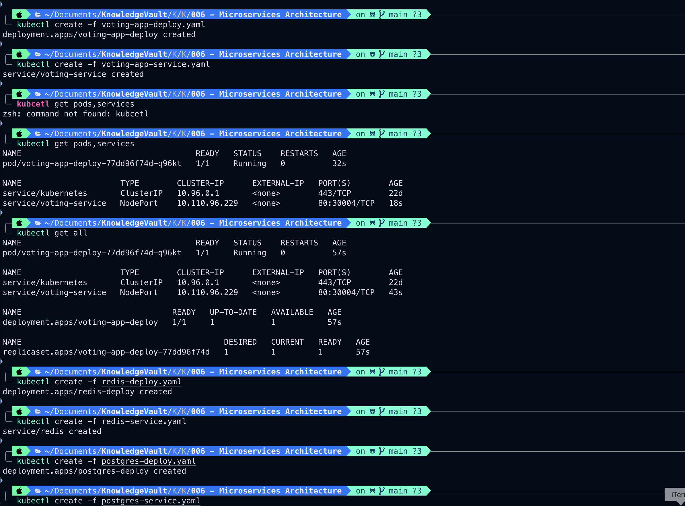
		- 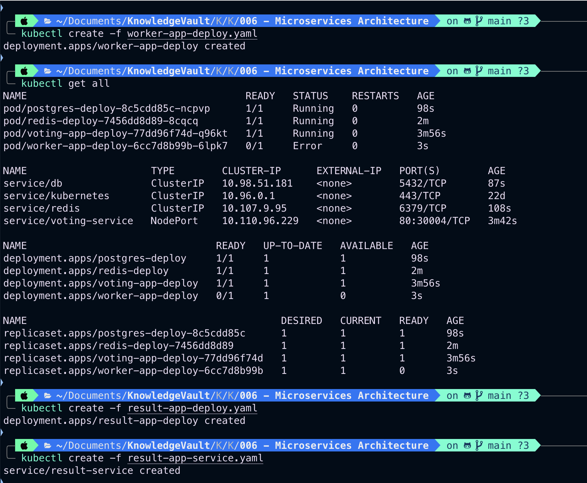
		- 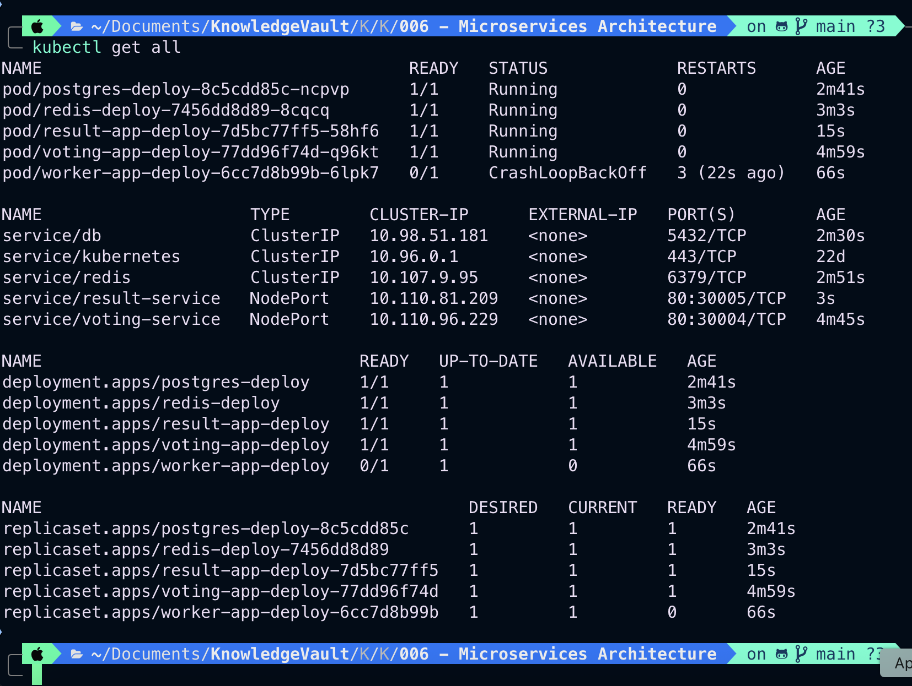
		- Get url for frontend services
			- $`minikube service voting-service url` - Gives url to access voting app service
			- $`minikube service result-service --url`
		- You should now be able to access both the frontend services
	- To scale run
		- $`kubectl scale deployment voting-app-deploy --replicas=3`
			- Scales replicas to 3
		- 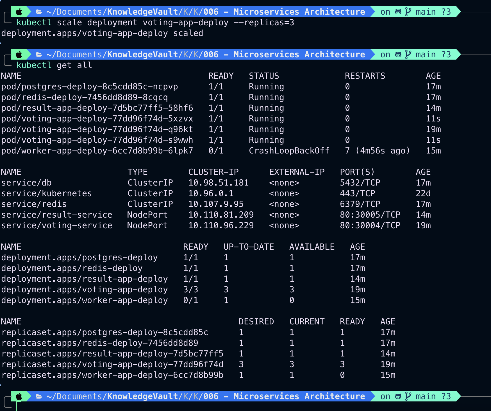

---

