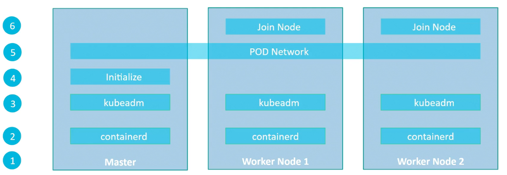

### Kubeadm

- Kubeadm helps setting up multi-node cluster using Kubernetes best practices

##### Steps
1. Have 3 VMs -> 1 Master node and 2 worker nodes
	1. Use virtual box
	2. Use Vagrant to automate provisioning of VMs - 
		1. https://github.com/kodekloudhub/certified-kubernetes-administrator-course/tree/master/kubeadm-clusters/apple-silicon
		2. https://github.com/kodekloudhub/certified-kubernetes-administrator-course/blob/master/kubeadm-clusters/virtualbox/Vagrantfile 
		3. https://notes.kodekloud.com/docs/CKA-Certification-Course-Certified-Kubernetes-Administrator/Install-Kubernetes-the-kubeadm-way/Deploy-with-Kubeadm-Provision-VMs-with-Vagrant
		4. `vagrant destroy -f` -> Destroys all created VMs.
		5. `./delete-virtual-machine.sh` -> Destroys all created VMs.
2. Install container runtime, like Docker, on all nodes
	1. https://kubernetes.io/docs/setup/production-environment/container-runtimes/
	2. https://kubernetes.io/docs/setup/production-environment/container-runtimes/#containerd
3. Initialize kubeadm tool on all nodes
	1. Control plane - https://github.com/kodekloudhub/certified-kubernetes-administrator-course/blob/master/kubeadm-clusters/generic/05-controlplane.md
	2. Worker nodes - https://github.com/kodekloudhub/certified-kubernetes-administrator-course/blob/master/kubeadm-clusters/generic/06-workers.md
	3. Kubernetes documentations - 
		1. https://kubernetes.io/docs/setup/production-environment/tools/kubeadm/install-kubeadm/
		2. https://kubernetes.io/docs/setup/production-environment/tools/kubeadm/create-cluster-kubeadm/
		3. https://kubernetes.io/docs/setup/production-environment/tools/kubeadm/high-availability/
4. Initialize master node -> All required components are initialized and configured
	1. https://kubernetes.io/docs/setup/production-environment/container-runtimes/#containerd
5. Configure networking solution between master and worker nodes -> This is pod networking
	1. Calico - https://docs.tigera.io/calico/latest/getting-started/kubernetes/self-managed-onprem/onpremises -> On control plane only
6. Join the worker nodes to master node
	1. https://kubernetes.io/docs/setup/production-environment/tools/kubeadm/create-cluster-kubeadm/#join-nodes

##### References
Install and set up the kubectl tool: [https://kubernetes.io/docs/tasks/tools/](https://kubernetes.io/docs/tasks/tools/)
Install Minikube: [https://minikube.sigs.k8s.io/docs/start/](https://minikube.sigs.k8s.io/docs/start/)
Install VirtualBox: [https://www.virtualbox.org/wiki/Downloads](https://www.virtualbox.org/wiki/Downloads)
[https://www.virtualbox.org/wiki/Linux_Downloads](https://www.virtualbox.org/wiki/Linux_Downloads)

Minikube Tutorial: [https://kubernetes.io/docs/tutorials/hello-minikube/](https://kubernetes.io/docs/tutorials/hello-minikube/)

If the minikube installation has been done on the macOS, then to access the URL on the local browser, we need to do a few steps to get the service URL to work. Those steps are covered on this documentation page: [https://minikube.sigs.k8s.io/docs/handbook/accessing/#using-minikube-service-with-tunnel](https://minikube.sigs.k8s.io/docs/handbook/accessing/#using-minikube-service-with-tunnel)

##### Kubernetes update and project videos
Uncover additional insights through the videos listed below:
**Kubernetes Update Videos**
1. Kubernetes v1.27 Update
[Kubernetes Update 1.27: Chill Vibes Edition - Exploring the Latest Enhancements](https://www.youtube.com/watch?v=rUFgZuIp1mY)
2. Kubernetes v1.28 Update
[Kubernetes Update 1.28: Planternetes Edition - Exploring the Latest Enhancements](https://www.youtube.com/watch?v=mRlBtYc-HSk)
3. Kubernetes v1.29 Update
[Exploring Kubernetes 1.29 Updates - Mandala Universe](https://www.youtube.com/watch?v=yCkQgKVwSVU)
**Kubernetes Project Videos**
4. Special Interest Groups (SIGs) in Kubernetes
[Kubernetes SIGs: What They Are and How They Work](https://www.youtube.com/watch?v=EoKuPoFXY-k&t=2s)
5. Kubernetes Enhancement Proposals (KEPs) Unveiled
[What are Kubernetes Enhancement Proposals (KEPs)?](https://www.youtube.com/watch?v=B810TDzTQsQ)

---
