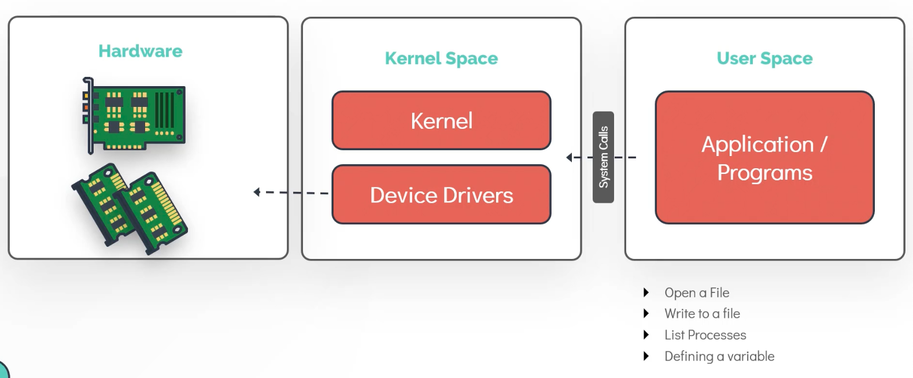

### Linux Kernel
Kernel is responsible for 4 major tasks
1. Memory management
2. Process management
3. Device drivers
4. System calls and security

`uname -r` -> Gives kernel version

4.15.0-72-generic

- '4' -> Kernel version
- '15' -> Major version
- '0' -> Minor version
- '72' -> Patch release
- 'generic' -> Distro specific information

#### Kernel space and User space

In kernel space, the following get executed
- Kernel code
- Kernel extensions
- Device drivers

Example for a user mode process
`cat /etc/os-release` -> Opens a file in HDD

---

### Working with hardware

`dmesg` -> Shows messages from ring buffer in kernel
- `dmesg | grep -i usb` -> Shows messages respect to USB device

`udevadm` -> Queries udevdb for device info
- `udevadm info --query=path --name=/dev/sda5`
- `udevadm monitor` -> Listens to kernels uevents

`lspci`
- Lists all peripheral component interconnect(PCI) devices connected
- Ex: Ethernet cards, Raid controllers

`lsblk`
- Lists all block devices and partitions
- `sda` -> Physical
- `sda1...sda5` -> Partitions
- Major number shows the device type (8 -> SCSI)

`lscpu`
- Displays info about CPU architecture - 32-bit & 64-bit

sockets * core * threads = # of cpus

`lsmem --summary` -> Memory info, available memory

`free -m`
- Memory used. Shows used vs free memory
- Use `-G` for displaying output in GB
- Use `-M` for displaying output in MB
- Use `-k` for displaying output in KB

`lshw` -> Hardware information/configuration in machine

---
### Linux boot sequence

4 steps in boot sequence
1. **BIOS POST**
	1. Power-on self test.
	2. Nothing to do with Linux
	3. Checks if all the hardware attached are functioning well
2. **Boot Loader (GRUB2)**
	1. Grand unified boot loader v2
	2. Boot code from `/boot` is executed
	3. Win OS or Ubuntu OS selection screen
3. **Kernel initialisation**
	1. Kernel is loaded into memory and executed
	2. Initialise hardware, memory management, etc
4. **INIT process (SYSTEMD)**
	1. INIT process sets up user space

`ls -l /sbin/init` -> Gives INIT process type, SYSTEMD or SYSTEM5

---
### Runlevels

1. runlevel 0 -> poweroff.target
2. runlevel 1 -> rescue.target
3. runlevel 2,3,4 -> multi-user.target
	1. CLI
	2. "display-manager" service is disabled
4. runlevel 5 -> graphical.target
	1. GUI
5. runlevel 6 -> reboot.target

`runlevel`

`systemctl get-default`
- Gives the default SYSTEMD target -> graphical.target or multi-user.target
- Gives default target set

`ls -ltr /etc/systemd/system/default.target`
- Same as above

`systemctl set-default multi-user.target`
- Changes default target set to (multi-user.target)

---
### File types

Everything is a file in linux

3 types of file types
1. Regular file
	1. images, scripts, data, configuration
2. Directory
	1. Contains files and directories
3. Special files
	1. Character files - `/dev`
		1. For communication with devices such as mouse and keyboard
	2. Block files - `/dev`
		1. For block devices, like HDD and RAM
		2. Reads and writes to devices in blocks (chunk of data)
	3. Link files
		1. 2 or more filenames point to the same data
		2. Hard links
			1. 2 or more file names that share the same bloc of data on file system
			2. Deleting one link will delete the other
		3. Symbolic links or Soft links or Sym links
			1. Pointers to a file
	4. Socket files
		1. For communication between processes
	5. Named pipes
		1. For connecting one process as input to another process
		2. Unidirectional

To get the file type, use either
- `file /home/user_name`
- `file bash-script.sh`

`ls -l` or `ls -ld`
 - Output's first letter gives file type
 - 'd' -> directory
 - '-' -> regular file
 - 'c' -> character device
 - 'l' -> link
 - 's' -> socket file
 - 'p' -> pipe
 - 'b' -> block device

---

### Filesystem hierarchy

`/home` -> Home directory for users

`/root` -> Root user's home directory

`/opt` -> Install 3rd party programs

`/mnt` -> Mounts loaded here. Mounts filesystem temporarily

`/tmp` -> Temporary files and folders

`/media` -> USB and external media are mounted here

`/dev` -> For communication to devices such as, block devices, mouse, keyboard, etc

`/bin` -> Basic programs and binaries, like `cp`, `mv`, `mkdir` are stored here

`/etc` -> Configuration files are stored here

`/lib and lib64` -> Shared libraries which will be imported in programs will be stored here

`/usr` -> All user land applications and their data resides here. Ex: firefox, vi, etc.

`/var` -> Logs reside here

`df -hP` -> Prints all mounted filesystem

---

