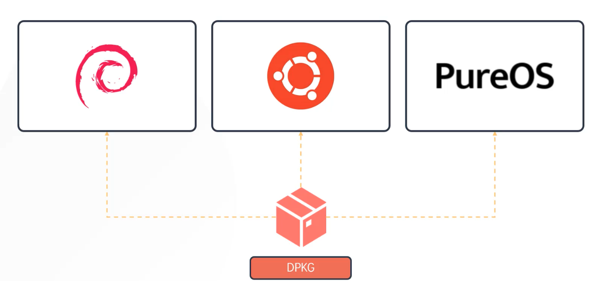

### Package management introduction

#### Package
- It is software in compressed format
- Each OS has its own format for software package, ex: ".deb" for debian based, ".rpm" for RHEL based

- RHEL - enterprise and Centos - commercial

#### Package manager
- Responsible for installing, configuring and removing software packages
- Maintains integrity
- Maintain dependencies of each software

**Types of package managers**
- DPKG -> Debian, Base
- APT -> Debian, is newer
- APT-Get -> Debian
- RPM -> RedHat, Base
- YUM -> RedHat
- DNF -> RedHat, feature rich

---

### RPM & YUM

#### RPM
- RedHat package manager
- CetOD, RHEL, Fedora
- File extension is ".rpm"

**RPM 5 modes of working**
1. Installing - $`rpm -ivh telnet.rpm`
	1. `-i` - install
	2. `-v` - verbose
	3. 
2. Uninstall - $ `rpm -e telnet.rpm`
3. Upgrade - $`rpm -Uvh telnet.rpm`
	1. Stores information about all packages in `/var/lib/rpm`
4. Query - $ `rpm -q telnet.rpm`
	1. 
5. Verify - $ `rpm -Vf <path_to_file>`

RPM does not resolve package dependencies

#### YUM
- Yellow dog updater modifier
- Used for RPM based distros
- Solves package dependencies automatically
- High level package manager
- Software repository location is mentioned at
	- `/etc/yum.repos.d/nginx.repo`
	- `/etc/yum.repos.d/redhat.repo`
- Flow is something like below
	- Software repository -> YUM (Package Manager) -> RPM -> Laptop
		- Software repository stores all software packages in ".rpm" format.
		- Package manager maintains dependencies between softwares and the integrity of each software.
		- RPM is the software package

$`yum install httpd`
- Checks software repositories configured under `repos.d` to find the software package.
- Checks if dependency is present in system or not.
	- If not, installs the dependencies before installing the software package.
- 

$`yum repolist` - Shows all repositories configured in system

$`yum provides scp` - Shows which package to install for the command `scp` to work

$`yum remove httpd` - Uninstalls and removes a package

$`yum update telnet` - Updates a package

$ `yum update` - Updates all packages in the system

---

### DPKG & APT

#### DPKG
- Debian package manager
- OS'es like Ubuntu, Debian, PureOS and Linux mint use DPKG
- 
- Install / Upgrade - $`dpkg -i telnet.deb`
	- 
- Uninstall - $`dpkg -r telnet.deb`
- List packages installed with version - $`dpkg -l telnet`
- Status of package (installed or not) - $ `dpkg-s telnet`
- Verify - $`dpkg -p <path_to_file>`

DPKG similar to RPM, does not check and resolve dependencies.

#### APT & APT-GET
- Advanced package manager.
- Frontend package manager based on DPKG.
- APT and APT-GET resolve dependencies.
- APT and APT-GET are unrelated.
- APT is more user friendly tool than APT-GET.
- 
- Software repositories configured in the system are listed under `/etc/apt/sources.list`.
	- The source repositories can be local filesystem or caan be hosted on HTTP/HTTPS/FTP.

$`apt update` - Refresh repository.

$`apt upgrade` - Upgrades all packages in system.

$`apt edit-sources` - Edit `sources.list` file.

$`apt install telnet` - Installs a package.

$`apt remove telnet` - Uninstalls a package.

$`apt search telnet` - Searches for package in repository.

$`apt list | grep telnet` - Lists all packages in repository.

---

