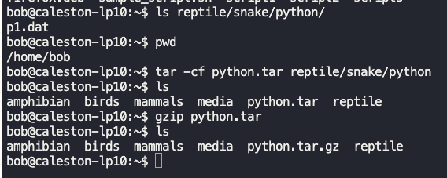
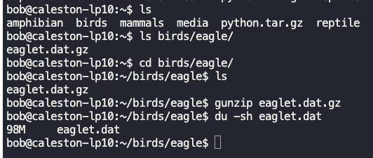
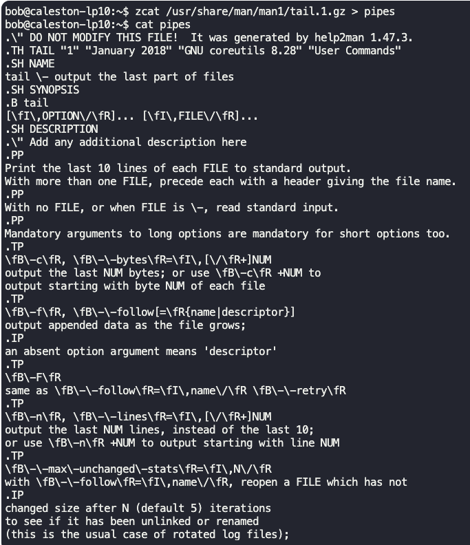
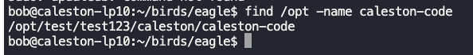
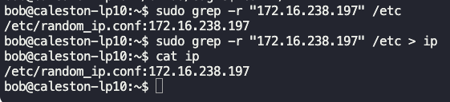
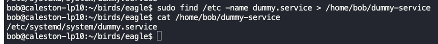
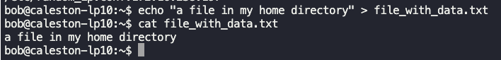
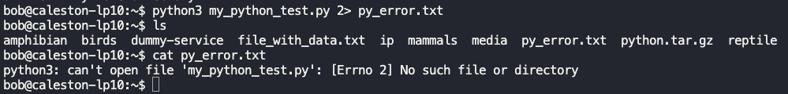

### File compression and archival

`du` - Disk usage command

$`du -sk test.img` - Result in kb (-`sm` will give result in mb, -`sg` will give result in gb)

$`du -sh test.img` - Result in readable form, in mb.

$`ls -lh test.img` - Same as above.

#### Archive

`tar` - Take archive
- Takes multiple files and folders into a single file.
- The archive is called a tarball.

$`tar -cf test.tar file1 file2 file3`
- `-c` create archive
- `-f` archive file name
- This command creates a tar file.

$`tar -tf test.tar` - See the contents of the tar file without extracting.

$`tar -xf test.tar` - Extract contents from the tar file.

$`tar -zcf test.tar file1 file2 file3` - Compress tar to reduce file size.

$`ls -ltr test.tar` - Gives size, permissions, and created date of file.

#### Compression

**bzip2 and bunzip2**
$`bzip2 test.img` - Compress using bzip2
$`bunzip2 test.img.bz2` - Uncompress using bunzip2

**gzip and gunzip**
$`gzip test1.img` - Compress using gzip

$`gunzip test1.img.gz` - Uncompress using gunzip

**xz and unxz**
- $`xz test2.img` - Compress using xz
- $`unxz test2.img.xz` - Uncompress using unxz

$`zcat hostfile.txt.bz2`
- Read contents of file without uncompressing.
- Can use `bzcat` and `xzcat`. 

---

### Searching for files and directories

$`locate city.txt`
- Finds file with name "city.txt".
- Gives full path where the file exists.
- Depends on mlocate.db database.

$`updatedb`
- Run `updatedb` command before `locate` command.
- `updatedb` command needs to be run as root.

$`find /home/bob -name city.txt`
- Searches "city.txt" under "home/bob" directory.

**Grep** - Searches for content within files

$`grep second sample.txt`
- Searches for string "second" in file "sample.txt".
- Will print out the line matching the string.

$`grep -i capitol sample.txt` - Case insensitive search.

$`grep -r "third line" /home/bob
- Recursively searches inside a directory.
- Gives the file name where the search string is present, along with the line having the search string.

$`grep -v "printed" sample.txt`
- Prints all lines in file "sample.txt", which does not have text "printed".

$`grep -w exam sample.txt`
- Searches for complete (whole) word "exam".
- Words like "example", "examination" will be skipped.

$`grep -vw exam sample.txt`
- Searches for lines which does not have complete (whole) word "exam".

$`grep -A1 chelsea pl.txt`
- Prints the line having the word "chelsea" and the line below it.

$`grep -B1 3 pl.txt`
- Prints line number 3 and the line above it.

$`grep -A1 -B1 chelsea pl.txt
- Prints the line having the word "chelsea" and one line above and below it.

- `A2` - 2 lines below.
- `A3` - 3 lines below.
- `B2` - 2 lines above.
- `B3` - 3 lines above.

---

### IO Redirection

1. Standard input (stdin)
	1. Ex: `echo $SHELL > shell.txt`
		1. inputs the contents of $SHELL environment variable to shell.txt file.
	2. "0"
2. Standard output (stdout)
	1. Ex: `cat sample.txt`
		1. Output of sample.txt file.
	2. "1"
3. Standard error (stderr)
	1. To capture errors, such as when trying to read missing files or directories.
	2. "2"

$`echo $SHELL > shell.txt`
- Redirects stdout to "shell.txt" file.
- Overwrites the contents of the "shell.txt" file.

$`echo "This is bash." >> shell.txt` - Appends at the end of file

$`cat missing_file.txt 2> error.txt`
- "2>" Redirect standard error to "error.txt" file.
- Overwrites the contents of "error.txt" file.

$`cat missing_file.txt 2>> shell.txt`- Appends standard error output to shell.txt.

$`cat missing_file.txt 2> /dev/null` - Does not printout error message.

**Command line Pipes**
- Can use the stdout of command 1 to be used as stdin for command 2, Ex: `cmd1 | cmd2`.

$`grep Hello sample.txt | less`

$`echo $SHELL | tee shell.txt`
- Output of $SHELL environment variable is written to shell.txt and is also printed on screen.

$`echo "This is bash" | tee -a shell.txt`
- Similar to above command, but appends instead of overwriting it.

---

### VI Editor

$`vi file.txt` - Opens file in vi editor

3 operation modes
1. Command mode
	1. Copy, Paste, Print, Delete a line or a word.
	2. When vi editor is opened, it loads into this mode by default.
	3. Pressing `:` takes to last line to quit (`q`) / save (`w`).
2. Insert mode
	1. To get into insert mode from command mode
		1. Press `A`, `a`, `I`, `i`, `O`, `o`.
	2. Can write text to file in this mode.
	3. Press `esc` to retun to command mode.
3. Lastline mode
	1. Pressing `:` from command mode takes to last line mode.
	2. Can save and discard changes and exit.
	3. Pressing `esc` takes back to command mode.

#### Command mode
- Cursor to be moved around via arrow keys.
- Mouse to highlight text, copy via right click.
- Copy a text or a line -> `yy`.
- Paste - `p` -> Pastes above the line.
- Save file `ZZ`.
- Delete a letter -> Move to the letter and `x`.
- Delete a line -> Move to the line and `dd`.
- Delete 3 lines from the current line -> `d3d`
	- Replace 3 with any number.
- Undo - `u`.
- Redo - `ctrl+r`.
- Find - `/` or `?` {string}
	- `/` Searches from current line below.
	- `?` Searches from current line above.
- Find next - `n`
- Previous find - `N`

#### Insert mode
- `A`, `a`, `I`, `i`, `O`, `o` - To enter insert mode from command mode.
- Can write text into file in this mode.
- To return to command mode, press `esc`.

#### Last line mode
- `:` - To enter last line mode from command mode.
- `:w` - To save file.
- `:q` - To exit.
- `:wq` - To save and quit.
- `!` - To force an operation.

Vim is an improved version of vi.

---

