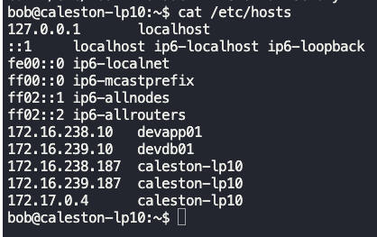
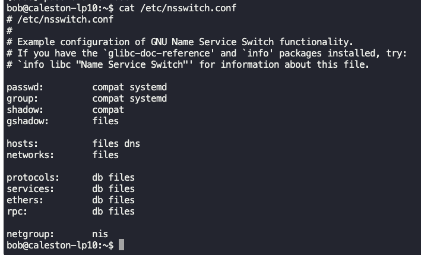
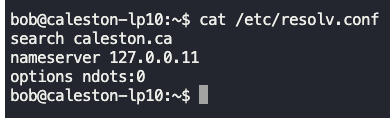
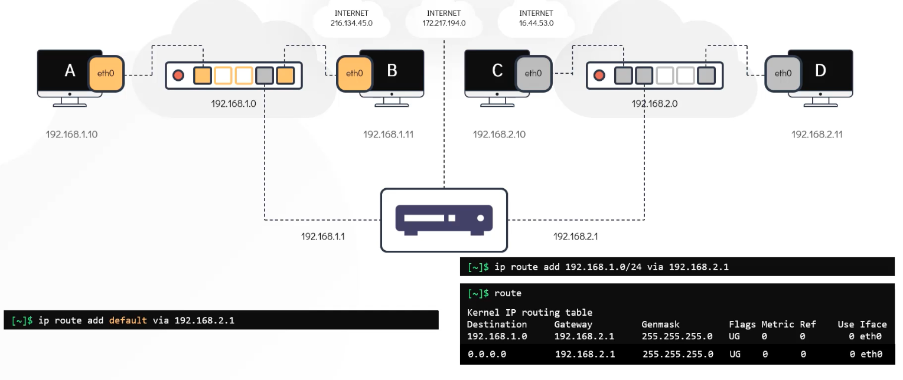
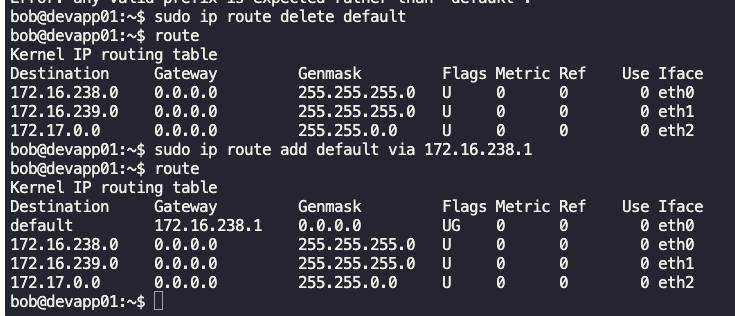
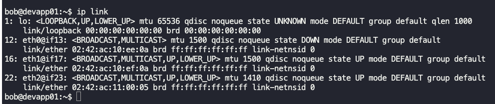
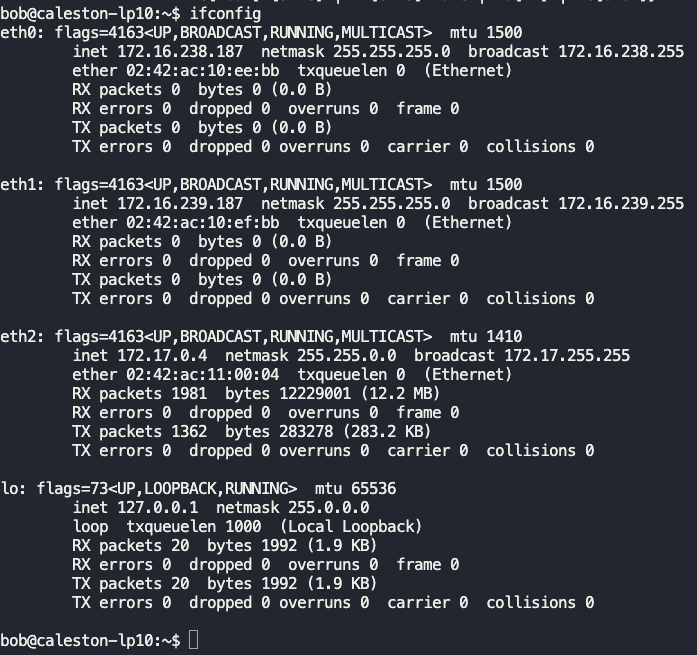
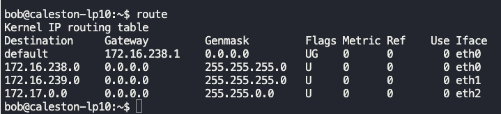
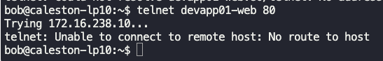
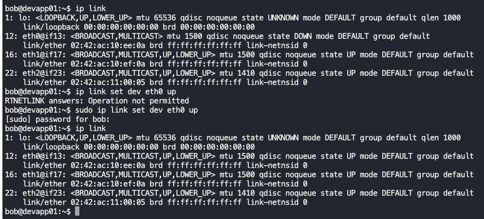

### DNS

- Domain name server (DNS) has a file with i.ps and hostnames.
- All system ask DNS for i.p-hostname mapping.
- `/etc/hosts` is a file in the local system which contains i.ps hostnames mapping.
- 
- $`cat >> /etc/hosts` and inputting `192.168.1.11       db` means
	- hostname `db` maps to i.p `192.168.1.11`
- `/etc/hosts` is where the hostname/i.p resolution is first queried. If not found, it goes to DNS.
	- Defined by the file in `/etc/nsswitch.conf`.
- `/etc/hosts` file will have an entry for DNS, like
	- `nameserver    192.168.1.100` -> Locally hosted DNS
	- `nameserver    8.8.8.8` -> Google's DNS
- `/etc/nsswitch.conf`
	- This file defines the order in which the resolution should be looked into.
	- Entry `hosts:     file dns` -> implies that the `/etc/hosts` file will be queried first, and if no resolution, then the query goes to DNS.
	- 
- Hierarchy
	- `.` -> Root
		- `.com` -> Top level domain
			- `google`
				- `mail`, `drive`, `www`, `maps`, `apps` -> Sub-domains
- Organisation DNS will cache the DNS responses for faster resolution.
- `/etc/resolv.conf` -> Contains the i.p of DNS.
	- Ex: `nameserver    192.168.1.100`
	- To append subdomains automatically when connecting to a server, like if you want to translate `ping web` command to `ping web.mycompany.com`
		- Add an entry as `search    mycompany.com`

**Record type**
- A Record - I.P to hostname
- AAAA Record - IPv6 to hostname
- CNAME Record - Mapping one hostname to another (aliases)m like food.web to eat.web and hungry.web

**To test DNS**
- $`nslookup google.com`
	- This will query the DNS, and not the `/etc/hosts` file.
	- Checks if it is resolving to valid i.p.
- $`dig google.com`

---
### Networking basics

$`ip link` -> Gives the available network interfaces/devices on the system.

$`ip addr add 192.168.1.10/24 dev eth0` -> Assigns i.p address to the network interface.

Switch -> Can receive and deliver packets on the same network.

Router
- Can talk to 2 or more networks.
- An I.P is assigned for each network to which the router is connected to.

Gateway
- Is like the door to go outside.
- Systems need to know where the Gateway or door is to send packets outside the network.
- $`route` -> Lists all the gateways configured.

$`ip route add 192.168.2.0/24 via 192.168.1.1`
- In the above figure, run this command on system A or B to talk to system C or D.
- The command specifies that to talk to any i.p in 192.168.2.0/24, use gateway or door or go via 192.168.1.1.
- Similarly, run $`ip route add 192.168.1.0/24 via 192.168.2.1` on system C or D to talk to system A or B.

To have systems communicate with internet, it has to go via router. So, the following command specifies that any traffic going outside network is routed to the router.
- $`ip route add default via 192.168.1.1` or `ip route add default via 192.168.2.1`

$`ip link`
- List and modify interfaces and devices.
- Shows if network interface is up or down.

$`ip addr` or $`ifconfig` -> Shows i.p assigned to those interfaces and devices.

Make changes to file `/etc/network/interfaces` to persist.

$`route` or $`ip route` shows routing table

---

### Troubleshooting

$`traceroute i.p` -> Shows the number of hops/devices from source to destination.

$`netstat -an | grep 80 | grep -i LISTEN`
- Lists if port 80 is open or active

$ `ip link set dev eth0 up` -> Brings interface eth0 up.

---

