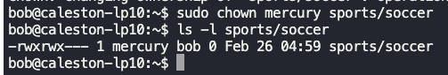

### Linux accounts

**Account**
- Every user has an account in linux.
- Has username and password.
- All accounts are listed in `/etc/passwd`.
- Every user has an associated userid.

**Group**
- Collection of users
- All groups are listed under `/etc/group`.
- Every group has an unique identifier GID.

**Different type of accounts**
1. Superuser account
	1. root - Has unrestricted access
	2. UID=0
	3. `/root/` is the home directory.
2. A user account account (individual people) will have typically.
	1. Username
	2. UID
	3. GID
	4. Home directory - `/home/user_name`
	5. Default shell
3. System accounts
	1. Ex: `ssh`, `mail`
	2. For services to run
	3. UID < 100 or between 500 and 1000
	4. No dedicated home directories
4. Service accounts
	1. Created when a service is installed.
	2. Ex: `nginx`, `apache`.

The following commands give the above details
- $`id bob`
- $`grep -i bob /etc/passwd`

- $`who` - List of users logged in to the system.
- $`last` - All logged in users and when the system was rebooted.

**Linux security**
- Access control
	- Based on credentials and decide who can access system.
- PAM - Pluggable authentication module
	- Used to authenticate to programs and services
- Network security
	- Access to services listening on ports.
- SSH - Secure shell
	- For remote access
- SELinux
	- Isolates processes running on same system

To switch user to a different user
- $`su -` - Switches to root user.
- $`su -c "whoami"` - Runs "whoami" command as root.
- $`sudo ls /root` - Runs command as root.

File `/etc/sudoers` lists which users can run commands with elevated privileges (sudo).

- All lines beginning with `#` are comments.
- First field can be user or group.
	- User - bob, michael
	- Group - `%sudo`, `%admin`
- Second field is HOST
	- Implies where the command can be run.
	- Can be `localhost`
	- Default is `ALL`.
- Third field implies the user and group which the user in first field can run the command as 
	- `(ALL:ALL)`
- Fourth field implies what command can be run
	- Default is `ALL`, which means all commands can be run.
	- Specific command can be specified such as, `/usr/bin/shutdown -r now`

To get the details about the user, their home directory, group, default shell etc, check in the following files
- `/etc/passwd`
- `/etc/shadow`
- `/etc/group`

---

### Access control files

`/etc/`
- Has almost all access control files.
- All users have access to read.
- Only root user has access to write.

`/etc/passwd` - Contains basic information about user.
- Format
	- username:password(x):uid:gid:gecos:HomeDir:shell
	- Password will be in`/etc/shadow` file in hashed format.
	- gecos (optional) - Comma separated list of first name,  last name, phone number etc.

`/etc/shadow` - Has user account's passwords stored in hashed format.
- Format
- username:password:lastChangedPassword:passwordMinAge:passwordMaxAge:warn:inactive:expiryDate
	- Password will be in hashed format.
	- "lastChangedPassword" will contain the details on when the password was last changed.
	- "passwordMinAge" and "passwordMaxAge" specifies the minimum and maximum age for password.
	- "warn" specifies when to start warning users to change password.
	- "inactive" specifies the number of days the password is expired.
	- "expiryDate" specifies the date when the account will expire.

`/etc/group` - Has all groups in system
- Format
	- name:password(x):GID:members
		- contains users part of the group.

---

### User management

- $`useradd user_name` -> New user created
- $`grep -i user_name /etc/passwd` -> Shows information about the created user
- $`passwd user_name` -> Sets/changes password to the user.

Run the above commands as root.

$`whoami` -> Gives user name

$`useradd -u 1009 -g 1009 -d /home/bob -s /bin/bash -c "user with custom settings" bob`
- `-c` -> Custom comments
- `-d` -> Custom home directory
- `-e` -> Expiry date
- `-g` -> Specific group id
- `G` -> Create user with multiple secondary groups
- `-s` -> Specify login shell
- `-u` -> Specific user id

$`id` -> Gives information about the user

$`userdel user_name` -> Deletes user

$`groupadd -g 1011 developer` -> Creates a new group "developer" with gid 1011.

$`groupdel developer` -> Deletes group "developer".

---

### File permissions and ownerships

$`ls -l test.txt`

- `-rwxrw-r-x`
- The first `-` denotes file type
	- `d` - Directory
	- `-` - Regular file
	- `c` - Character device
	- `l` - Link
	- `s` - Socket file
	- `p` - Pipe
	- `b` - Block device
- The first `rwx` denotes permission to the owner(u) of the file.
- The second `rwx`(`rw-`) denotes permission to the group(g) owning the file.
- The third `rwx`(`r-x`) denotes permission to all other users(o).
- Permission `r` implies read permission.
- Permission `w` implies write permission.
- Permission `x` implies execute permission.
- Permission `-` implies no permission.

Permissions are check sequentially.
- If the user is owner, then only owner's(u) permissions are checked, and the rest (g and o) are ignored.
- If the user is part of group(g) owning the file, then only group's permissions are checked and other(o) user permissions are ignored.

Changing file permissions
- `chmod <permissions> file_name` -> Changes file permissions
- Symbolic mode
	- $`chmod u+rwx test.txt` -> Provides full access(rwx) to the owner of the file test.txt.
	- $`chmod ugo+r-x test.txt` -> Provides read access and removes execute access to owner(o) of the file, to the group(g) owning the file and all other users(o).
	- $`chmod o-rwx test.txt` -> Removes all access(rwx) to all other users(o).
	- $`chmod u+rwx,g+r-x,o-rwx test.txt` -> Provides full access(rwx) to the owner, Provides read access and removes execute access to the group(g) owning the file, and removes all access(rwx) to all other users(o).
	- 
	- 
- Numeric mode
	- `r`= 2^2 = 4
	- `w`= 2^1 = 2
	- `x` = 2^0 = 1
	- $`chmod 777 test.txt` -> Provides full access (rwx) to owner(o) of the file, group(g) owning the file, and all other users(o).
	- $`chmod 555 test.txt` -> Provides read and execute permissions to to owner(o) of the file, group(g) owning the file, and all other users(o).
	- $`chmod 660 test.txt` -> Provides read and write permissions to to owner(o) of the file and the group(g) owning the file, and no permission to all other users(o).
	- $`chmod 750 test.txt` -> Provides full access (rwx) to owner(o) of the file, provides read and execute permission to the group(g) owning the file, and no permission to all other users(o).

Changing ownership of file
- $`chown owner:group file_name` -> Changes ownership of file and group owning the file.
- $`chown bob:developer test.txt` -> For test.txt file, the owner is user "bob" and group owning the file is "developer".
- $`chown bob test.txt` -> For test.txt file, the owner is set to user "bob". No change in the group owning the file.
- $`chgrp tester test.txt` -> For test.txt file, the group owning the file is set to "tester". No change in the user owning the file.

---

### SSH and SCP

To ssh into a remote host
- $`ssh ip`
- $ `ssh user_name@ip/hostname`
- $`ssh -l user_name ip/hostname`

Key pair = Public key (stored in remote server) + Private key (In client machine)

To create key pair
- $`ssh -keygen -t rsa`
- Public key is generated and stored under - `<user_home_directory>/.ssh/id_rsa.pub`.
- Private key is generated and stored under - `<user_home_directory>/.ssh/id_rsa`.

$`ssh-copy-id bob@devapp01`
- Copies public key of bob user to devapp01 machine.
- It will be placed under `/<user_home_directory>/.ssh/authorized_keys` in remote server.

SCP -> Secure copy or Copy over SSH

$`scp test.txt devapp01:/home/bob`
- Copies test.txt file to devapp01 machine at /home/bob directory.
- `-p` -> Preservers ownership and group permissions.
- `-r` -> Copies directories.

---

### IPTables introduction

External firewall appliances such as below, control network connection and traffic.
- Cisco ASA
- Juniper NGFW
- Barracuda NGFW
- Fortinet

IPTables and FirewallD are firewalls for operating systems.

$`sudo apt install iptables` -> Installs iptables.

$`sudo iptables -L` -> Lists default rules configured.

IPTables basics
- INPUT -> Network traffic coming into the system.
- OUTPUT -> Network traffic going out of the system.
- FORWARD -> typically used in routers, where data is forwarded to other systems in the network.
- Default is all traffic is allowed in and out of the system.
- Chain is group of rules.

---

### IPTables to secure the environment

$`iptables -A INPUT -p TCP -s 172.16.238.187 --dport 22 -j ACCEPT`
- Adds an IPTable rule to accept incoming SSH connection from 172.16.238.187 on port 22.
- `-A` - Add rule (INPUT/OUTPUT/FORWARD)
- `-p` - Protocol (TCP)
- `-s` - Source ip or ip range
- `-d` - Destination ip or ip range
- `--dport` - Destination port (22)
- `j` - Action to take (ACCEPT/DROP)

$`iptables -A INPUT -p TCP --dport 22 -j DROP`
- Drops all incoming connection to port 22.

IPTable rules basics
- IPTable rules are implemented from top to bottom.
- Sequence in which we add rules are very important.
- Every new rule is added to the bottom of the list.

$`iptables -A OUTPUT -p TCP -d 172.16.238.11 --dport 5432 -j ACCEPT`
- Outbound connection to ip 172.16.238.11 on port 5432 is allowed.

$`iptables -A OUTPUT -p TCP 172.16.238.15 --dport 80 -j ACCEPT`
- Outbound connection to ip 172.16.238.15 on port 80 is allowed.

To drop all outgoing connections to port 80 and 443
- $`iptables -A OUTPUT -p TCP --dport 443 -j DROP`
- $`iptables -A OUTPUT -p TCP --dport 80 -j DROP`

$`iptables -A INPUT -p TCP -s 172.16.238.187 --dport 80 -j ACCEPT`
- Accept all incoming requests from 172.16.238.187 on port 80.

$`iptables -I OUTPUT -p TCP -d 172.16.238.100 --dport 443 -j ACCEPT`
- `-I` inserts to the top of rules in IPTables.

$`iptables -D OUTPUT 5`
- Deletes rule at position 5 (Starts from 1)

$`iptables -A INPUT -p TCP -s 172.16.238.10 --dport 5432 -j ACCEPT`
- Allows connection from ip 172.16.238.10 on port 5432.

$`iptables -A INPUT -p TCP --dport 5432 -j DROP`
- Drops all connection to port 5432.

$`netstat -an | grep 5432`
- Lists all connections related to port 5432.
- Ephemeral port ranges -> 32768 to 60999.

---

### Cron jobs

$`uptime >> /tmp/system-report.txt`
- Redirects output of "uptime" command to the mentioned file.

$`crontab -e`
- To setup cron jobs, run this command as the user who needs to run the command. (Mention @eof)
- Ex: `0 21 * * * uptime >> /tmp/system-report.txt`

To schedule a job on 8:10 a.m on 19th Feb and if it is a Monday
- 10(Minute) 8(Hour) 19(Day) 2(Month) 1(Weekday)
- `*` -> Any value

To schedule a job on 8:10 a.m every month on 19th
- 10(Minute) 8(Hour) 19(Day) `*`(Month) `*`(Weekday)

To run every minute
- `* * * * *`

To run every 2 minutes
- `*/2 * * * *`

$`cronjob -l` -> Lists all cron jobs
- All cron job runs are logged under `/var/log/syslog`

---

