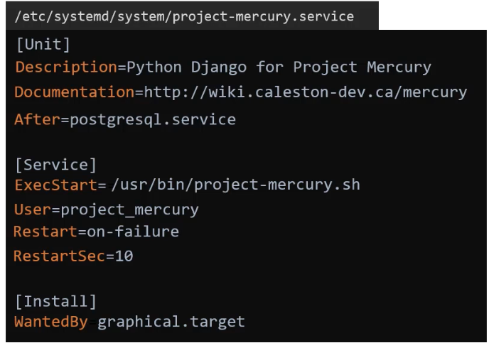

### Creating a SYSTEMD service

- Service management is done via SYSTEMD

Requirements
- Program `/usr/bin/project-mercury.sh` to run on boot in background.
- Start Python application after prostgresql service is started.
- Use service account user `project_mercury` to run the service.
- Auto restart on failure.
- Restart interval is 10 seconds.
- Log service events -> This is automatically done by SYSTEMD.
- Service is loaded when booting into graphical mode.

To satisfy the above requirements
- Step 1 - Create a service unit file, which will contain the service description.
	- `/etc/systemd/system/project-mercury.service`
- Step 2 - Begin with `[Unit]` section.
	- Contains `Description` which specifies text about the service.
	- Contains `Documentation` which specifies link to additional documentation.
	- Contains `After` which specifies which service to start prior.
		- As per the requirement, we mention `After=postgresql.service`.
- Step 3 - Next section will be `[Service]` section.
	- Contains `ExecStart` which specifies the path the file/code/script to run.
		- As per the requirement, we mention `ExecStart=/usr/bin/project-mercury.sh`
	- Contains `User` which specifies the user to run the service.
		- As per the requirement, we mention `User=project_mercury`.
	- Contains `Restart` which specifies the condition to restart service.
		- As per the requirement, we mention `Restart=on-failure`.
	- Contains `RestartSec` which specifies the restart interval.
		- As per the requirement, we mention `RestartSec=10`.
- Step 4 - Next section will be `[Install]` section.
	- Contains `WantedBy` which specifies the run level or target when the service should be executed.
		- As per the requirement, we mention `WantedBy graphical.target`.

$`systemctl start/stop/status project-mercury.service`
- Starts/stops/status of the service.

If any changes are made to the service unit file, run the below command to detect changes.
- $`systemctl daemon-reload`

---

### SYSTEMD tools

SYSTEMCTL
- Used to manage services.
- start/stop/status/enable/disable/restart/reload

JOURNALCTL
- For logging and debugging issues.

$`systemctl start/stop/restart/reload docker`

$`systemctl enable/disable/status docker`
- Enable makes persistent across reboots.

$`systemctl daemon-reload`
- Run after making changes in service unit file.
- Makes SYSTEMD aware of changes.

$`systemctl edit project-mercury.service --full`
- To edit service unit file.
- No need to run daemon reload after this.

$`systemctl get-default`
- Gives current run level or target.

$`systemctl set-default multi-user.target`
- Changes run level or target.

$`systemctl list-units --all`
- Gives all service units loaded or attempted to load.
- Without `--all` flag, it gives only active services.

$`journalctl`
- Gives all log entries of services.

$`journalctl -b`
- Gives all log entries in current boot.

$`journalctl -u docker.service`
- Gives log entries of specific service.

---

