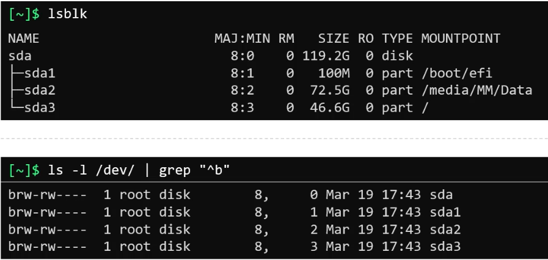
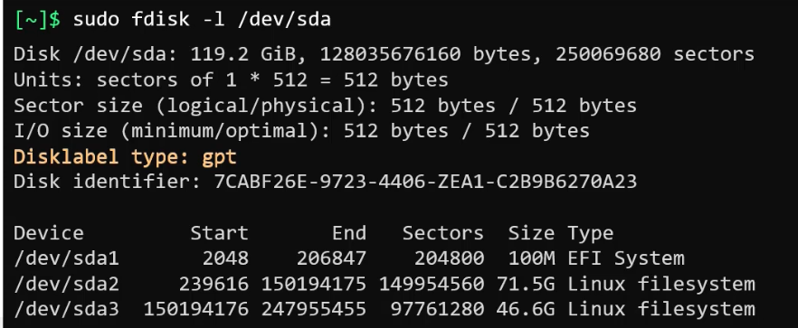
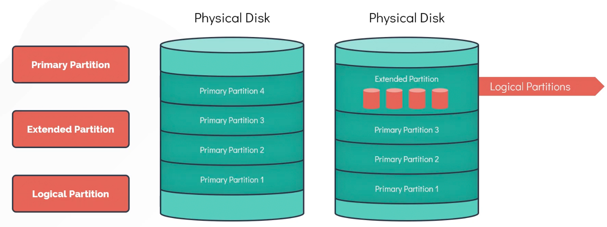
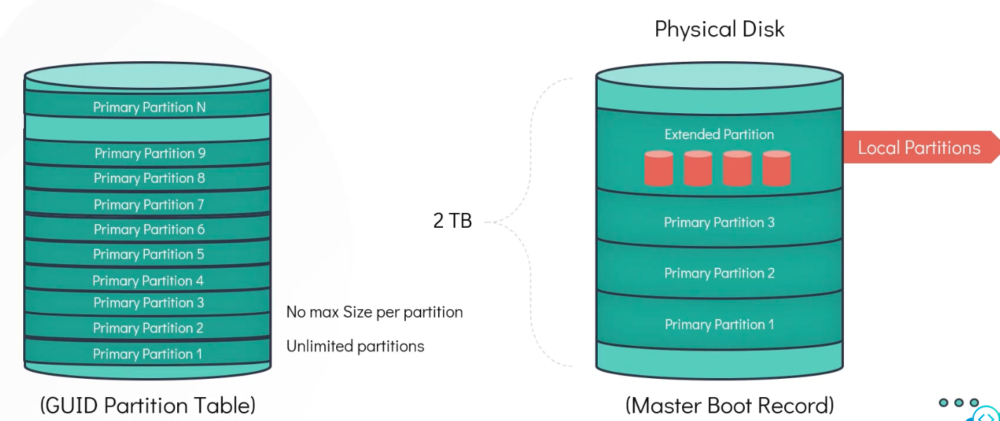
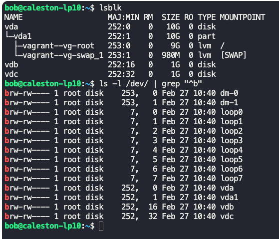
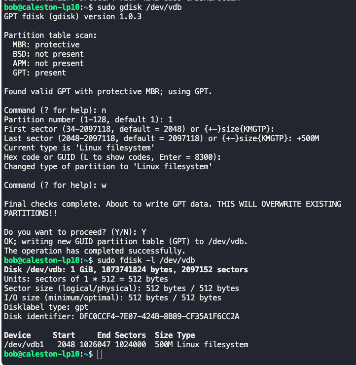

### Disk partitions

`/dev` -> All block devices will be listed here.

To list all block devices in the system
- $`lsblk`
- $`ls -l /dev | grep "^b"`
- $`fdisk -l /dev/sda` -> Gives partition information

**Partition**
- Smaller chunk of usable space.
- Ex: sda1, sda2, sda3
- sda1 - `/boot/efi` -> System boot
- sda2 - `/media/mm/data` -> Backups
- sda3 - `/` -> Root partition
- Major number defines the device type
	- 1 - RAM
	- 3 HDD or CDROM
	- 6 Parallel printers
	- 8 SCSI disks
- Minimum number is for partitions

**Partition types**

- Primary partition -> Used to boot OS.
- Extended partition
	- Acts like a disk on its own and can be carved to multiple logical partitions.
- Logical partition -> Partitions in extended partitions

$`gdisk /dev/sdb`
- Partition `/dev/sdb`
- Improved version of fdisk which works with gpt.
- `?` -> Specifies all available options
- `n` -> New partition (partition #1, size 2048)
- `w` -> Write partition to disk

---

### File systems in Linux

$`mkfs.ext4 /dev/sdb1` -> Creates a ext4 file system.

Steps to convert a physical hard disk to a usable storage in system
- Physical disc
- Partition
- Create a file system
- Mount
- Use

$`mkdir /mnt/ext4` - > Create a directory to mount.

$`mount /dev/sdb1 /mnt/ext4`
- Mounts `/dev/sdb1` in `/mnt/ext4` location.

List all mounts and mount points
- $`mount | grep /dev/sdb1`
- $`df -hP | grep /dev/sdb1`

Add entry to `/etc/fstab` file to persist mount across reboots.
- `<file_system>` - `/dev/sda1`
- `<mount_point>` - `/`
- `<type>` - `ext4`
- `<options>` - `defaults, relatime, errors=panic 0, RW, RO`
- `<dump>` - `0 or 1`
- `<pass>` -`0, 1 or 2`

---

### DAS, NAS and SAN

DAS -> Direct attached storage (Block storage)

NAS -> Network attached storage (NFS)

SAN -> Storage area network (fibre) (Block storage)

---

### NFS filesystem

Server-client model
- NFS server is connected to multiple NFS clients.

$`/etc/exports`
- NFS server defines the clients which can connect to it.
- Ex: `/software/repos` ip1,ip2, ip3 or hostnames.

On server
- $`exportfs -a` -> Exports all entries in `/etc/exports`
- $`exportfs -o ip:/software/repos`

On client
- $`mount serverip:/software/repos /mnt/software/repos`

---

### Logical volume manager (LVM)

- Allows grouping of physical volumes to volume groups to create logical volumes.
- LVMS can be resized dynamically.
- $`apt-get install lvm2` -> Installs lvm package
- $`pvcreate /dev/sdb` -> Creates physical volume
- $`vgcreate caleston_vg /dev/sdb`
	- Creates volume group `caleston_vg` on physical volume `/dev/sdb`.
- Volume groups can be created on multiple physical volumes.
- $`pvdisplays` -> Shows all physical volumes and volume groups.
- $`vgdisplay` ->Shows all volume groups.
- $`lvcreate -L 1G -n vol1 caleston_vg`
	- 1 GB volume is created from `caleston_vg` volume group.
- Show all logical volumes
	- $`lvdisplay`
	- $`lvs`
- To create a file system on the volume created
	- $`mkfs.ext4 /dev/caleston_vg/vol1`
- Mount the above created file system to `/mnt/vol1`
	- $`mount -t ext4 /dev/caleston_vg/vol1 /mnt/vol1`
- $`vgs` -> Gives details about volume group including space etc.
- To in crease space by 1GB in logical volume `vol1`
	- $`lvresize -L +1G -n /dev/caleston_vg/vol1`
- To resize the filesystem to the increased size
	- $`resize2fs /dev/caleston_vg/vol1`
- To check the increased size
	- $`df -hP /mnt/vol1`

---

