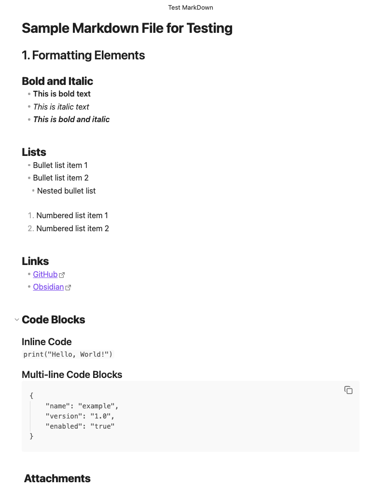

# Sample Markdown File for Testing

## 1. Formatting Elements

### **Bold and Italic**
- **This is bold text**
- *This is italic text*
- ***This is bold and italic***

### **Lists**
- Bullet list item 1
- Bullet list item 2
  - Nested bullet list
  
1. Numbered list item 1
2. Numbered list item 2

### **Links**
- [GitHub](https://github.com)
- [Obsidian](https://obsidian.md)

### **Code Blocks**
#### Inline Code
`print("Hello, World!")`
#### Multi-line Code Blocks
````
{
	"name": "example",
	"version": "1.0",
	"enabled": "true"
}
````

###  **Attachments**

**Screenshot**



**PDF File**


**YAML File**


**Python Script**


---
